# Brolly Juniors — Application Flow Document

**Version:** 1.0
**Date:** 2 September 2026
**Audience:** Product · Engineering · QA · UX
**Companions:** `Product_Requirement_Document.md`, `Technical_Requirement_Document.md`, `Backend_Schema_Document.md`

Every flow in this document specifies: the actor, the precondition, the happy path, the alternate and error paths, the API calls involved, the data written, and the audit events emitted. QA should be able to write test cases directly from these without asking a follow-up question.

---

## 1. Flow Conventions

| Symbol | Meaning |
|---|---|
| **Precondition** | Must be true before the flow starts; otherwise the flow is not reachable |
| **Postcondition** | Guaranteed true after the happy path |
| **Audit** | Rows written to `audit_logs` |
| **Degrades to** | What the user gets when a dependency is unavailable |

Global preconditions applying to every authenticated flow: a valid access JWT; an active `Membership` in the resolved tenant; the tenant is in `active` state; the tenant GUC is set on the database transaction.

---

## 2. End-to-End User Journey

### 2.1 The B2B journey, from contract to a marked exercise

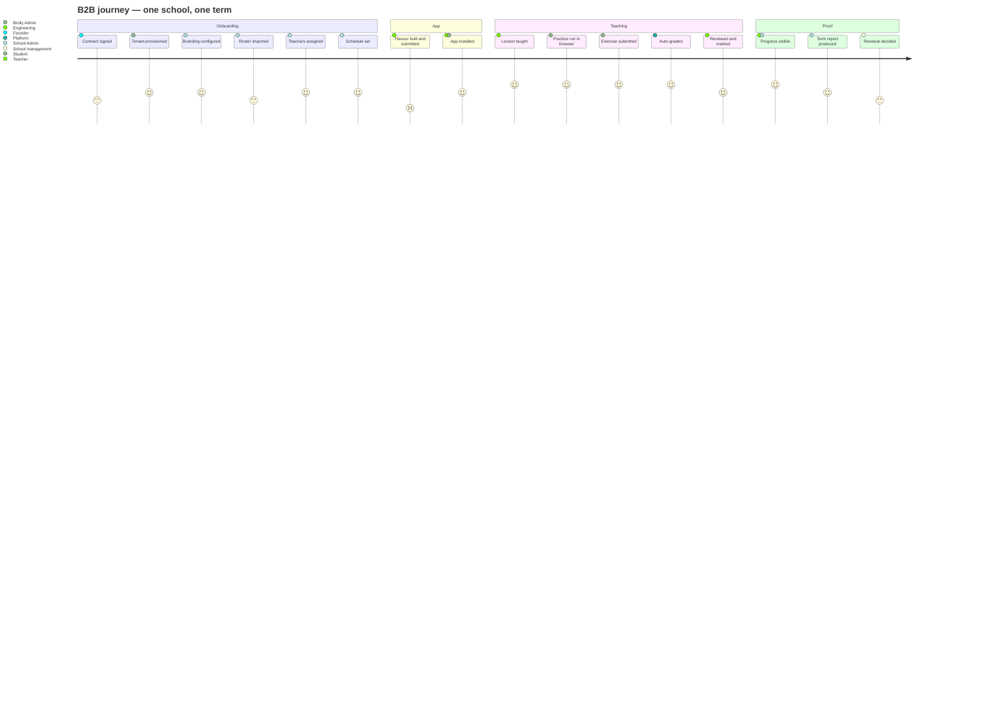
```mermaid
journey
    title B2B journey — one school, one term
    section Onboarding
      Contract signed: 3: Founder
      Tenant provisioned: 4: Brolly Admin
      Branding configured: 4: School Admin
      Roster imported: 3: School Admin
      Teachers assigned: 4: School Admin
      Schedule set: 4: School Admin
    section App
      Flavour built and submitted: 2: Engineering
      App installed: 4: Teacher, Student
    section Teaching
      Lesson taught: 5: Teacher
      Practice run in browser: 5: Student
      Exercise submitted: 5: Student
      Auto-graded: 5: Platform
      Reviewed and marked: 4: Teacher
    section Proof
      Progress visible: 5: Teacher, School Admin
      Term report produced: 4: School Admin
      Renewal decided: 3: School management
```

### 2.2 System-level sequence for the same journey

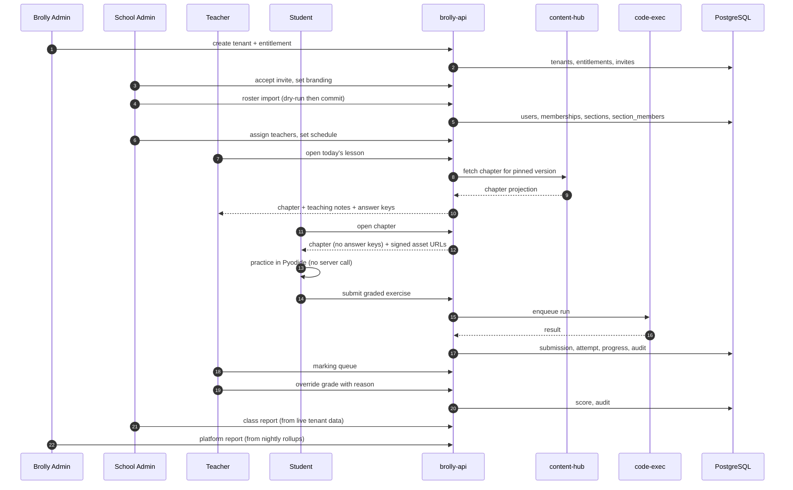
```mermaid
sequenceDiagram
    autonumber
    participant BA as Brolly Admin
    participant SA as School Admin
    participant TE as Teacher
    participant ST as Student
    participant API as brolly-api
    participant HUB as content-hub
    participant EX as code-exec
    participant DB as PostgreSQL

    BA->>API: create tenant + entitlement
    API->>DB: tenants, entitlements, invites
    SA->>API: accept invite, set branding
    SA->>API: roster import (dry-run then commit)
    API->>DB: users, memberships, sections, section_members
    SA->>API: assign teachers, set schedule
    TE->>API: open today's lesson
    API->>HUB: fetch chapter for pinned version
    HUB-->>API: chapter projection
    API-->>TE: chapter + teaching notes + answer keys
    ST->>API: open chapter
    API-->>ST: chapter (no answer keys) + signed asset URLs
    ST->>ST: practice in Pyodide (no server call)
    ST->>API: submit graded exercise
    API->>EX: enqueue run
    EX-->>API: result
    API->>DB: submission, attempt, progress, audit
    TE->>API: marking queue
    TE->>API: override grade with reason
    API->>DB: score, audit
    SA->>API: class report (from live tenant data)
    BA->>API: platform report (from nightly rollups)
```

### 2.3 The B2C journey

```mermaid
flowchart LR
    A[Guardian finds marketing site] --> B[Chooses class + track]
    B --> C[Web checkout, Guardian pays]
    C --> D[Guardian account created in Tenant #1]
    D --> E[Consent granted, fiduciary_role=brolly]
    E --> F[Child profile created by Guardian]
    F --> G[Entitlement activated for the child]
    G --> H[Child logs in with issued credential]
    H --> I[Self-paced schedule releases chapter 1]
    I --> J[Practice + graded submissions]
    J --> K[Guardian sees progress; no other child visible]
```

The difference that matters: in B2B the school creates the learner and the school schedules the content; in B2C the guardian does both. The code path is identical — Tenant #1 simply has a guardian holding the permissions a School Admin holds elsewhere, and a self-paced release mode instead of a date-driven schedule.

---

## 3. Login Flow

**Actors:** all. **Precondition:** account exists and membership is active.

### 3.1 Staff and guardian login

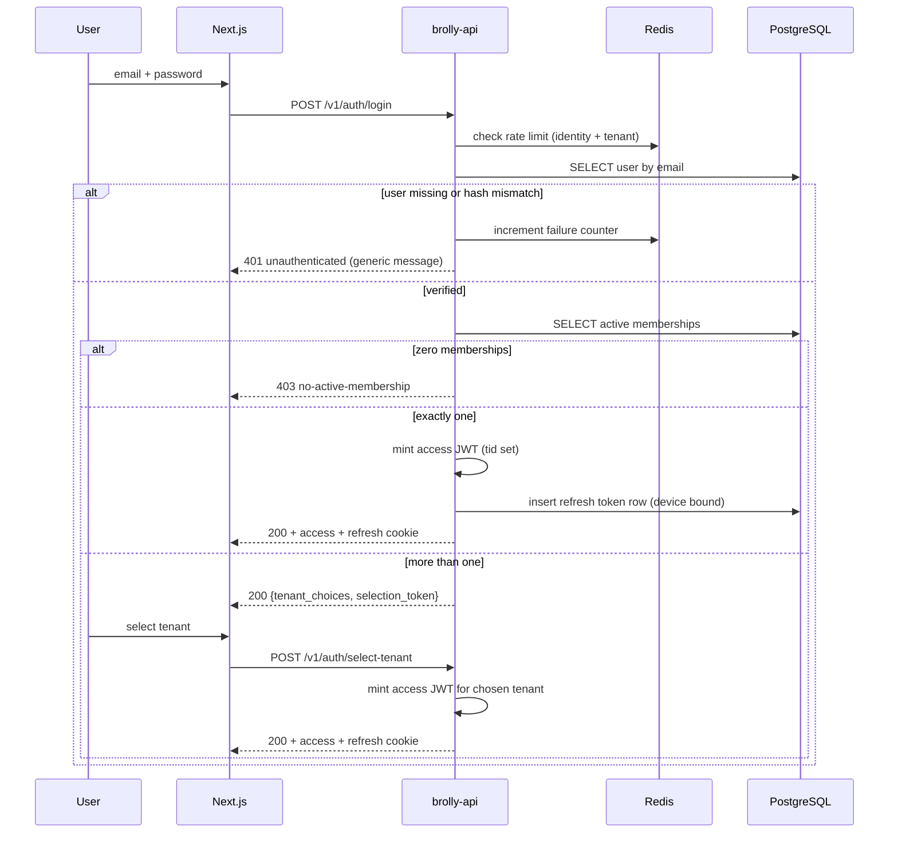
```mermaid
sequenceDiagram
    participant U as User
    participant W as Next.js
    participant A as brolly-api
    participant R as Redis
    participant D as PostgreSQL

    U->>W: email + password
    W->>A: POST /v1/auth/login
    A->>R: check rate limit (identity + tenant)
    A->>D: SELECT user by email
    alt user missing or hash mismatch
        A->>R: increment failure counter
        A-->>W: 401 unauthenticated (generic message)
    else verified
        A->>D: SELECT active memberships
        alt zero memberships
            A-->>W: 403 no-active-membership
        else exactly one
            A->>A: mint access JWT (tid set)
            A->>D: insert refresh token row (device bound)
            A-->>W: 200 + access + refresh cookie
        else more than one
            A-->>W: 200 {tenant_choices, selection_token}
            U->>W: select tenant
            W->>A: POST /v1/auth/select-tenant
            A->>A: mint access JWT for chosen tenant
            A-->>W: 200 + access + refresh cookie
        end
    end
```

**Error paths**

| Condition | Response | Notes |
|---|---|---|
| Wrong password | 401 `unauthenticated` | Message identical to unknown-user, so the endpoint does not confirm which emails exist |
| Account locked | 423 `locked` with unlock guidance | Lock is per identity, not per IP |
| Tenant suspended | 403 `tenant-suspended` | Brolly Admin may still enter |
| MFA required | 200 `{mfa_required, mfa_token}` then `POST /auth/mfa` | Mandatory for Brolly Admin |
| Expired password reset token | 400 `invalid-token` | |

**Audit:** `auth.login.success`, `auth.login.failure`, `auth.tenant_selected`.

### 3.2 Student login

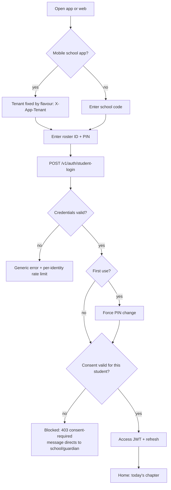
```mermaid
flowchart TD
    A[Open app or web] --> B{Mobile school app?}
    B -- yes --> C[Tenant fixed by flavour: X-App-Tenant]
    B -- no --> D[Enter school code]
    C --> E[Enter roster ID + PIN]
    D --> E
    E --> F[POST /v1/auth/student-login]
    F --> G{Credentials valid?}
    G -- no --> H[Generic error + per-identity rate limit]
    G -- yes --> I{First use?}
    I -- yes --> J[Force PIN change]
    I -- no --> K{Consent valid for this student?}
    J --> K
    K -- no --> L[Blocked: 403 consent-required<br/>message directs to school/guardian]
    K -- yes --> M[Access JWT + refresh]
    M --> N[Home: today's chapter]
```

**Why PIN lockout is per identity, not per IP:** a class of forty students shares one lab NAT address. IP-based lockout after ten failures would take the whole class offline within the first five minutes of the first lesson.

### 3.3 Token refresh and revocation

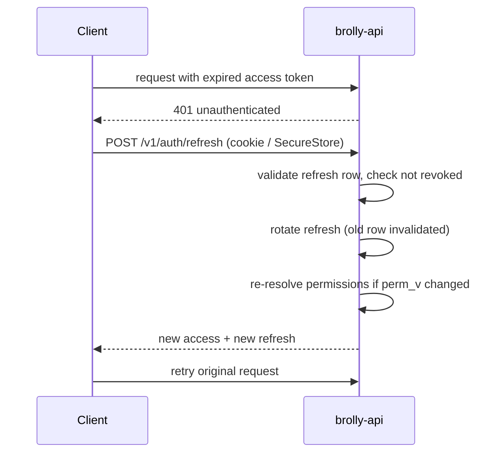
```mermaid
sequenceDiagram
    participant C as Client
    participant A as brolly-api
    C->>A: request with expired access token
    A-->>C: 401 unauthenticated
    C->>A: POST /v1/auth/refresh (cookie / SecureStore)
    A->>A: validate refresh row, check not revoked
    A->>A: rotate refresh (old row invalidated)
    A->>A: re-resolve permissions if perm_v changed
    A-->>C: new access + new refresh
    C->>A: retry original request
```

If the membership was revoked while the user was active, `perm_v` has changed, permissions re-resolve to none for that tenant, and the refresh returns 403 rather than a working token.

---

## 4. Signup Flow

### 4.1 B2C guardian signup (the only self-service signup)

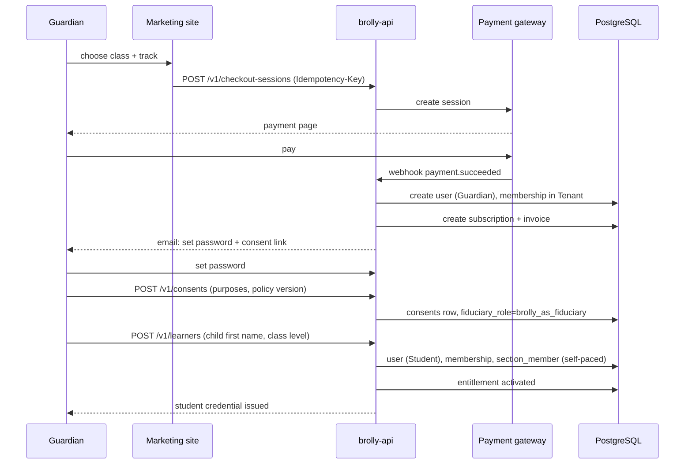
```mermaid
sequenceDiagram
    participant G as Guardian
    participant M as Marketing site
    participant A as brolly-api
    participant P as Payment gateway
    participant D as PostgreSQL

    G->>M: choose class + track
    M->>A: POST /v1/checkout-sessions (Idempotency-Key)
    A->>P: create session
    P-->>G: payment page
    G->>P: pay
    P->>A: webhook payment.succeeded
    A->>D: create user (Guardian), membership in Tenant #1
    A->>D: create subscription + invoice
    A-->>G: email: set password + consent link
    G->>A: set password
    G->>A: POST /v1/consents (purposes, policy version)
    A->>D: consents row, fiduciary_role=brolly_as_fiduciary
    G->>A: POST /v1/learners (child first name, class level)
    A->>D: user (Student), membership, section_member (self-paced)
    A->>D: entitlement activated
    A-->>G: student credential issued
```

**Rules enforced**

- A child cannot self-register (BR-CON-04). The learner record is created by the guardian.
- No date of birth is collected; class level is sufficient (BR-CON-07).
- Entitlement does not activate until consent exists (BR-CON-01).
- Payment webhook handling is idempotent; a duplicate webhook creates nothing.

**Failure paths:** payment failed → no account created, session marked failed; webhook lost → reconciliation job polls the gateway hourly and completes the account; guardian abandons before consent → account exists, entitlement inactive, reminder at 24 h and 72 h, then the incomplete record is purged at 30 days.

### 4.2 B2B staff onboarding (invite only)

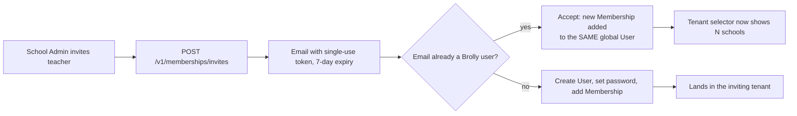
```mermaid
flowchart LR
    A[School Admin invites teacher] --> B[POST /v1/memberships/invites]
    B --> C[Email with single-use token, 7-day expiry]
    C --> D{Email already a Brolly user?}
    D -- yes --> E[Accept: new Membership added<br/>to the SAME global User]
    D -- no --> F[Create User, set password, add Membership]
    E --> G[Tenant selector now shows N schools]
    F --> H[Lands in the inviting tenant]
```

E is the multi-school teacher case. A Brolly-supplied teacher invited by a third school gets a third membership on one identity, never a third account.

### 4.3 B2B student creation

Students are never invited or self-registered in B2B. They are created by roster import (§13) and receive credentials through the school, on paper or through the school's existing parent channel. This keeps the school as the party that holds the relationship with the family, which is consistent with the school being the data fiduciary in that channel.

---

## 5. Student Journey

### 5.1 Session state machine

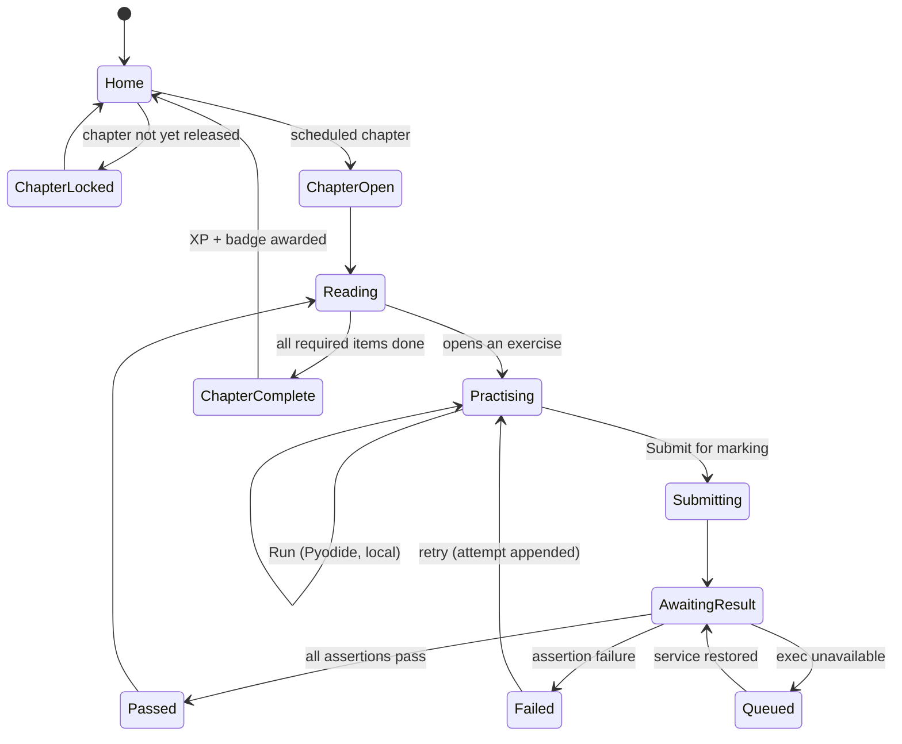
```mermaid
stateDiagram-v2
    [*] --> Home
    Home --> ChapterLocked: chapter not yet released
    Home --> ChapterOpen: scheduled chapter
    ChapterLocked --> Home
    ChapterOpen --> Reading
    Reading --> Practising: opens an exercise
    Practising --> Practising: Run (Pyodide, local)
    Practising --> Submitting: Submit for marking
    Submitting --> AwaitingResult
    AwaitingResult --> Passed: all assertions pass
    AwaitingResult --> Failed: assertion failure
    AwaitingResult --> Queued: exec unavailable
    Queued --> AwaitingResult: service restored
    Failed --> Practising: retry (attempt appended)
    Passed --> Reading
    Reading --> ChapterComplete: all required items done
    ChapterComplete --> Home: XP + badge awarded
```

### 5.2 Chapter open sequence

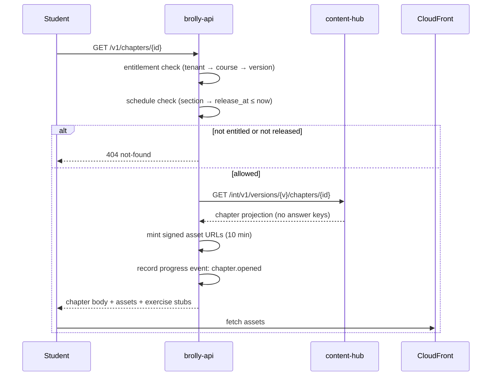
```mermaid
sequenceDiagram
    participant S as Student
    participant A as brolly-api
    participant H as content-hub
    participant CF as CloudFront

    S->>A: GET /v1/chapters/{id}
    A->>A: entitlement check (tenant → course → version)
    A->>A: schedule check (section → release_at ≤ now)
    alt not entitled or not released
        A-->>S: 404 not-found
    else allowed
        A->>H: GET /int/v1/versions/{v}/chapters/{id}
        H-->>A: chapter projection (no answer keys)
        A->>A: mint signed asset URLs (10 min)
        A->>A: record progress event: chapter.opened
        A-->>S: chapter body + assets + exercise stubs
        S->>CF: fetch assets
    end
```

Answer keys are stripped server-side by the response projection, not hidden by the client. A student calling the API directly gets the same payload the app renders.

### 5.3 Practice run (no server involvement)

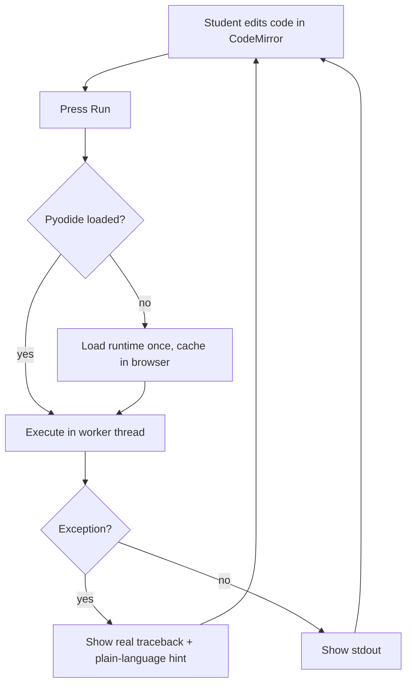
```mermaid
flowchart TD
    A[Student edits code in CodeMirror] --> B[Press Run]
    B --> C{Pyodide loaded?}
    C -- no --> D[Load runtime once, cache in browser]
    C -- yes --> E[Execute in worker thread]
    D --> E
    E --> F{Exception?}
    F -- yes --> G[Show real traceback + plain-language hint]
    F -- no --> H[Show stdout]
    G --> A
    H --> A
```

The traceback is shown unedited with a hint beside it, never instead of it. Reading an error message is taught as a core skill in the Class 6 and Class 7 books; hiding the traceback would contradict the curriculum the platform delivers.

### 5.4 Graded submission

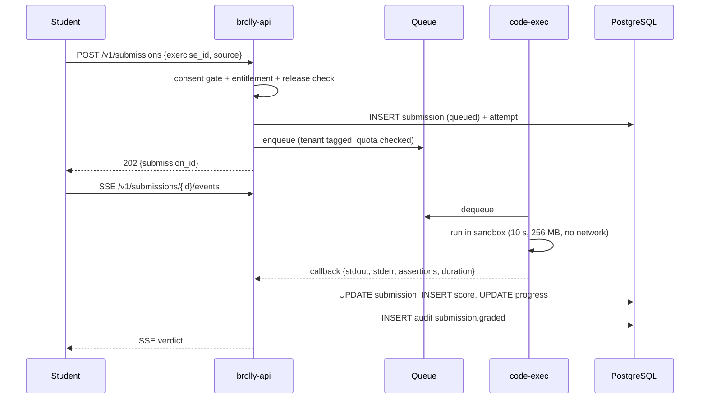
```mermaid
sequenceDiagram
    participant S as Student
    participant A as brolly-api
    participant Q as Queue
    participant E as code-exec
    participant D as PostgreSQL

    S->>A: POST /v1/submissions {exercise_id, source}
    A->>A: consent gate + entitlement + release check
    A->>D: INSERT submission (queued) + attempt
    A->>Q: enqueue (tenant tagged, quota checked)
    A-->>S: 202 {submission_id}
    S->>A: SSE /v1/submissions/{id}/events
    E->>Q: dequeue
    E->>E: run in sandbox (10 s, 256 MB, no network)
    E-->>A: callback {stdout, stderr, assertions, duration}
    A->>D: UPDATE submission, INSERT score, UPDATE progress
    A->>D: INSERT audit submission.graded
    A-->>S: SSE verdict
```

**Alternate paths**

| Condition | Behaviour |
|---|---|
| Exec service down | Submission stays `queued`; student told plainly; practice still works; flushed on recovery |
| Quota exhausted for tenant | 429 with a message; practice unaffected; School Admin notified |
| Timeout in sandbox | Verdict `timeout` with the hint "your program did not finish — check for a loop that never ends", naming THE INFINITE from the textbook |
| Output over cap | Truncated with a marker; verdict computed on the truncated stream and flagged for teacher review |
| Callback token invalid/expired | Result discarded, submission re-queued once, then alarmed |

### 5.5 Progress and XP

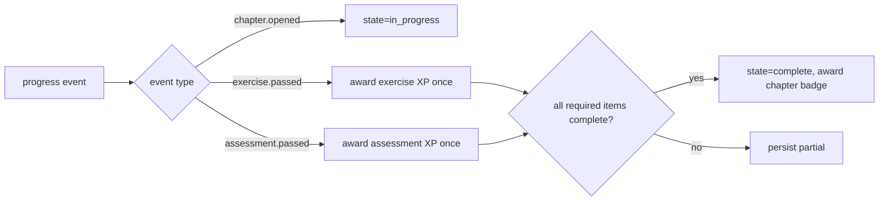
```mermaid
flowchart LR
    A[progress event] --> B{event type}
    B -- chapter.opened --> C[state=in_progress]
    B -- exercise.passed --> D[award exercise XP once]
    B -- assessment.passed --> E[award assessment XP once]
    D --> F{all required items complete?}
    E --> F
    F -- yes --> G[state=complete, award chapter badge]
    F -- no --> H[persist partial]
```

XP is idempotent per item: re-passing an exercise never awards XP twice, and the total per chapter equals the total printed in the corresponding textbook chapter (BR-ASM-07).

---

## 6. Teacher Journey

### 6.1 Daily flow

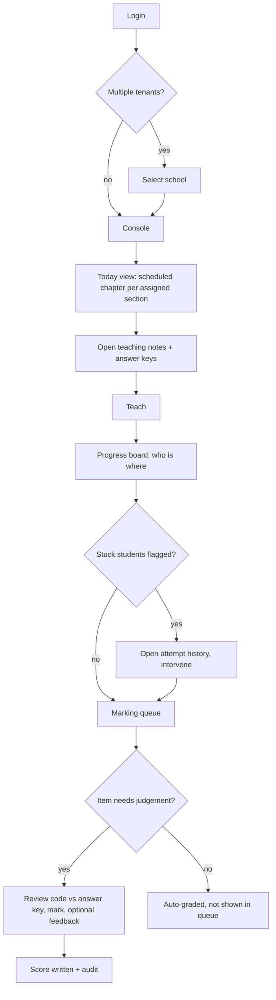
```mermaid
flowchart TD
    A[Login] --> B{Multiple tenants?}
    B -- yes --> C[Select school]
    B -- no --> D[Console]
    C --> D
    D --> E[Today view: scheduled chapter per assigned section]
    E --> F[Open teaching notes + answer keys]
    F --> G[Teach]
    G --> H[Progress board: who is where]
    H --> I{Stuck students flagged?}
    I -- yes --> J[Open attempt history, intervene]
    I -- no --> K[Marking queue]
    J --> K
    K --> L{Item needs judgement?}
    L -- yes --> M[Review code vs answer key, mark, optional feedback]
    L -- no --> N[Auto-graded, not shown in queue]
    M --> O[Score written + audit]
```

### 6.2 Multi-school switching

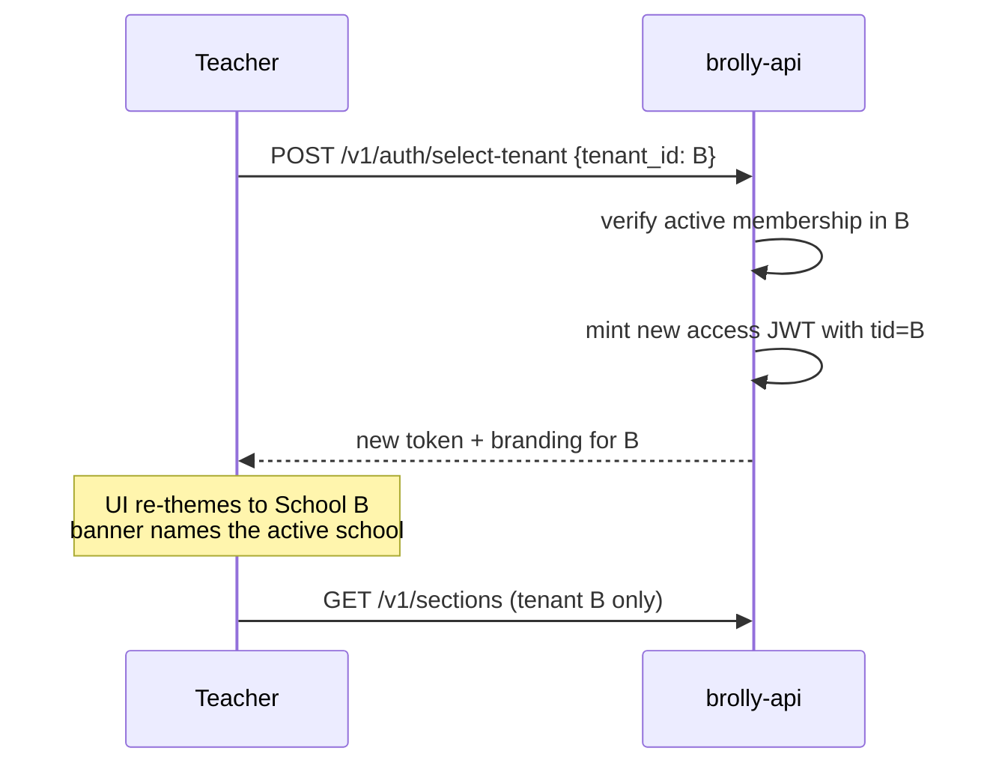
```mermaid
sequenceDiagram
    participant T as Teacher
    participant A as brolly-api
    T->>A: POST /v1/auth/select-tenant {tenant_id: B}
    A->>A: verify active membership in B
    A->>A: mint new access JWT with tid=B
    A-->>T: new token + branding for B
    Note over T: UI re-themes to School B<br/>banner names the active school
    T->>A: GET /v1/sections (tenant B only)
```

If the teacher's client holds a stale tenant-A resource identifier and requests it while in tenant B, RLS returns nothing and the API responds 404 — the wrong school's class is not merely hidden, it is unreachable.

### 6.3 Marking with override

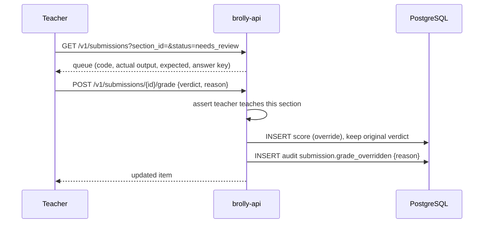
```mermaid
sequenceDiagram
    participant T as Teacher
    participant A as brolly-api
    participant D as PostgreSQL
    T->>A: GET /v1/submissions?section_id=&status=needs_review
    A-->>T: queue (code, actual output, expected, answer key)
    T->>A: POST /v1/submissions/{id}/grade {verdict, reason}
    A->>A: assert teacher teaches this section
    A->>D: INSERT score (override), keep original verdict
    A->>D: INSERT audit submission.grade_overridden {reason}
    A-->>T: updated item
```

The original auto-verdict is never deleted. A parent or School Admin asking why a mark changed can be answered from the record.

---

## 7. School Admin Journey

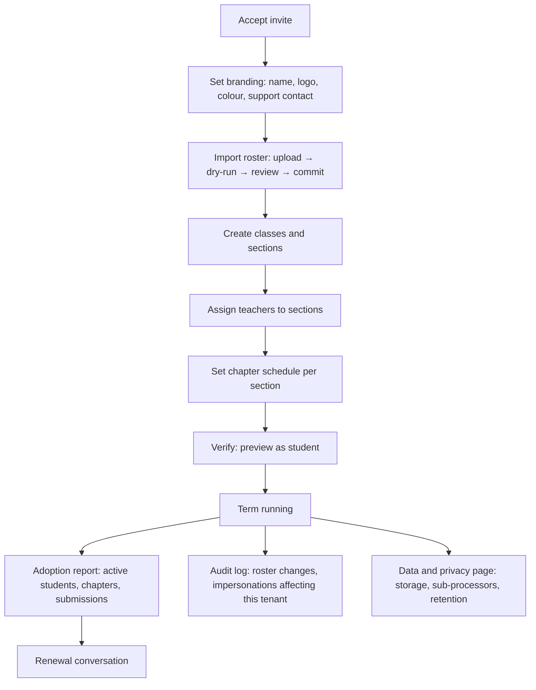
```mermaid
flowchart TD
    A[Accept invite] --> B[Set branding: name, logo, colour, support contact]
    B --> C[Import roster: upload → dry-run → review → commit]
    C --> D[Create classes and sections]
    D --> E[Assign teachers to sections]
    E --> F[Set chapter schedule per section]
    F --> G[Verify: preview as student]
    G --> H[Term running]
    H --> I[Adoption report: active students, chapters, submissions]
    H --> J[Audit log: roster changes, impersonations affecting this tenant]
    H --> K[Data and privacy page: storage, sub-processors, retention]
    I --> L[Renewal conversation]
```

**Preview-as-student** is a read-only rendering of what a named section sees today. It is not impersonation and creates no session for that student; it exists because the most common onboarding error is a schedule that releases nothing, and the admin should be able to see that before the lesson rather than during it.

---

## 8. Brolly Admin Journey

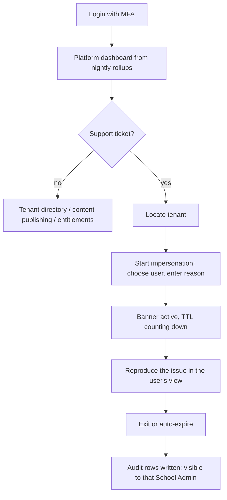
```mermaid
flowchart TD
    A[Login with MFA] --> B[Platform dashboard from nightly rollups]
    B --> C{Support ticket?}
    C -- no --> D[Tenant directory / content publishing / entitlements]
    C -- yes --> E[Locate tenant]
    E --> F[Start impersonation: choose user, enter reason]
    F --> G[Banner active, TTL counting down]
    G --> H[Reproduce the issue in the user's view]
    H --> I[Exit or auto-expire]
    I --> J[Audit rows written; visible to that School Admin]
```

Constraints made visible in the UI: the dashboard states its rollup timestamp so nobody mistakes it for live data; impersonation cannot start without a reason; graded and financial writes are refused while impersonating.

---

## 9. Content Management Flow

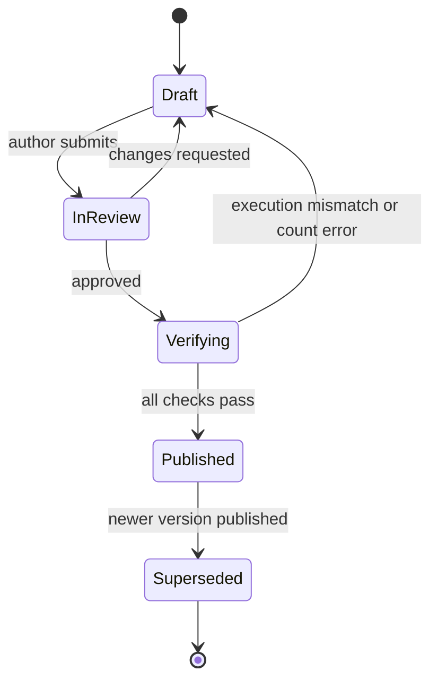
```mermaid
stateDiagram-v2
    [*] --> Draft
    Draft --> InReview: author submits
    InReview --> Draft: changes requested
    InReview --> Verifying: approved
    Verifying --> Draft: execution mismatch or count error
    Verifying --> Published: all checks pass
    Published --> Superseded: newer version published
    Superseded --> [*]
```

### 9.1 Publish pipeline

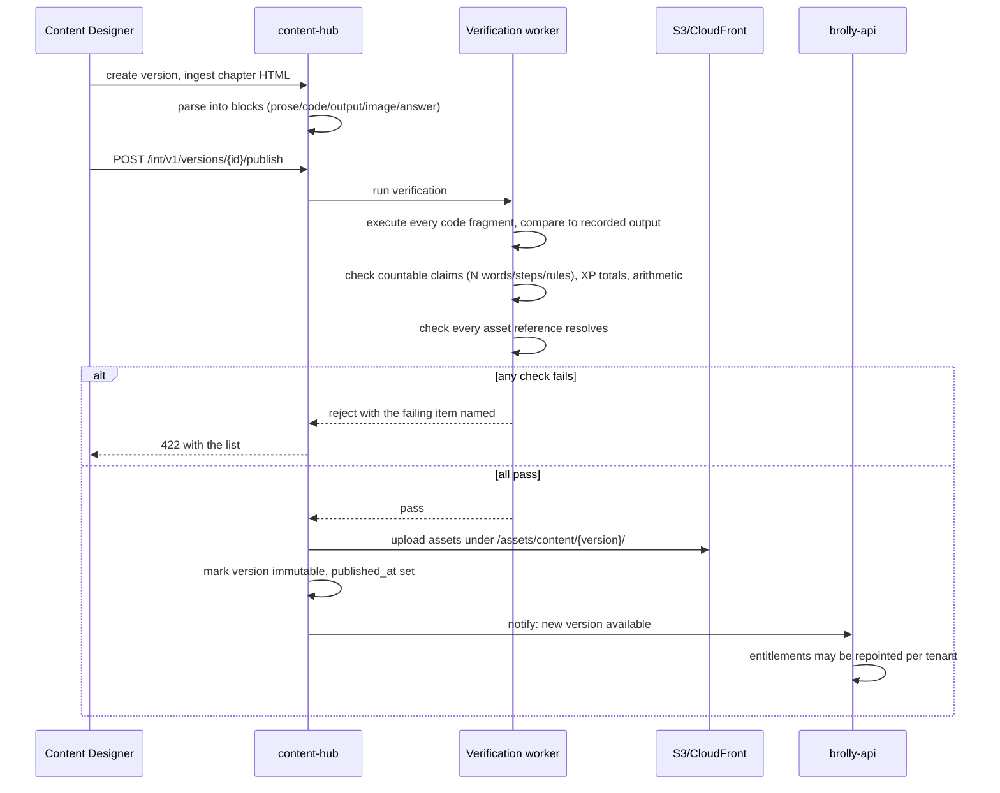
```mermaid
sequenceDiagram
    participant CD as Content Designer
    participant H as content-hub
    participant W as Verification worker
    participant S3 as S3/CloudFront
    participant A as brolly-api

    CD->>H: create version, ingest chapter HTML
    H->>H: parse into blocks (prose/code/output/image/answer)
    CD->>H: POST /int/v1/versions/{id}/publish
    H->>W: run verification
    W->>W: execute every code fragment, compare to recorded output
    W->>W: check countable claims (N words/steps/rules), XP totals, arithmetic
    W->>W: check every asset reference resolves
    alt any check fails
        W-->>H: reject with the failing item named
        H-->>CD: 422 with the list
    else all pass
        W-->>H: pass
        H->>S3: upload assets under /assets/content/{version}/
        H->>H: mark version immutable, published_at set
        H->>A: notify: new version available
        A->>A: entitlements may be repointed per tenant
    end
```

**Why verification is a gate and not a checklist.** The textbook series previously shipped two defects that survived human review and were found only by mechanical checking. Countable claims, arithmetic and XP totals are checked independently of prose reading, because reading prose does not catch a word-search grid that is missing a word.

### 9.2 Correction rollout

A correction creates version *n+1*. Tenants are repointed by entitlement update — immediately for a factual error, at term boundary for a pedagogical change. Because asset URLs contain the version, no cache invalidation is needed, and two tenants can legitimately sit on different versions during a term without conflict.

---

## 10. Assessment Flow

```mermaid
stateDiagram-v2
    [*] --> NotStarted
    NotStarted --> InProgress: attempt created
    InProgress --> InProgress: answers autosaved
    InProgress --> Submitted: student submits
    InProgress --> Submitted: time limit reached (auto-submit)
    Submitted --> AutoGraded: objective items scored
    AutoGraded --> NeedsReview: any subjective or flagged item
    AutoGraded --> Released: fully objective
    NeedsReview --> Released: teacher marks
    Released --> [*]
```

### 10.1 Attempt sequence

```mermaid
sequenceDiagram
    participant S as Student
    participant A as brolly-api
    participant D as PostgreSQL
    S->>A: POST /v1/assessments/{id}/attempts
    A->>A: check release, attempt limit, consent
    A->>D: INSERT attempt (in_progress, started_at)
    A-->>S: questions (no correct answers in payload)
    loop each question
        S->>A: PATCH /v1/attempts/{id}/answers
        A->>D: upsert answer, autosave
    end
    S->>A: POST /v1/attempts/{id}/submit
    A->>D: UPDATE attempt (submitted_at)
    A->>A: score objective items
    A->>D: INSERT score, UPDATE progress
    A->>D: INSERT audit assessment.submitted
    A-->>S: result if fully objective, else "with your teacher"
```

**Rules:** correct answers are never sent to the client before submission; the attempt limit is enforced server-side; a disconnected student resumes the same attempt rather than starting a new one; the server clock governs time limits.

### 10.2 Class 9 practical-file tracking

```mermaid
flowchart LR
    A[Official 417 programme list] --> B[Programme 1..24 as tracked items]
    B --> C[Student completes a programme]
    C --> D[Marked complete with date]
    D --> E[Progress card: N of the required minimum]
    E --> F{Minimum reached?}
    F -- yes --> G[File readiness indicator]
    F -- no --> H[Outstanding list, ordered by group]
```

The tracker follows the official numbering so a student's in-platform record and their physical practical file agree, which is the artefact actually assessed.

---

## 11. Assignment Flow

```mermaid
sequenceDiagram
    participant T as Teacher
    participant A as brolly-api
    participant S as Student
    participant D as PostgreSQL

    T->>A: POST /v1/assignments {section_id, chapter_id, items, due_at}
    A->>A: validate entitlement + release
    A->>D: INSERT assignment + assignment_targets (per student)
    A->>D: enqueue notification task (TenantTask)
    S->>A: GET /v1/assignments (mine, open)
    S->>A: POST /v1/submissions (linked to assignment item)
    A->>D: submission linked to assignment
    T->>A: GET /v1/assignments/{id}/status
    A-->>T: submitted / not started / late, per student
    T->>A: POST /v1/assignments/{id}/close
```

**Rules:** an assignment cannot reference a chapter the section has not been released; late submissions are accepted and flagged rather than blocked, because the pedagogical cost of a hard block on a 12-year-old outweighs the administrative benefit; removing a student from a section preserves their assignment history.

---

## 12. Notification Flow

```mermaid
flowchart TD
    A[Domain event] --> B[Notification task, TenantTask]
    B --> C[Resolve recipients by role + scope]
    C --> D{Consent + preference allows this channel?}
    D -- no --> E[Drop, log suppression reason]
    D -- yes --> F{Channel}
    F -- in-app --> G[INSERT notification row]
    F -- push --> H[Expo Push to registered devices]
    F -- email --> I[Templated, tenant-branded]
    H --> J{Token invalid?}
    J -- yes --> K[Mark device inactive]
    G --> L[Badge count on next fetch]
```

| Event | Recipients | Channels |
|---|---|---|
| Assignment created | Students in section | in-app, push |
| Assignment due tomorrow | Students with nothing submitted | in-app, push |
| Submission graded | Student | in-app |
| Roster import complete | School Admin | in-app, email |
| Content version available | Brolly Admin, School Admin | in-app |
| Consent expiring | Guardian | email |
| Payment failed | Guardian | email |
| Impersonation in your tenant | School Admin | in-app |

**Constraints:** no notification is timed or tuned to maximise a child's engagement; quiet hours 21:00–07:00 tenant-local for student channels; every push payload is content-free beyond a title and a deep link, so a lock screen never displays a child's marks.

---

## 13. Tenant Onboarding Flow

```mermaid
sequenceDiagram
    autonumber
    participant F as Founder
    participant BA as Brolly Admin
    participant SA as School Admin
    participant ENG as Engineering
    participant API as brolly-api

    F->>BA: signed contract, deployment class, entitlement scope
    BA->>API: POST /v1/admin/tenants
    API->>API: create tenant (provisioning), default settings
    BA->>API: POST /v1/admin/tenants/{id}/entitlements
    BA->>API: POST /v1/memberships/invites (School Admin)
    SA->>API: accept invite, set password
    SA->>API: PUT /v1/branding
    SA->>API: roster import (dry-run → commit)
    SA->>API: classes, sections, teacher assignments, schedule
    SA->>API: preview as student
    BA->>API: PATCH tenant status = active
    ENG->>ENG: add flavour to EAS matrix, build, submit (unlisted)
    Note over ENG: Play review is the long pole — start before everything else
```

### 13.1 Onboarding checklist (target ≤ 8 hours by the third school)

| # | Step | Owner | Blocking |
|---|---|---|---|
| 1 | Contract, deployment class, payer model | Founder | yes |
| 2 | Tenant created + entitlements granted | Brolly Admin | yes |
| 3 | School Admin invited and active | Brolly Admin | yes |
| 4 | Branding configured | School Admin | yes |
| 5 | Roster imported and reconciled | School Admin | yes |
| 6 | Classes, sections, teachers assigned | School Admin | yes |
| 7 | Schedule set and previewed | School Admin | yes |
| 8 | Flavour added, built, submitted | Engineering | app only |
| 9 | Teacher walkthrough (60 min) | Brolly | no |
| 10 | Go-live and first-week check-in | Account owner | no |

### 13.2 Class B (isolated) variation

Steps 2 onward run against the isolated database. Additional steps: provision the dedicated RDS instance and KMS key, register the connection alias, run migrations against it in the same pipeline stage, verify the isolation suite against the new instance, and confirm the backup plan is attached. Nothing about the application changes.

---

## 14. Teacher Allocation Flow

```mermaid
flowchart TD
    A[Need: section requires a teacher] --> B{School-employed or Brolly-supplied?}
    B -- School --> C[School Admin invites teacher into tenant]
    B -- Brolly --> D{Teacher already a Brolly user?}
    D -- yes --> E[Add Membership to this tenant<br/>same global User]
    D -- no --> F[Create User, add Membership]
    C --> G[Assign to sections]
    E --> G
    F --> G
    G --> H{Delegate schedule:write?}
    H -- yes --> I[Set delegation flag on membership]
    H -- no --> J[Teacher has read-only schedule]
    I --> K[Teacher sees section in today view]
    J --> K
    K --> L{Teacher leaves the school?}
    L -- yes --> M[Deactivate Membership in this tenant only]
    M --> N[Other tenants unaffected; perm_v bumped;<br/>access lost on next request]
```

```mermaid
sequenceDiagram
    participant SA as School Admin
    participant A as brolly-api
    participant D as PostgreSQL
    SA->>A: POST /v1/sections/{id}/teachers {user_id}
    A->>A: verify user has active Teacher membership in this tenant
    A->>D: INSERT teacher_assignment
    A->>D: INSERT audit section.teacher_assigned
    A->>A: bump tenant perm_v (cache invalidation)
    A-->>SA: 201
```

**Rule:** a teacher cannot be assigned to a section without an existing membership in that tenant. There is no implicit membership creation on assignment, because an implicitly created membership is one nobody reviews.

---

## 15. Payment Flow

**Status:** the B2B payer decision (PRD §20.4 Q4) is open. Two flows are specified; only one ships.

### 15.1 B2C — guardian pays (confirmed)

```mermaid
sequenceDiagram
    participant G as Guardian
    participant M as Marketing site (web)
    participant A as brolly-api
    participant P as Gateway
    participant D as PostgreSQL

    G->>M: select plan
    M->>A: POST /v1/checkout-sessions (Idempotency-Key)
    A->>D: INSERT payment_intent (pending)
    A->>P: create session
    P-->>G: hosted payment page
    G->>P: pay
    P->>A: webhook payment.succeeded (signed)
    A->>A: verify signature, check idempotency
    A->>D: INSERT payment, invoice; UPDATE subscription active
    A->>D: activate entitlement
    A->>D: INSERT audit payment.succeeded
    A-->>G: email receipt + access
```

**Failure and edge paths:** signature invalid → 400, alarm, no state change; duplicate webhook → 200 no-op; payment succeeded but account creation failed → reconciliation job completes it and alarms; refund → credit note, entitlement end-dated, completed work retained; renewal failure → grace period, then new content release suspended while completed work and the practical file remain accessible (BR-COM-05).

### 15.2 B2B — school pays (recommended)

```mermaid
flowchart LR
    A[Term start] --> B[Seat snapshot: active Student memberships]
    B --> C[Invoice generated per tenant]
    C --> D[Sent to school finance]
    D --> E{Paid?}
    E -- yes --> F[Entitlement extended]
    E -- no --> G[Grace period + escalation to account owner]
    G --> H[Suspend new releases; retain existing work]
```

No payment surface appears in a school app (BR-BRD-05, FR-MOB-05). This is what keeps five child-directed white-label apps out of the hardest part of Play review.

### 15.3 B2B — parent pays (contingency, not recommended)

If required: the checkout runs on the **web**, under the Brolly brand, outside the school app. The school app remains consumption-only, and the guardian's consent record inside the school tenant carries `fiduciary_role` reflecting the split relationship. This is the reason `fiduciary_role` is stored per consent row rather than derived from the tenant type — the derivation would be wrong the first time a school tenant contains a directly-billed parent.

---

## 16. Cross-Cutting Flows

### 16.1 Consent lifecycle

```mermaid
stateDiagram-v2
    [*] --> NotGranted
    NotGranted --> Granted: guardian/school grants (evidence recorded)
    Granted --> Granted: new purpose appended (new row)
    Granted --> Withdrawn: withdrawal event appended
    Withdrawn --> Suspended: access suspended within one request cycle
    Suspended --> ErasureScheduled: retention window applied
    ErasureScheduled --> Erased: job executes
    Erased --> [*]
    Granted --> Expired: policy version superseded
    Expired --> Granted: re-consent to new version
```

### 16.2 Roster import

```mermaid
flowchart TD
    A[Upload CSV] --> B[Schema validation]
    B --> C{Valid columns?}
    C -- no --> D[422 with column diagnosis]
    C -- yes --> E[Row validation + match against existing]
    E --> F[Dry-run report: create N, update M, skip K, errors E]
    F --> G{Errors present?}
    G -- yes --> H[Block commit; per-row error file]
    G -- no --> I[Admin confirms]
    I --> J[Single transaction: users, memberships, section_members]
    J --> K{Transaction succeeds?}
    K -- no --> L[Full rollback; nothing applied]
    K -- yes --> M[Audit + notification + credential sheet generated]
```

All-or-nothing per file (BR-SCH-01). A partially applied roster is worse than a rejected one, because the admin cannot tell which half succeeded.

### 16.3 Data subject request

```mermaid
sequenceDiagram
    participant R as Requester (Guardian/School)
    participant A as brolly-api
    participant W as Worker
    participant S3 as S3
    R->>A: POST /v1/data-requests {type: export|erasure, subject}
    A->>A: verify requester's right over the subject
    A->>A: INSERT data_request (received) + audit
    A->>W: enqueue (TenantTask)
    W->>W: gather person-scoped rows across tables
    alt export
        W->>S3: write encrypted archive
        W-->>R: signed download link, 72 h expiry
    else erasure
        W->>W: apply retention exceptions (statutory, financial)
        W->>W: delete or irreversibly pseudonymise
        W-->>R: completion notice with what was retained and why
    end
    W->>A: mark complete + audit
```

---

## 17. Flow-to-Requirement Traceability

| Flow | PRD requirements | Acceptance criteria |
|---|---|---|
| Login (§3) | FR-IAM-04, 05, 08, 10 | US-TE-02, US-ST-04 |
| Signup (§4) | FR-CON-05, FR-IAM-09 | US-GU-01 |
| Student journey (§5) | FR-LRN-01…09, FR-CODE-01…07 | US-ST-01…03 |
| Teacher journey (§6) | FR-TCH-01…07, FR-ASM-03 | US-TE-01, 03, 04 |
| School Admin (§7) | FR-SAD-01…07 | US-SA-01…04 |
| Brolly Admin (§8) | FR-BAD-01…07, FR-IAM-07 | US-BA-01…03 |
| Content (§9) | FR-CH-01…10 | US-BA-04 |
| Assessment (§10) | FR-ASM-01…06 | AC-G-08 |
| Assignment (§11) | FR-TCH-06, FR-ENT-04 | — |
| Notification (§12) | FR-BRD-04, FR-CON-07 | AC-G-06 |
| Tenant onboarding (§13) | FR-TEN-06, 07, FR-BRD-01 | US-BA-01 |
| Teacher allocation (§14) | FR-IAM-02, 03, 08 | US-TE-02 |
| Payment (§15) | FR-MOB-05, BR-COM-* | AC-G-07 |
| Consent (§16.1) | FR-CON-01…11 | US-GU-01, AC-G-05 |
