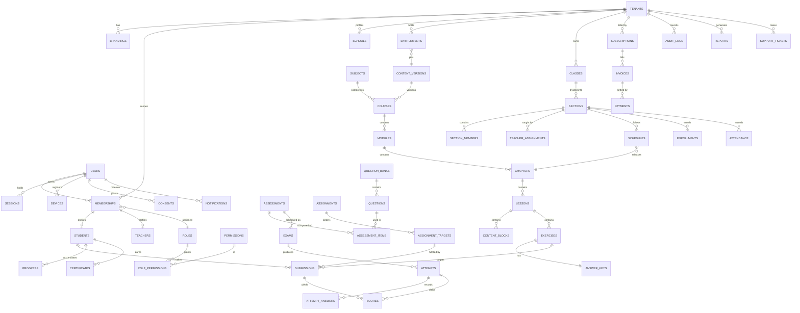
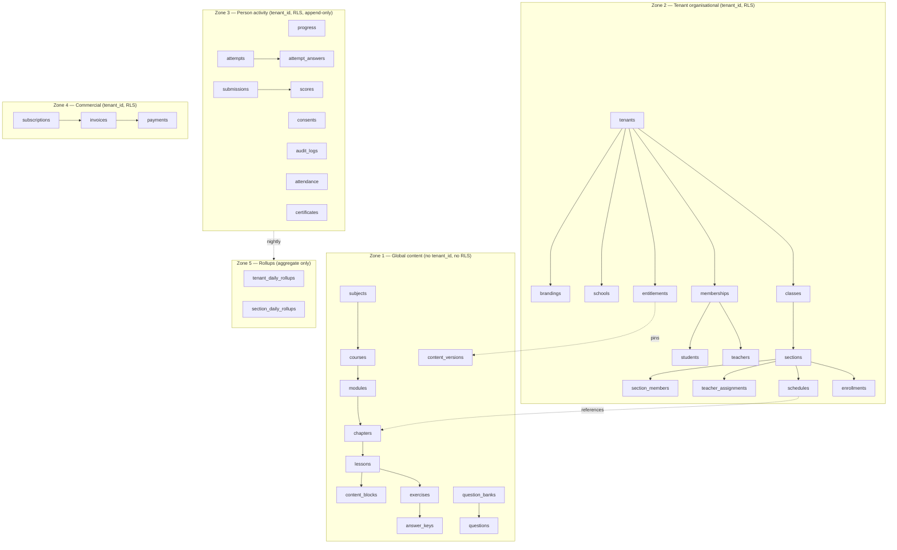

# Brolly Juniors — Backend Schema Document

**Version:** 1.0
**Date:** 2 September 2026
**Owner:** Database Architect
**Target:** PostgreSQL 16 (Amazon RDS, `ap-south-1`)
**Audience:** Engineering · DBA · DevOps · QA · Security

This document is implementation-ready. The DDL in §5 is the source of truth for the initial migration set. Where a decision depends on an open business question, the dependency is stated inline rather than guessed.

---

## 1. Design Principles

1. **`tenant_id` is not optional.** Every tenant-owned table declares `tenant_id uuid NOT NULL` and carries an RLS policy. There is no "we'll add it later" table.
2. **Tenant integrity is enforced by composite foreign keys.** A child row cannot reference a parent in another tenant, because the FK includes `tenant_id` on both sides. Application code cannot create that inconsistency even by mistake.
3. **Content carries no tenant.** Course, chapter, lesson, block, exercise, question and answer-key tables have no `tenant_id` and no RLS. Tenancy attaches to entitlement and schedule.
4. **Append-only where it matters.** `consents`, `audit_logs`, `attempts`, `payments` and `invoices` reject `UPDATE`/`DELETE` from the application role. History is a feature, not a side effect.
5. **UUIDv7 primary keys.** Time-ordered UUIDs give the index locality of a bigserial without leaking a global row count and without collisions across the shared and isolated deployment classes.
6. **Soft delete only where the domain needs recovery.** `deleted_at` on organisational rows; hard delete on nothing that has a legal retention obligation until the retention job says so.
7. **Every tenant-scoped index leads with `tenant_id`.** Without that, the planner scans other tenants' rows and discards them under RLS.
8. **Timestamps are `timestamptz`, stored UTC.** Tenant timezone is applied at render and at schedule evaluation, never in storage.
9. **Money is `numeric(12,2)` with an explicit currency column.** Never float.

### 1.1 Naming conventions

| Object | Convention | Example |
|---|---|---|
| Table | plural snake_case | `section_members` |
| Column | singular snake_case | `released_at` |
| Primary key | `id` | |
| Foreign key | `<referenced_singular>_id` | `section_id` |
| Index | `ix_<table>__<cols>` | `ix_submissions__tenant_section_status` |
| Unique index | `uq_<table>__<cols>` | `uq_memberships__tenant_user_active` |
| Check | `ck_<table>__<rule>` | `ck_invoices__total_non_negative` |
| Foreign key constraint | `fk_<table>__<target>` | `fk_sections__classes` |
| Partitioned child | `<table>_p<yyyymm>` | `attempts_p202609` |

### 1.2 Shared extensions and enums

```sql
CREATE EXTENSION IF NOT EXISTS pgcrypto;      -- gen_random_uuid, digest
CREATE EXTENSION IF NOT EXISTS pg_trgm;       -- name search
CREATE EXTENSION IF NOT EXISTS btree_gist;    -- exclusion constraints on ranges
CREATE EXTENSION IF NOT EXISTS pg_stat_statements;

-- UUIDv7 helper (until native support); time-ordered, index friendly
CREATE OR REPLACE FUNCTION uuid_generate_v7() RETURNS uuid AS $$
  SELECT encode(
    set_bit(set_bit(overlay(uuid_send(gen_random_uuid())
      PLACING substring(int8send(floor(extract(epoch FROM clock_timestamp())*1000)::bigint) FROM 3)
      FROM 1 FOR 6), 52, 1), 53, 1), 'hex')::uuid;
$$ LANGUAGE sql VOLATILE;

CREATE TYPE tenant_channel      AS ENUM ('b2c','b2b');
CREATE TYPE tenant_status       AS ENUM ('provisioning','active','suspended','archived');
CREATE TYPE deployment_class    AS ENUM ('shared','isolated');
CREATE TYPE membership_role     AS ENUM ('school_admin','teacher','student','guardian');
CREATE TYPE membership_status   AS ENUM ('invited','active','suspended','revoked');
CREATE TYPE fiduciary_role      AS ENUM ('brolly_as_fiduciary','school_as_fiduciary');
CREATE TYPE consent_purpose     AS ENUM ('service_delivery','assessment_records','guardian_reporting','transactional_comms','support_access');
CREATE TYPE content_status      AS ENUM ('draft','in_review','verifying','published','superseded');
CREATE TYPE track_type          AS ENUM ('python','ai');
CREATE TYPE block_type          AS ENUM ('prose','code','output','image','answer_box','callout','table','quiz_ref');
CREATE TYPE exercise_kind       AS ENUM ('practice','graded','practical_file');
CREATE TYPE question_type       AS ENUM ('mcq','multi_select','short_text','predict_output','code');
CREATE TYPE attempt_status      AS ENUM ('in_progress','submitted','auto_graded','needs_review','released','abandoned');
CREATE TYPE submission_status   AS ENUM ('queued','running','passed','failed','timeout','error','needs_review','graded');
CREATE TYPE progress_state      AS ENUM ('not_started','in_progress','complete');
CREATE TYPE enrollment_status   AS ENUM ('active','completed','withdrawn');
CREATE TYPE attendance_status   AS ENUM ('present','absent','late','excused');
CREATE TYPE notification_channel AS ENUM ('in_app','push','email','sms');
CREATE TYPE device_platform     AS ENUM ('android','ios','web');
CREATE TYPE subscription_status AS ENUM ('trialing','active','past_due','suspended','cancelled');
CREATE TYPE payment_status      AS ENUM ('pending','succeeded','failed','refunded');
CREATE TYPE invoice_status      AS ENUM ('draft','issued','paid','void','credited');
CREATE TYPE ticket_status       AS ENUM ('open','in_progress','waiting_customer','resolved','closed');
CREATE TYPE ticket_priority     AS ENUM ('low','normal','high','urgent');
CREATE TYPE schedule_mode       AS ENUM ('date_driven','self_paced');
```

---

## 2. ER Diagram

### 2.1 Full entity relationship model



### 2.2 Zone view



---

## 3. Multi-Tenant Strategy

### 3.1 Model chosen and rejected alternatives

| Model | Verdict | Reason |
|---|---|---|
| Database per tenant | Rejected | 5 developers cannot run N migration targets; content would be duplicated N times; cross-tenant reporting becomes an ETL project |
| Schema per tenant | Rejected | Migration fan-out and `search_path` fragility; connection pooling becomes tenant-aware |
| **Shared database, shared schema, `tenant_id` + RLS** | **Chosen** | One migration, one content copy, isolation enforced by the database rather than by every developer remembering a `WHERE` clause |
| Hybrid: shared + isolated instance for contracted tenants | **Chosen as the exception** | Satisfies a contractual separation requirement without paying its cost for every tenant |

### 3.2 The isolation contract

```sql
-- Applied to EVERY tenant-owned table by a generated migration.
ALTER TABLE %I ENABLE ROW LEVEL SECURITY;
ALTER TABLE %I FORCE  ROW LEVEL SECURITY;

CREATE POLICY tenant_isolation ON %I
  USING      (tenant_id = NULLIF(current_setting('app.tenant_id', true), '')::uuid)
  WITH CHECK (tenant_id = NULLIF(current_setting('app.tenant_id', true), '')::uuid);
```

`NULLIF(..., '')` is the load-bearing detail: an unset GUC yields `NULL`, `tenant_id = NULL` is never true, and an unscoped query therefore returns **zero rows** rather than **all rows**. A system that fails open here fails catastrophically and silently.

### 3.3 Roles

```sql
CREATE ROLE brolly_owner    LOGIN;                       -- migrations only
CREATE ROLE brolly_app      LOGIN NOSUPERUSER NOBYPASSRLS NOCREATEDB NOCREATEROLE;
CREATE ROLE brolly_platform LOGIN NOSUPERUSER NOBYPASSRLS;  -- rollups + tenant directory only
CREATE ROLE brolly_readonly LOGIN NOSUPERUSER NOBYPASSRLS;

GRANT SELECT, INSERT, UPDATE, DELETE ON ALL TABLES IN SCHEMA public TO brolly_app;
REVOKE UPDATE, DELETE ON audit_logs, consents, attempts, payments, invoices FROM brolly_app;
GRANT SELECT ON tenants, tenant_daily_rollups, section_daily_rollups TO brolly_platform;
ALTER ROLE brolly_app SET statement_timeout = '5s';
ALTER ROLE brolly_readonly SET statement_timeout = '30s';
```

CI assertion, run on every build:

```sql
SELECT rolname, rolsuper, rolbypassrls FROM pg_roles WHERE rolname = 'brolly_app';
-- must return: brolly_app | f | f

-- every tenant-owned table must be covered
SELECT c.relname FROM pg_class c JOIN pg_namespace n ON n.oid=c.relnamespace
WHERE n.nspname='public' AND c.relkind='r'
  AND EXISTS (SELECT 1 FROM information_schema.columns
              WHERE table_name=c.relname AND column_name='tenant_id')
  AND (NOT c.relrowsecurity OR NOT c.relforcerowsecurity);
-- must return zero rows
```

### 3.4 Composite foreign keys for tenant integrity

Every tenant-owned table declares a redundant unique key on `(id, tenant_id)`, and children reference the pair. This makes a cross-tenant reference impossible at the storage layer.

```sql
ALTER TABLE sections  ADD CONSTRAINT uq_sections__id_tenant  UNIQUE (id, tenant_id);
ALTER TABLE section_members
  ADD CONSTRAINT fk_section_members__sections
  FOREIGN KEY (section_id, tenant_id) REFERENCES sections (id, tenant_id) ON DELETE CASCADE;
```

The extra unique index costs storage. The alternative costs a cross-tenant data incident, which ends the B2B channel.

### 3.5 Immutability of `tenant_id`

```sql
CREATE OR REPLACE FUNCTION forbid_tenant_change() RETURNS trigger AS $$
BEGIN
  IF NEW.tenant_id IS DISTINCT FROM OLD.tenant_id THEN
    RAISE EXCEPTION 'tenant_id is immutable (table %, row %)', TG_TABLE_NAME, OLD.id;
  END IF;
  RETURN NEW;
END $$ LANGUAGE plpgsql;
-- attached BEFORE UPDATE on every tenant-owned table by the generated migration
```

---

## 4. Table Catalogue

Per-table metadata. DDL follows in §5. `RLS` = tenant policy applied. `Audit` = rows written to `audit_logs` on change. Retention is defined in §9.

| # | Table | Zone | tenant_id | RLS | Partition | Audit | Purpose |
|---|---|---|---|---|---|---|---|
| 1 | `tenants` | Org | — (is the tenant) | platform | no | ✔ | The isolation boundary. B2C is row #1. |
| 2 | `brandings` | Org | ✔ | ✔ | no | ✔ | White-label identity resolved at runtime |
| 3 | `schools` | Org | ✔ | ✔ | no | ✔ | School profile: board, address, contacts |
| 4 | `users` | Identity | — (global) | none | no | ✔ | One row per human, platform-wide |
| 5 | `memberships` | Org | ✔ | ✔ | no | ✔ | The only grant of tenant access |
| 6 | `roles` | Org | ✔ nullable | ✔ | no | ✔ | System roles + per-tenant custom roles |
| 7 | `permissions` | Global | — | none | no | — | Permission catalogue |
| 8 | `role_permissions` | Org | ✔ nullable | ✔ | no | ✔ | Role→permission mapping |
| 9 | `students` | Org | ✔ | ✔ | no | ✔ | Student profile attached to a membership |
| 10 | `teachers` | Org | ✔ | ✔ | no | ✔ | Teacher profile attached to a membership |
| 11 | `classes` | Org | ✔ | ✔ | no | ✔ | Class level within a tenant (e.g. Class 7) |
| 12 | `sections` | Org | ✔ | ✔ | no | ✔ | Teaching group within a class |
| 13 | `section_members` | Org | ✔ | ✔ | no | ✔ | Student→section link |
| 14 | `teacher_assignments` | Org | ✔ | ✔ | no | ✔ | Teacher→section link, with delegation flag |
| 15 | `subjects` | Content | — | none | no | ✔ | Subject taxonomy (Python, AI) |
| 16 | `courses` | Content | — | none | no | ✔ | A class-level course in a track |
| 17 | `modules` | Content | — | none | no | ✔ | Term/part grouping within a course |
| 18 | `chapters` | Content | — | none | no | ✔ | The teaching unit; CBSE mapping lives here |
| 19 | `lessons` | Content | — | none | no | ✔ | Page-level unit inside a chapter |
| 20 | `content_blocks` | Content | — | none | no | — | Rendered body: prose, code, output, image |
| 21 | `exercises` | Content | — | none | no | ✔ | Practice / graded / practical-file items |
| 22 | `answer_keys` | Content | — | none | no | ✔ | Solution, explanation, expected output |
| 23 | `content_versions` | Content | — | none | no | ✔ | Immutable published version |
| 24 | `question_banks` | Content | — | none | no | ✔ | Reusable question pools |
| 25 | `questions` | Content | — | none | no | ✔ | Individual assessment questions |
| 26 | `entitlements` | Org | ✔ | ✔ | no | ✔ | Tenant's right to a course at a pinned version |
| 27 | `schedules` | Org | ✔ | ✔ | no | ✔ | Chapter release per section |
| 28 | `enrollments` | Org | ✔ | ✔ | no | ✔ | Student's enrolment in a course for a term |
| 29 | `assignments` | Org | ✔ | ✔ | no | ✔ | Teacher-set work with a due date |
| 30 | `assignment_targets` | Person | ✔ | ✔ | no | — | Per-student assignment state |
| 31 | `assessments` | Content | — | none | no | ✔ | Quiz/test definition |
| 32 | `assessment_items` | Content | — | none | no | — | Ordered questions within an assessment |
| 33 | `exams` | Org | ✔ | ✔ | no | ✔ | A scheduled sitting of an assessment |
| 34 | `attempts` | Person | ✔ | ✔ | **monthly** | ✔ | Append-only attempt records |
| 35 | `attempt_answers` | Person | ✔ | ✔ | **monthly** | — | Answers within an attempt |
| 36 | `submissions` | Person | ✔ | ✔ | **monthly** | ✔ | Code submissions and verdicts |
| 37 | `scores` | Person | ✔ | ✔ | no | ✔ | Final marks, including overrides |
| 38 | `progress` | Person | ✔ | ✔ | no | — | Per-student, per-chapter state and XP |
| 39 | `attendance` | Person | ✔ | ✔ | **monthly** | ✔ | Session attendance |
| 40 | `notifications` | Person | ✔ | ✔ | **monthly** | — | In-app notification inbox |
| 41 | `devices` | Person | ✔ | ✔ | no | ✔ | Push tokens per user per platform |
| 42 | `sessions` | Person | ✔ | ✔ | no | ✔ | Refresh tokens, device-bound |
| 43 | `consents` | Person | ✔ | ✔ | no | ✔ | Append-only consent ledger |
| 44 | `audit_logs` | Person | ✔ | ✔ | **monthly** | — (is the audit) | Immutable privileged-action record |
| 45 | `subscriptions` | Commercial | ✔ | ✔ | no | ✔ | Billing relationship |
| 46 | `invoices` | Commercial | ✔ | ✔ | no | ✔ | Immutable once issued |
| 47 | `payments` | Commercial | ✔ | ✔ | no | ✔ | Gateway transactions |
| 48 | `reports` | Org | ✔ | ✔ | no | ✔ | Generated report artefacts |
| 49 | `certificates` | Person | ✔ | ✔ | no | ✔ | Issued completion certificates |
| 50 | `support_tickets` | Org | ✔ | ✔ | no | ✔ | Support requests and their thread |
| 51 | `tenant_daily_rollups` | Rollup | ✔ | platform | no | — | Aggregates for cross-tenant dashboards |
| 52 | `section_daily_rollups` | Rollup | ✔ | ✔ | no | — | Aggregates for class reporting |

---

## 5. PostgreSQL DDL

Presented in dependency order. Every tenant-owned table is followed by its RLS block in §5.9; the policy is generated rather than hand-written per table so none is missed.

### 5.1 Tenancy and identity

```sql
-- 1. TENANTS ------------------------------------------------------------
CREATE TABLE tenants (
    id                uuid PRIMARY KEY DEFAULT uuid_generate_v7(),
    short_code        citext NOT NULL,
    name              text NOT NULL,
    legal_name        text,
    channel           tenant_channel NOT NULL,
    status            tenant_status NOT NULL DEFAULT 'provisioning',
    deployment_class  deployment_class NOT NULL DEFAULT 'shared',
    db_alias          text,                       -- non-null when isolated
    timezone          text NOT NULL DEFAULT 'Asia/Kolkata',
    locale            text NOT NULL DEFAULT 'en-IN',
    fiduciary_default fiduciary_role NOT NULL,
    settings          jsonb NOT NULL DEFAULT '{}'::jsonb,
    permission_version integer NOT NULL DEFAULT 1,
    contract_start    date,
    contract_end      date,
    created_at        timestamptz NOT NULL DEFAULT now(),
    updated_at        timestamptz NOT NULL DEFAULT now(),
    archived_at       timestamptz,
    CONSTRAINT uq_tenants__short_code UNIQUE (short_code),
    CONSTRAINT ck_tenants__isolated_alias
        CHECK (deployment_class = 'shared' OR db_alias IS NOT NULL),
    CONSTRAINT ck_tenants__contract_window
        CHECK (contract_end IS NULL OR contract_start IS NULL OR contract_end >= contract_start),
    CONSTRAINT ck_tenants__settings_object CHECK (jsonb_typeof(settings) = 'object')
);
CREATE INDEX ix_tenants__status_channel ON tenants (status, channel);
COMMENT ON TABLE tenants IS 'The isolation boundary. B2C is tenant #1 and is created by the same path as any school.';

-- 4. USERS (global, no tenant_id) ---------------------------------------
CREATE TABLE users (
    id                 uuid PRIMARY KEY DEFAULT uuid_generate_v7(),
    email              citext,
    phone              text,
    password_hash      text,
    display_name       text NOT NULL,
    is_platform_admin  boolean NOT NULL DEFAULT false,
    mfa_secret         bytea,
    mfa_enabled        boolean NOT NULL DEFAULT false,
    last_login_at      timestamptz,
    failed_login_count smallint NOT NULL DEFAULT 0,
    locked_until       timestamptz,
    must_change_credential boolean NOT NULL DEFAULT false,
    created_at         timestamptz NOT NULL DEFAULT now(),
    updated_at         timestamptz NOT NULL DEFAULT now(),
    deleted_at         timestamptz,
    CONSTRAINT uq_users__email UNIQUE (email),
    CONSTRAINT uq_users__phone UNIQUE (phone),
    CONSTRAINT ck_users__identity_present
        CHECK (email IS NOT NULL OR phone IS NOT NULL OR password_hash IS NULL),
    CONSTRAINT ck_users__admin_has_mfa
        CHECK (NOT is_platform_admin OR mfa_enabled)
);
CREATE INDEX ix_users__platform_admin ON users (is_platform_admin) WHERE is_platform_admin;
COMMENT ON COLUMN users.is_platform_admin IS
  'Brolly Admin is a platform flag. It is NEVER expressed as a membership row.';
COMMENT ON TABLE users IS
  'No date_of_birth column exists by design: class level is sufficient (DPDP data minimisation).';

-- 5. MEMBERSHIPS --------------------------------------------------------
CREATE TABLE memberships (
    id                 uuid NOT NULL DEFAULT uuid_generate_v7(),
    tenant_id          uuid NOT NULL REFERENCES tenants(id) ON DELETE RESTRICT,
    user_id            uuid NOT NULL REFERENCES users(id)   ON DELETE RESTRICT,
    role               membership_role NOT NULL,
    role_id            uuid,                                  -- optional custom role
    status             membership_status NOT NULL DEFAULT 'invited',
    roster_identifier  citext,                                -- students: school roll number
    credential_hash    text,                                  -- student PIN, Argon2id
    can_manage_schedule boolean NOT NULL DEFAULT false,       -- delegation flag
    invited_by         uuid REFERENCES users(id),
    invited_at         timestamptz,
    activated_at       timestamptz,
    revoked_at         timestamptz,
    created_at         timestamptz NOT NULL DEFAULT now(),
    updated_at         timestamptz NOT NULL DEFAULT now(),
    PRIMARY KEY (id),
    CONSTRAINT uq_memberships__id_tenant UNIQUE (id, tenant_id),
    CONSTRAINT ck_memberships__student_roster
        CHECK (role <> 'student' OR roster_identifier IS NOT NULL),
    CONSTRAINT ck_memberships__revoked_time
        CHECK (status <> 'revoked' OR revoked_at IS NOT NULL)
);
CREATE UNIQUE INDEX uq_memberships__tenant_user_active
    ON memberships (tenant_id, user_id) WHERE status IN ('invited','active','suspended');
CREATE UNIQUE INDEX uq_memberships__tenant_roster
    ON memberships (tenant_id, roster_identifier)
    WHERE roster_identifier IS NOT NULL AND status <> 'revoked';
CREATE INDEX ix_memberships__tenant_role_status ON memberships (tenant_id, role, status);
CREATE INDEX ix_memberships__user ON memberships (user_id) WHERE status = 'active';
COMMENT ON TABLE memberships IS
  'The only grant of tenant access. A Brolly-supplied teacher holds one row per school on ONE user.';

-- 6/7/8. ROLES, PERMISSIONS, ROLE_PERMISSIONS ---------------------------
CREATE TABLE permissions (
    id          uuid PRIMARY KEY DEFAULT uuid_generate_v7(),
    code        text NOT NULL,          -- resource:action[:qualifier]
    description text NOT NULL,
    is_platform boolean NOT NULL DEFAULT false,
    CONSTRAINT uq_permissions__code UNIQUE (code),
    CONSTRAINT ck_permissions__code_shape CHECK (code ~ '^[a-z_]+:[a-z_]+(:[a-z_]+)?$')
);

CREATE TABLE roles (
    id          uuid NOT NULL DEFAULT uuid_generate_v7(),
    tenant_id   uuid REFERENCES tenants(id) ON DELETE CASCADE,  -- NULL = system role
    code        text NOT NULL,
    name        text NOT NULL,
    is_system   boolean NOT NULL DEFAULT false,
    created_at  timestamptz NOT NULL DEFAULT now(),
    PRIMARY KEY (id),
    CONSTRAINT ck_roles__system_has_no_tenant CHECK (NOT is_system OR tenant_id IS NULL)
);
CREATE UNIQUE INDEX uq_roles__scope_code
    ON roles (COALESCE(tenant_id, '00000000-0000-0000-0000-000000000000'::uuid), code);

CREATE TABLE role_permissions (
    role_id       uuid NOT NULL REFERENCES roles(id) ON DELETE CASCADE,
    permission_id uuid NOT NULL REFERENCES permissions(id) ON DELETE RESTRICT,
    tenant_id     uuid REFERENCES tenants(id) ON DELETE CASCADE,
    PRIMARY KEY (role_id, permission_id)
);
CREATE INDEX ix_role_permissions__tenant ON role_permissions (tenant_id);

ALTER TABLE memberships
  ADD CONSTRAINT fk_memberships__roles FOREIGN KEY (role_id) REFERENCES roles(id);

-- 42. SESSIONS (refresh tokens) -----------------------------------------
CREATE TABLE sessions (
    id             uuid NOT NULL DEFAULT uuid_generate_v7(),
    tenant_id      uuid NOT NULL REFERENCES tenants(id) ON DELETE CASCADE,
    user_id        uuid NOT NULL REFERENCES users(id) ON DELETE CASCADE,
    refresh_hash   bytea NOT NULL,
    device_id      uuid,
    user_agent     text,
    ip_hash        bytea,                       -- hashed, never raw
    issued_at      timestamptz NOT NULL DEFAULT now(),
    expires_at     timestamptz NOT NULL,
    revoked_at     timestamptz,
    rotated_from   uuid,
    PRIMARY KEY (id),
    CONSTRAINT uq_sessions__refresh UNIQUE (refresh_hash),
    CONSTRAINT ck_sessions__expiry CHECK (expires_at > issued_at)
);
CREATE INDEX ix_sessions__tenant_user_active
    ON sessions (tenant_id, user_id) WHERE revoked_at IS NULL;
CREATE INDEX ix_sessions__expiry ON sessions (expires_at) WHERE revoked_at IS NULL;

-- 41. DEVICES -----------------------------------------------------------
CREATE TABLE devices (
    id            uuid NOT NULL DEFAULT uuid_generate_v7(),
    tenant_id     uuid NOT NULL REFERENCES tenants(id) ON DELETE CASCADE,
    user_id       uuid NOT NULL REFERENCES users(id) ON DELETE CASCADE,
    platform      device_platform NOT NULL,
    expo_token    text,
    native_token  text,
    app_flavour   text,                          -- must match tenant short_code
    app_version   text,
    is_active     boolean NOT NULL DEFAULT true,
    last_seen_at  timestamptz,
    created_at    timestamptz NOT NULL DEFAULT now(),
    PRIMARY KEY (id),
    CONSTRAINT uq_devices__expo_token UNIQUE (expo_token)
);
CREATE INDEX ix_devices__tenant_user ON devices (tenant_id, user_id) WHERE is_active;
```

### 5.2 Tenant configuration and organisation

```sql
-- 2. BRANDINGS ----------------------------------------------------------
CREATE TABLE brandings (
    id                uuid NOT NULL DEFAULT uuid_generate_v7(),
    tenant_id         uuid NOT NULL REFERENCES tenants(id) ON DELETE CASCADE,
    display_name      text NOT NULL,
    app_name          text NOT NULL,
    logo_asset_key    text,
    icon_asset_key    text,
    splash_asset_key  text,
    primary_color     text NOT NULL DEFAULT '#123A4B',
    secondary_color   text NOT NULL DEFAULT '#129C8B',
    support_email     citext,
    support_phone     text,
    privacy_policy_url text,
    android_package   text,
    updated_by        uuid REFERENCES users(id),
    created_at        timestamptz NOT NULL DEFAULT now(),
    updated_at        timestamptz NOT NULL DEFAULT now(),
    PRIMARY KEY (id),
    CONSTRAINT uq_brandings__tenant UNIQUE (tenant_id),
    CONSTRAINT ck_brandings__hex_primary   CHECK (primary_color   ~* '^#[0-9a-f]{6}$'),
    CONSTRAINT ck_brandings__hex_secondary CHECK (secondary_color ~* '^#[0-9a-f]{6}$'),
    CONSTRAINT uq_brandings__android_package UNIQUE (android_package)
);

-- 3. SCHOOLS ------------------------------------------------------------
CREATE TABLE schools (
    id                 uuid NOT NULL DEFAULT uuid_generate_v7(),
    tenant_id          uuid NOT NULL REFERENCES tenants(id) ON DELETE CASCADE,
    affiliation_board  text NOT NULL DEFAULT 'CBSE',
    affiliation_number text,
    address_line1      text, address_line2 text,
    city               text, state text, postal_code text,
    country            text NOT NULL DEFAULT 'IN',
    principal_name     text,
    primary_contact_user_id uuid REFERENCES users(id),
    academic_year_start date,
    academic_year_end   date,
    created_at         timestamptz NOT NULL DEFAULT now(),
    updated_at         timestamptz NOT NULL DEFAULT now(),
    PRIMARY KEY (id),
    CONSTRAINT uq_schools__tenant UNIQUE (tenant_id)
);

-- 11. CLASSES -----------------------------------------------------------
CREATE TABLE classes (
    id            uuid NOT NULL DEFAULT uuid_generate_v7(),
    tenant_id     uuid NOT NULL REFERENCES tenants(id) ON DELETE CASCADE,
    class_level   smallint NOT NULL,
    name          text NOT NULL,
    academic_year text NOT NULL,
    created_at    timestamptz NOT NULL DEFAULT now(),
    deleted_at    timestamptz,
    PRIMARY KEY (id),
    CONSTRAINT uq_classes__id_tenant UNIQUE (id, tenant_id),
    CONSTRAINT uq_classes__tenant_level_year UNIQUE (tenant_id, class_level, academic_year),
    CONSTRAINT ck_classes__level_range CHECK (class_level BETWEEN 1 AND 12)
);

-- 12. SECTIONS ----------------------------------------------------------
CREATE TABLE sections (
    id            uuid NOT NULL DEFAULT uuid_generate_v7(),
    tenant_id     uuid NOT NULL REFERENCES tenants(id) ON DELETE CASCADE,
    class_id      uuid NOT NULL,
    name          text NOT NULL,
    schedule_mode schedule_mode NOT NULL DEFAULT 'date_driven',
    capacity      smallint,
    created_at    timestamptz NOT NULL DEFAULT now(),
    deleted_at    timestamptz,
    PRIMARY KEY (id),
    CONSTRAINT uq_sections__id_tenant UNIQUE (id, tenant_id),
    CONSTRAINT fk_sections__classes
        FOREIGN KEY (class_id, tenant_id) REFERENCES classes (id, tenant_id) ON DELETE CASCADE,
    CONSTRAINT uq_sections__class_name UNIQUE (tenant_id, class_id, name),
    CONSTRAINT ck_sections__capacity CHECK (capacity IS NULL OR capacity > 0)
);
CREATE INDEX ix_sections__tenant_class ON sections (tenant_id, class_id) WHERE deleted_at IS NULL;

-- 9. STUDENTS -----------------------------------------------------------
CREATE TABLE students (
    id                uuid NOT NULL DEFAULT uuid_generate_v7(),
    tenant_id         uuid NOT NULL REFERENCES tenants(id) ON DELETE CASCADE,
    membership_id     uuid NOT NULL,
    user_id           uuid NOT NULL REFERENCES users(id) ON DELETE RESTRICT,
    class_level       smallint NOT NULL,
    guardian_user_id  uuid REFERENCES users(id),
    admission_number  citext,
    joined_at         date NOT NULL DEFAULT current_date,
    left_at           date,
    created_at        timestamptz NOT NULL DEFAULT now(),
    updated_at        timestamptz NOT NULL DEFAULT now(),
    PRIMARY KEY (id),
    CONSTRAINT uq_students__id_tenant UNIQUE (id, tenant_id),
    CONSTRAINT uq_students__membership UNIQUE (membership_id),
    CONSTRAINT fk_students__memberships
        FOREIGN KEY (membership_id, tenant_id) REFERENCES memberships (id, tenant_id) ON DELETE CASCADE,
    CONSTRAINT ck_students__level CHECK (class_level BETWEEN 5 AND 9),
    CONSTRAINT ck_students__left_after_join CHECK (left_at IS NULL OR left_at >= joined_at)
);
CREATE INDEX ix_students__tenant_level ON students (tenant_id, class_level);
CREATE INDEX ix_students__guardian ON students (guardian_user_id) WHERE guardian_user_id IS NOT NULL;
COMMENT ON TABLE students IS
  'No date_of_birth. guardian_user_id is mandatory in the B2C tenant, enforced at the service layer
   because the rule depends on tenant channel, not on the row.';

-- 10. TEACHERS ----------------------------------------------------------
CREATE TABLE teachers (
    id                uuid NOT NULL DEFAULT uuid_generate_v7(),
    tenant_id         uuid NOT NULL REFERENCES tenants(id) ON DELETE CASCADE,
    membership_id     uuid NOT NULL,
    user_id           uuid NOT NULL REFERENCES users(id) ON DELETE RESTRICT,
    employment_type   text NOT NULL DEFAULT 'school',   -- 'school' | 'brolly_supplied'
    qualification     text,
    trained_at        date,
    created_at        timestamptz NOT NULL DEFAULT now(),
    PRIMARY KEY (id),
    CONSTRAINT uq_teachers__id_tenant UNIQUE (id, tenant_id),
    CONSTRAINT uq_teachers__membership UNIQUE (membership_id),
    CONSTRAINT fk_teachers__memberships
        FOREIGN KEY (membership_id, tenant_id) REFERENCES memberships (id, tenant_id) ON DELETE CASCADE,
    CONSTRAINT ck_teachers__employment CHECK (employment_type IN ('school','brolly_supplied'))
);

-- 13. SECTION_MEMBERS ---------------------------------------------------
CREATE TABLE section_members (
    id          uuid NOT NULL DEFAULT uuid_generate_v7(),
    tenant_id   uuid NOT NULL REFERENCES tenants(id) ON DELETE CASCADE,
    section_id  uuid NOT NULL,
    student_id  uuid NOT NULL,
    joined_at   timestamptz NOT NULL DEFAULT now(),
    left_at     timestamptz,
    PRIMARY KEY (id),
    CONSTRAINT fk_section_members__sections
        FOREIGN KEY (section_id, tenant_id) REFERENCES sections (id, tenant_id) ON DELETE CASCADE,
    CONSTRAINT fk_section_members__students
        FOREIGN KEY (student_id, tenant_id) REFERENCES students (id, tenant_id) ON DELETE RESTRICT
);
CREATE UNIQUE INDEX uq_section_members__active
    ON section_members (tenant_id, section_id, student_id) WHERE left_at IS NULL;
CREATE INDEX ix_section_members__tenant_student ON section_members (tenant_id, student_id);

-- 14. TEACHER_ASSIGNMENTS -----------------------------------------------
CREATE TABLE teacher_assignments (
    id          uuid NOT NULL DEFAULT uuid_generate_v7(),
    tenant_id   uuid NOT NULL REFERENCES tenants(id) ON DELETE CASCADE,
    section_id  uuid NOT NULL,
    teacher_id  uuid NOT NULL,
    is_primary  boolean NOT NULL DEFAULT true,
    assigned_by uuid REFERENCES users(id),
    assigned_at timestamptz NOT NULL DEFAULT now(),
    ended_at    timestamptz,
    PRIMARY KEY (id),
    CONSTRAINT fk_teacher_assignments__sections
        FOREIGN KEY (section_id, tenant_id) REFERENCES sections (id, tenant_id) ON DELETE CASCADE,
    CONSTRAINT fk_teacher_assignments__teachers
        FOREIGN KEY (teacher_id, tenant_id) REFERENCES teachers (id, tenant_id) ON DELETE RESTRICT
);
CREATE UNIQUE INDEX uq_teacher_assignments__active
    ON teacher_assignments (tenant_id, section_id, teacher_id) WHERE ended_at IS NULL;
CREATE INDEX ix_teacher_assignments__tenant_teacher
    ON teacher_assignments (tenant_id, teacher_id) WHERE ended_at IS NULL;
```

### 5.3 Global content (no `tenant_id`, no RLS)

```sql
-- 23. CONTENT_VERSIONS --------------------------------------------------
CREATE TABLE content_versions (
    id              uuid PRIMARY KEY DEFAULT uuid_generate_v7(),
    semver          text NOT NULL,
    status          content_status NOT NULL DEFAULT 'draft',
    notes           text,
    verified_at     timestamptz,
    verification_report jsonb,
    published_at    timestamptz,
    published_by    uuid REFERENCES users(id),
    superseded_by   uuid REFERENCES content_versions(id),
    created_at      timestamptz NOT NULL DEFAULT now(),
    CONSTRAINT uq_content_versions__semver UNIQUE (semver),
    CONSTRAINT ck_content_versions__published_verified
        CHECK (status <> 'published' OR (published_at IS NOT NULL AND verified_at IS NOT NULL))
);

CREATE OR REPLACE FUNCTION forbid_published_mutation() RETURNS trigger AS $$
BEGIN
  IF OLD.status = 'published' AND NEW.status NOT IN ('published','superseded') THEN
     RAISE EXCEPTION 'a published content version is immutable';
  END IF;
  RETURN NEW;
END $$ LANGUAGE plpgsql;
CREATE TRIGGER tg_content_versions__immutable
  BEFORE UPDATE ON content_versions FOR EACH ROW EXECUTE FUNCTION forbid_published_mutation();

-- 15. SUBJECTS / 16. COURSES / 17. MODULES ------------------------------
CREATE TABLE subjects (
    id    uuid PRIMARY KEY DEFAULT uuid_generate_v7(),
    code  text NOT NULL,
    name  text NOT NULL,
    track track_type NOT NULL,
    CONSTRAINT uq_subjects__code UNIQUE (code)
);

CREATE TABLE courses (
    id                 uuid PRIMARY KEY DEFAULT uuid_generate_v7(),
    subject_id         uuid NOT NULL REFERENCES subjects(id),
    content_version_id uuid NOT NULL REFERENCES content_versions(id),
    code               text NOT NULL,
    title              text NOT NULL,
    class_level        smallint NOT NULL,
    track              track_type NOT NULL,
    total_xp           integer NOT NULL DEFAULT 0,
    estimated_hours    smallint,
    cbse_summary       jsonb NOT NULL DEFAULT '{}'::jsonb,
    created_at         timestamptz NOT NULL DEFAULT now(),
    CONSTRAINT uq_courses__code_version UNIQUE (code, content_version_id),
    CONSTRAINT ck_courses__level CHECK (class_level BETWEEN 5 AND 9),
    CONSTRAINT ck_courses__xp CHECK (total_xp >= 0)
);
CREATE INDEX ix_courses__level_track ON courses (class_level, track);

CREATE TABLE modules (
    id         uuid PRIMARY KEY DEFAULT uuid_generate_v7(),
    course_id  uuid NOT NULL REFERENCES courses(id) ON DELETE CASCADE,
    sequence   smallint NOT NULL,
    title      text NOT NULL,
    CONSTRAINT uq_modules__course_sequence UNIQUE (course_id, sequence)
);

-- 18. CHAPTERS ----------------------------------------------------------
CREATE TABLE chapters (
    id             uuid PRIMARY KEY DEFAULT uuid_generate_v7(),
    module_id      uuid NOT NULL REFERENCES modules(id) ON DELETE CASCADE,
    course_id      uuid NOT NULL REFERENCES courses(id) ON DELETE CASCADE,
    sequence       smallint NOT NULL,
    title          text NOT NULL,
    summary        text,
    boss_villain   text,
    badge_name     text,
    chapter_xp     integer NOT NULL DEFAULT 100,
    estimated_minutes smallint,
    cbse_mapping   jsonb NOT NULL DEFAULT '{}'::jsonb,
    is_boost       boolean NOT NULL DEFAULT false,
    teaching_notes text,
    CONSTRAINT uq_chapters__course_sequence UNIQUE (course_id, sequence),
    CONSTRAINT ck_chapters__xp CHECK (chapter_xp >= 0),
    CONSTRAINT ck_chapters__mapping_object CHECK (jsonb_typeof(cbse_mapping) = 'object')
);
CREATE INDEX ix_chapters__course ON chapters (course_id, sequence);
COMMENT ON COLUMN chapters.is_boost IS
  'TRUE = Brolly addition beyond the official CBSE syllabus. Rendered as such; never described as examined.';

-- 19. LESSONS / 20. CONTENT_BLOCKS --------------------------------------
CREATE TABLE lessons (
    id         uuid PRIMARY KEY DEFAULT uuid_generate_v7(),
    chapter_id uuid NOT NULL REFERENCES chapters(id) ON DELETE CASCADE,
    sequence   smallint NOT NULL,
    title      text NOT NULL,
    kind       text NOT NULL DEFAULT 'deep_dive',
    CONSTRAINT uq_lessons__chapter_sequence UNIQUE (chapter_id, sequence)
);

CREATE TABLE content_blocks (
    id          uuid PRIMARY KEY DEFAULT uuid_generate_v7(),
    lesson_id   uuid NOT NULL REFERENCES lessons(id) ON DELETE CASCADE,
    sequence    smallint NOT NULL,
    type        block_type NOT NULL,
    body        text,
    payload     jsonb NOT NULL DEFAULT '{}'::jsonb,
    asset_key   text,
    language    text,                              -- for code blocks
    expected_output text,                          -- for code blocks; verified at publish
    CONSTRAINT uq_content_blocks__lesson_sequence UNIQUE (lesson_id, sequence),
    CONSTRAINT ck_content_blocks__code_language
        CHECK (type <> 'code' OR language IS NOT NULL)
);
CREATE INDEX ix_content_blocks__lesson ON content_blocks (lesson_id, sequence);

-- 21. EXERCISES / 22. ANSWER_KEYS ---------------------------------------
CREATE TABLE exercises (
    id              uuid PRIMARY KEY DEFAULT uuid_generate_v7(),
    lesson_id       uuid NOT NULL REFERENCES lessons(id) ON DELETE CASCADE,
    chapter_id      uuid NOT NULL REFERENCES chapters(id) ON DELETE CASCADE,
    kind            exercise_kind NOT NULL,
    sequence        smallint NOT NULL,
    title           text NOT NULL,
    prompt          text NOT NULL,
    starter_code    text,
    assertions      jsonb NOT NULL DEFAULT '[]'::jsonb,
    xp              smallint NOT NULL DEFAULT 0,
    time_limit_ms   integer NOT NULL DEFAULT 10000,
    practical_file_number smallint,               -- Class 9: official programme number 1..24
    CONSTRAINT uq_exercises__lesson_sequence UNIQUE (lesson_id, sequence),
    CONSTRAINT ck_exercises__graded_has_assertions
        CHECK (kind = 'practice' OR jsonb_array_length(assertions) > 0),
    CONSTRAINT ck_exercises__pf_number
        CHECK (practical_file_number IS NULL OR practical_file_number BETWEEN 1 AND 24)
);
CREATE INDEX ix_exercises__chapter_kind ON exercises (chapter_id, kind);

CREATE TABLE answer_keys (
    id           uuid PRIMARY KEY DEFAULT uuid_generate_v7(),
    exercise_id  uuid NOT NULL REFERENCES exercises(id) ON DELETE CASCADE,
    solution     text NOT NULL,
    explanation  text NOT NULL,
    expected_output text,
    common_errors jsonb NOT NULL DEFAULT '[]'::jsonb,
    CONSTRAINT uq_answer_keys__exercise UNIQUE (exercise_id)
);
COMMENT ON TABLE answer_keys IS
  'Stripped server-side from any student-facing projection. Never sent to a student client.';

-- 24. QUESTION_BANKS / 25. QUESTIONS ------------------------------------
CREATE TABLE question_banks (
    id          uuid PRIMARY KEY DEFAULT uuid_generate_v7(),
    code        text NOT NULL,
    title       text NOT NULL,
    class_level smallint NOT NULL,
    track       track_type NOT NULL,
    CONSTRAINT uq_question_banks__code UNIQUE (code)
);

CREATE TABLE questions (
    id              uuid PRIMARY KEY DEFAULT uuid_generate_v7(),
    question_bank_id uuid NOT NULL REFERENCES question_banks(id) ON DELETE CASCADE,
    chapter_id      uuid REFERENCES chapters(id) ON DELETE SET NULL,
    type            question_type NOT NULL,
    stem            text NOT NULL,
    options         jsonb NOT NULL DEFAULT '[]'::jsonb,
    correct_answer  jsonb NOT NULL,
    explanation     text NOT NULL,
    marks           smallint NOT NULL DEFAULT 1,
    difficulty      smallint NOT NULL DEFAULT 2,
    CONSTRAINT ck_questions__mcq_options
        CHECK (type NOT IN ('mcq','multi_select') OR jsonb_array_length(options) >= 2),
    CONSTRAINT ck_questions__difficulty CHECK (difficulty BETWEEN 1 AND 5),
    CONSTRAINT ck_questions__marks CHECK (marks > 0)
);
CREATE INDEX ix_questions__bank_chapter ON questions (question_bank_id, chapter_id);

-- 31/32. ASSESSMENTS + ITEMS --------------------------------------------
CREATE TABLE assessments (
    id            uuid PRIMARY KEY DEFAULT uuid_generate_v7(),
    course_id     uuid NOT NULL REFERENCES courses(id) ON DELETE CASCADE,
    chapter_id    uuid REFERENCES chapters(id) ON DELETE SET NULL,
    code          text NOT NULL,
    title         text NOT NULL,
    total_marks   smallint NOT NULL,
    duration_minutes smallint,
    max_attempts  smallint NOT NULL DEFAULT 1,
    pass_percent  smallint NOT NULL DEFAULT 40,
    CONSTRAINT uq_assessments__code UNIQUE (code),
    CONSTRAINT ck_assessments__marks CHECK (total_marks > 0),
    CONSTRAINT ck_assessments__attempts CHECK (max_attempts > 0)
);

CREATE TABLE assessment_items (
    assessment_id uuid NOT NULL REFERENCES assessments(id) ON DELETE CASCADE,
    question_id   uuid NOT NULL REFERENCES questions(id) ON DELETE RESTRICT,
    sequence      smallint NOT NULL,
    marks         smallint NOT NULL,
    PRIMARY KEY (assessment_id, question_id),
    CONSTRAINT uq_assessment_items__sequence UNIQUE (assessment_id, sequence)
);
```

### 5.4 Entitlement, scheduling, enrolment

```sql
-- 26. ENTITLEMENTS ------------------------------------------------------
CREATE TABLE entitlements (
    id                 uuid NOT NULL DEFAULT uuid_generate_v7(),
    tenant_id          uuid NOT NULL REFERENCES tenants(id) ON DELETE CASCADE,
    course_id          uuid NOT NULL REFERENCES courses(id) ON DELETE RESTRICT,
    content_version_id uuid NOT NULL REFERENCES content_versions(id) ON DELETE RESTRICT,
    seats              integer,
    valid_from         date NOT NULL DEFAULT current_date,
    valid_to           date,
    granted_by         uuid REFERENCES users(id),
    created_at         timestamptz NOT NULL DEFAULT now(),
    revoked_at         timestamptz,
    PRIMARY KEY (id),
    CONSTRAINT uq_entitlements__id_tenant UNIQUE (id, tenant_id),
    CONSTRAINT ck_entitlements__window CHECK (valid_to IS NULL OR valid_to >= valid_from),
    CONSTRAINT ck_entitlements__seats  CHECK (seats IS NULL OR seats > 0),
    CONSTRAINT ex_entitlements__no_overlap
      EXCLUDE USING gist (
        tenant_id WITH =, course_id WITH =,
        daterange(valid_from, COALESCE(valid_to, 'infinity'::date), '[]') WITH &&
      ) WHERE (revoked_at IS NULL)
);
CREATE INDEX ix_entitlements__tenant_course ON entitlements (tenant_id, course_id) WHERE revoked_at IS NULL;
COMMENT ON CONSTRAINT ex_entitlements__no_overlap ON entitlements IS
  'A tenant cannot hold two live entitlements to the same course, which would make "which version?" ambiguous.';

-- 27. SCHEDULES ---------------------------------------------------------
CREATE TABLE schedules (
    id            uuid NOT NULL DEFAULT uuid_generate_v7(),
    tenant_id     uuid NOT NULL REFERENCES tenants(id) ON DELETE CASCADE,
    section_id    uuid NOT NULL,
    course_id     uuid NOT NULL REFERENCES courses(id) ON DELETE CASCADE,
    chapter_id    uuid NOT NULL REFERENCES chapters(id) ON DELETE CASCADE,
    sequence      smallint NOT NULL,
    released_at   timestamptz,
    due_at        timestamptz,
    is_locked     boolean NOT NULL DEFAULT false,
    updated_by    uuid REFERENCES users(id),
    created_at    timestamptz NOT NULL DEFAULT now(),
    updated_at    timestamptz NOT NULL DEFAULT now(),
    PRIMARY KEY (id),
    CONSTRAINT fk_schedules__sections
        FOREIGN KEY (section_id, tenant_id) REFERENCES sections (id, tenant_id) ON DELETE CASCADE,
    CONSTRAINT uq_schedules__section_chapter UNIQUE (tenant_id, section_id, chapter_id),
    CONSTRAINT ck_schedules__due_after_release
        CHECK (due_at IS NULL OR released_at IS NULL OR due_at >= released_at)
);
CREATE INDEX ix_schedules__tenant_section_release
    ON schedules (tenant_id, section_id, released_at);
COMMENT ON TABLE schedules IS
  'Two tenants schedule the same global chapter differently. Content is never duplicated.';

-- 28. ENROLLMENTS -------------------------------------------------------
CREATE TABLE enrollments (
    id            uuid NOT NULL DEFAULT uuid_generate_v7(),
    tenant_id     uuid NOT NULL REFERENCES tenants(id) ON DELETE CASCADE,
    student_id    uuid NOT NULL,
    section_id    uuid NOT NULL,
    course_id     uuid NOT NULL REFERENCES courses(id) ON DELETE RESTRICT,
    status        enrollment_status NOT NULL DEFAULT 'active',
    enrolled_at   timestamptz NOT NULL DEFAULT now(),
    completed_at  timestamptz,
    withdrawn_at  timestamptz,
    PRIMARY KEY (id),
    CONSTRAINT fk_enrollments__students
        FOREIGN KEY (student_id, tenant_id) REFERENCES students (id, tenant_id) ON DELETE RESTRICT,
    CONSTRAINT fk_enrollments__sections
        FOREIGN KEY (section_id, tenant_id) REFERENCES sections (id, tenant_id) ON DELETE RESTRICT
);
CREATE UNIQUE INDEX uq_enrollments__active
    ON enrollments (tenant_id, student_id, course_id) WHERE status = 'active';
CREATE INDEX ix_enrollments__tenant_section ON enrollments (tenant_id, section_id, status);

-- 29/30. ASSIGNMENTS ----------------------------------------------------
CREATE TABLE assignments (
    id           uuid NOT NULL DEFAULT uuid_generate_v7(),
    tenant_id    uuid NOT NULL REFERENCES tenants(id) ON DELETE CASCADE,
    section_id   uuid NOT NULL,
    chapter_id   uuid NOT NULL REFERENCES chapters(id) ON DELETE RESTRICT,
    created_by   uuid NOT NULL REFERENCES users(id),
    title        text NOT NULL,
    instructions text,
    exercise_ids uuid[] NOT NULL DEFAULT '{}',
    due_at       timestamptz,
    published_at timestamptz,
    closed_at    timestamptz,
    created_at   timestamptz NOT NULL DEFAULT now(),
    PRIMARY KEY (id),
    CONSTRAINT uq_assignments__id_tenant UNIQUE (id, tenant_id),
    CONSTRAINT fk_assignments__sections
        FOREIGN KEY (section_id, tenant_id) REFERENCES sections (id, tenant_id) ON DELETE CASCADE,
    CONSTRAINT ck_assignments__has_items CHECK (cardinality(exercise_ids) > 0)
);
CREATE INDEX ix_assignments__tenant_section_due ON assignments (tenant_id, section_id, due_at);

CREATE TABLE assignment_targets (
    id            uuid NOT NULL DEFAULT uuid_generate_v7(),
    tenant_id     uuid NOT NULL REFERENCES tenants(id) ON DELETE CASCADE,
    assignment_id uuid NOT NULL,
    student_id    uuid NOT NULL,
    status        text NOT NULL DEFAULT 'not_started',
    submitted_at  timestamptz,
    is_late       boolean NOT NULL DEFAULT false,
    PRIMARY KEY (id),
    CONSTRAINT fk_assignment_targets__assignments
        FOREIGN KEY (assignment_id, tenant_id) REFERENCES assignments (id, tenant_id) ON DELETE CASCADE,
    CONSTRAINT fk_assignment_targets__students
        FOREIGN KEY (student_id, tenant_id) REFERENCES students (id, tenant_id) ON DELETE RESTRICT,
    CONSTRAINT uq_assignment_targets UNIQUE (tenant_id, assignment_id, student_id),
    CONSTRAINT ck_assignment_targets__status
        CHECK (status IN ('not_started','in_progress','submitted','graded'))
);
CREATE INDEX ix_assignment_targets__tenant_student_status
    ON assignment_targets (tenant_id, student_id, status);

-- 33. EXAMS -------------------------------------------------------------
CREATE TABLE exams (
    id            uuid NOT NULL DEFAULT uuid_generate_v7(),
    tenant_id     uuid NOT NULL REFERENCES tenants(id) ON DELETE CASCADE,
    assessment_id uuid NOT NULL REFERENCES assessments(id) ON DELETE RESTRICT,
    section_id    uuid NOT NULL,
    opens_at      timestamptz NOT NULL,
    closes_at     timestamptz NOT NULL,
    max_attempts  smallint NOT NULL DEFAULT 1,
    created_by    uuid NOT NULL REFERENCES users(id),
    created_at    timestamptz NOT NULL DEFAULT now(),
    PRIMARY KEY (id),
    CONSTRAINT uq_exams__id_tenant UNIQUE (id, tenant_id),
    CONSTRAINT fk_exams__sections
        FOREIGN KEY (section_id, tenant_id) REFERENCES sections (id, tenant_id) ON DELETE CASCADE,
    CONSTRAINT ck_exams__window CHECK (closes_at > opens_at)
);
CREATE INDEX ix_exams__tenant_section_window ON exams (tenant_id, section_id, opens_at, closes_at);
```

### 5.5 Person-scoped activity (append-only, partitioned)

```sql
-- 34. ATTEMPTS (partitioned monthly) ------------------------------------
CREATE TABLE attempts (
    id            uuid NOT NULL DEFAULT uuid_generate_v7(),
    tenant_id     uuid NOT NULL,
    student_id    uuid NOT NULL,
    exam_id       uuid,
    assessment_id uuid,
    exercise_id   uuid,
    attempt_no    smallint NOT NULL DEFAULT 1,
    status        attempt_status NOT NULL DEFAULT 'in_progress',
    started_at    timestamptz NOT NULL DEFAULT now(),
    submitted_at  timestamptz,
    raw_score     numeric(6,2),
    max_score     numeric(6,2),
    created_at    timestamptz NOT NULL DEFAULT now(),
    PRIMARY KEY (id, created_at),
    CONSTRAINT ck_attempts__target_present
        CHECK (num_nonnulls(exam_id, exercise_id) >= 1),
    CONSTRAINT ck_attempts__score_range
        CHECK (raw_score IS NULL OR max_score IS NULL OR (raw_score >= 0 AND raw_score <= max_score))
) PARTITION BY RANGE (created_at);

CREATE TABLE attempts_p202609 PARTITION OF attempts
  FOR VALUES FROM ('2026-09-01') TO ('2026-10-01');
-- further partitions created 3 months ahead by a scheduled maintenance task

CREATE INDEX ix_attempts__tenant_student_created ON attempts (tenant_id, student_id, created_at DESC);
CREATE INDEX ix_attempts__tenant_exam ON attempts (tenant_id, exam_id) WHERE exam_id IS NOT NULL;

-- 35. ATTEMPT_ANSWERS (partitioned monthly) -----------------------------
CREATE TABLE attempt_answers (
    id           uuid NOT NULL DEFAULT uuid_generate_v7(),
    tenant_id    uuid NOT NULL,
    attempt_id   uuid NOT NULL,
    question_id  uuid NOT NULL,
    answer       jsonb NOT NULL,
    is_correct   boolean,
    marks_awarded numeric(5,2),
    answered_at  timestamptz NOT NULL DEFAULT now(),
    created_at   timestamptz NOT NULL DEFAULT now(),
    PRIMARY KEY (id, created_at)
) PARTITION BY RANGE (created_at);
CREATE TABLE attempt_answers_p202609 PARTITION OF attempt_answers
  FOR VALUES FROM ('2026-09-01') TO ('2026-10-01');
CREATE UNIQUE INDEX uq_attempt_answers__attempt_question
  ON attempt_answers (tenant_id, attempt_id, question_id, created_at);

-- 36. SUBMISSIONS (partitioned monthly) ---------------------------------
CREATE TABLE submissions (
    id                uuid NOT NULL DEFAULT uuid_generate_v7(),
    tenant_id         uuid NOT NULL,
    student_id        uuid NOT NULL,
    exercise_id       uuid NOT NULL,
    assignment_id     uuid,
    section_id        uuid,
    source            text NOT NULL,
    source_hash       bytea NOT NULL,
    status            submission_status NOT NULL DEFAULT 'queued',
    verdict_detail    jsonb NOT NULL DEFAULT '{}'::jsonb,
    stdout            text,
    stderr            text,
    duration_ms       integer,
    runtime_version   text,
    queued_at         timestamptz NOT NULL DEFAULT now(),
    started_at        timestamptz,
    completed_at      timestamptz,
    created_at        timestamptz NOT NULL DEFAULT now(),
    PRIMARY KEY (id, created_at),
    CONSTRAINT ck_submissions__source_size CHECK (octet_length(source) <= 65536),
    CONSTRAINT ck_submissions__duration CHECK (duration_ms IS NULL OR duration_ms >= 0)
) PARTITION BY RANGE (created_at);
CREATE TABLE submissions_p202609 PARTITION OF submissions
  FOR VALUES FROM ('2026-09-01') TO ('2026-10-01');

CREATE INDEX ix_submissions__tenant_section_status
  ON submissions (tenant_id, section_id, status, created_at DESC);
CREATE INDEX ix_submissions__tenant_student_exercise
  ON submissions (tenant_id, student_id, exercise_id, created_at DESC);
CREATE INDEX ix_submissions__queue
  ON submissions (status, queued_at) WHERE status IN ('queued','running');
COMMENT ON COLUMN submissions.source_hash IS
  'Deterministic grading check: same source_hash + same assertions must yield the same verdict.';

-- 37. SCORES ------------------------------------------------------------
CREATE TABLE scores (
    id              uuid NOT NULL DEFAULT uuid_generate_v7(),
    tenant_id       uuid NOT NULL REFERENCES tenants(id) ON DELETE CASCADE,
    student_id      uuid NOT NULL,
    exercise_id     uuid,
    assessment_id   uuid,
    submission_id   uuid,
    attempt_id      uuid,
    auto_value      numeric(6,2),
    final_value     numeric(6,2) NOT NULL,
    max_value       numeric(6,2) NOT NULL,
    is_override     boolean NOT NULL DEFAULT false,
    override_reason text,
    graded_by       uuid REFERENCES users(id),
    graded_at       timestamptz NOT NULL DEFAULT now(),
    PRIMARY KEY (id),
    CONSTRAINT fk_scores__students
        FOREIGN KEY (student_id, tenant_id) REFERENCES students (id, tenant_id) ON DELETE RESTRICT,
    CONSTRAINT ck_scores__override_reason
        CHECK (NOT is_override OR (override_reason IS NOT NULL AND graded_by IS NOT NULL)),
    CONSTRAINT ck_scores__bounds CHECK (final_value >= 0 AND final_value <= max_value)
);
CREATE INDEX ix_scores__tenant_student ON scores (tenant_id, student_id, graded_at DESC);
COMMENT ON COLUMN scores.auto_value IS
  'The original machine verdict is retained even when overridden, so a mark change can be explained.';

-- 38. PROGRESS ----------------------------------------------------------
CREATE TABLE progress (
    id             uuid NOT NULL DEFAULT uuid_generate_v7(),
    tenant_id      uuid NOT NULL REFERENCES tenants(id) ON DELETE CASCADE,
    student_id     uuid NOT NULL,
    course_id      uuid NOT NULL REFERENCES courses(id) ON DELETE CASCADE,
    chapter_id     uuid NOT NULL REFERENCES chapters(id) ON DELETE CASCADE,
    state          progress_state NOT NULL DEFAULT 'not_started',
    xp_earned      integer NOT NULL DEFAULT 0,
    items_passed   smallint NOT NULL DEFAULT 0,
    items_total    smallint NOT NULL DEFAULT 0,
    badge_awarded  boolean NOT NULL DEFAULT false,
    streak_count   smallint NOT NULL DEFAULT 0,
    first_opened_at timestamptz,
    completed_at   timestamptz,
    updated_at     timestamptz NOT NULL DEFAULT now(),
    PRIMARY KEY (id),
    CONSTRAINT fk_progress__students
        FOREIGN KEY (student_id, tenant_id) REFERENCES students (id, tenant_id) ON DELETE CASCADE,
    CONSTRAINT uq_progress__student_chapter UNIQUE (tenant_id, student_id, chapter_id),
    CONSTRAINT ck_progress__xp CHECK (xp_earned >= 0),
    CONSTRAINT ck_progress__items CHECK (items_passed <= items_total)
);
CREATE INDEX ix_progress__tenant_course_state ON progress (tenant_id, course_id, state);
CREATE INDEX ix_progress__tenant_student ON progress (tenant_id, student_id);

-- 39. ATTENDANCE (partitioned monthly) ----------------------------------
CREATE TABLE attendance (
    id           uuid NOT NULL DEFAULT uuid_generate_v7(),
    tenant_id    uuid NOT NULL,
    section_id   uuid NOT NULL,
    student_id   uuid NOT NULL,
    session_date date NOT NULL,
    status       attendance_status NOT NULL,
    marked_by    uuid NOT NULL,
    note         text,
    created_at   timestamptz NOT NULL DEFAULT now(),
    PRIMARY KEY (id, created_at)
) PARTITION BY RANGE (created_at);
CREATE TABLE attendance_p202609 PARTITION OF attendance
  FOR VALUES FROM ('2026-09-01') TO ('2026-10-01');
CREATE UNIQUE INDEX uq_attendance__section_student_date
  ON attendance (tenant_id, section_id, student_id, session_date, created_at);
CREATE INDEX ix_attendance__tenant_student_date ON attendance (tenant_id, student_id, session_date DESC);
```

### 5.6 Consent, audit, notifications

```sql
-- 43. CONSENTS (append-only ledger) -------------------------------------
CREATE TABLE consents (
    id                 uuid NOT NULL DEFAULT uuid_generate_v7(),
    tenant_id          uuid NOT NULL REFERENCES tenants(id) ON DELETE RESTRICT,
    subject_user_id    uuid NOT NULL REFERENCES users(id) ON DELETE RESTRICT,
    grantor_user_id    uuid REFERENCES users(id) ON DELETE RESTRICT,
    grantor_kind       text NOT NULL,               -- 'guardian' | 'school' | 'self'
    purpose            consent_purpose NOT NULL,
    fiduciary_role     fiduciary_role NOT NULL,
    policy_version     text NOT NULL,
    verification_method text,                       -- e.g. 'digilocker', 'school_attested'
    evidence_ref       text,
    granted_at         timestamptz NOT NULL DEFAULT now(),
    expires_at         timestamptz,
    withdrawn_at       timestamptz,
    withdrawal_of      uuid,                        -- points at the grant being withdrawn
    source_ip_hash     bytea,
    created_at         timestamptz NOT NULL DEFAULT now(),
    PRIMARY KEY (id),
    CONSTRAINT ck_consents__grantor_kind CHECK (grantor_kind IN ('guardian','school','self')),
    CONSTRAINT ck_consents__withdrawal_shape
        CHECK ((withdrawn_at IS NULL AND withdrawal_of IS NULL)
            OR (withdrawn_at IS NOT NULL AND withdrawal_of IS NOT NULL)),
    CONSTRAINT fk_consents__withdrawal_of FOREIGN KEY (withdrawal_of) REFERENCES consents(id)
);
CREATE INDEX ix_consents__tenant_subject_purpose
    ON consents (tenant_id, subject_user_id, purpose, granted_at DESC);
CREATE UNIQUE INDEX uq_consents__active_grant
    ON consents (tenant_id, subject_user_id, purpose, policy_version)
    WHERE withdrawn_at IS NULL AND withdrawal_of IS NULL;

CREATE OR REPLACE FUNCTION forbid_mutation() RETURNS trigger AS $$
BEGIN
  RAISE EXCEPTION '% is append-only', TG_TABLE_NAME;
END $$ LANGUAGE plpgsql;
CREATE TRIGGER tg_consents__append_only
  BEFORE UPDATE OR DELETE ON consents FOR EACH ROW EXECUTE FUNCTION forbid_mutation();

COMMENT ON COLUMN consents.fiduciary_role IS
  'Written at grant time from the contracted position. Deriving it from tenant channel at read time
   would be wrong the first time a school tenant contains a directly-billed parent.';

-- 44. AUDIT_LOGS (partitioned monthly, append-only) ---------------------
CREATE TABLE audit_logs (
    id             uuid NOT NULL DEFAULT uuid_generate_v7(),
    tenant_id      uuid NOT NULL,
    actor_user_id  uuid,
    actor_role     text,
    impersonator_user_id uuid,
    impersonation_reason text,
    action         text NOT NULL,
    target_table   text,
    target_id      uuid,
    before_state   jsonb,
    after_state    jsonb,
    reason         text,
    request_id     text,
    source_ip_hash bytea,
    user_agent     text,
    created_at     timestamptz NOT NULL DEFAULT now(),
    PRIMARY KEY (id, created_at),
    CONSTRAINT ck_audit_logs__action_shape CHECK (action ~ '^[a-z_]+\.[a-z_]+$')
) PARTITION BY RANGE (created_at);
CREATE TABLE audit_logs_p202609 PARTITION OF audit_logs
  FOR VALUES FROM ('2026-09-01') TO ('2026-10-01');
CREATE INDEX ix_audit_logs__tenant_created ON audit_logs (tenant_id, created_at DESC);
CREATE INDEX ix_audit_logs__actor ON audit_logs (actor_user_id, created_at DESC);
CREATE INDEX ix_audit_logs__target ON audit_logs (target_table, target_id);
CREATE INDEX ix_audit_logs__impersonation
  ON audit_logs (tenant_id, created_at DESC) WHERE impersonator_user_id IS NOT NULL;
CREATE TRIGGER tg_audit_logs__append_only
  BEFORE UPDATE OR DELETE ON audit_logs FOR EACH ROW EXECUTE FUNCTION forbid_mutation();

-- 40. NOTIFICATIONS (partitioned monthly) -------------------------------
CREATE TABLE notifications (
    id          uuid NOT NULL DEFAULT uuid_generate_v7(),
    tenant_id   uuid NOT NULL,
    user_id     uuid NOT NULL,
    channel     notification_channel NOT NULL,
    template    text NOT NULL,
    title       text NOT NULL,
    body        text,
    deep_link   text,
    payload     jsonb NOT NULL DEFAULT '{}'::jsonb,
    read_at     timestamptz,
    delivered_at timestamptz,
    suppressed_reason text,
    created_at  timestamptz NOT NULL DEFAULT now(),
    PRIMARY KEY (id, created_at)
) PARTITION BY RANGE (created_at);
CREATE TABLE notifications_p202609 PARTITION OF notifications
  FOR VALUES FROM ('2026-09-01') TO ('2026-10-01');
CREATE INDEX ix_notifications__tenant_user_unread
  ON notifications (tenant_id, user_id, created_at DESC) WHERE read_at IS NULL;
COMMENT ON COLUMN notifications.body IS
  'Push payloads carry a title and a deep link only. A lock screen must never display a child''s marks.';
```

### 5.7 Commercial

```sql
-- 45. SUBSCRIPTIONS -----------------------------------------------------
CREATE TABLE subscriptions (
    id              uuid NOT NULL DEFAULT uuid_generate_v7(),
    tenant_id       uuid NOT NULL REFERENCES tenants(id) ON DELETE RESTRICT,
    payer_user_id   uuid REFERENCES users(id),        -- B2C guardian; NULL when the school pays
    payer_kind      text NOT NULL,                    -- 'guardian' | 'school'
    plan_code       text NOT NULL,
    unit_price      numeric(12,2) NOT NULL,
    currency        char(3) NOT NULL DEFAULT 'INR',
    seats           integer NOT NULL DEFAULT 1,
    billing_period  text NOT NULL DEFAULT 'term',
    status          subscription_status NOT NULL DEFAULT 'active',
    current_period_start date NOT NULL,
    current_period_end   date NOT NULL,
    cancelled_at    timestamptz,
    created_at      timestamptz NOT NULL DEFAULT now(),
    PRIMARY KEY (id),
    CONSTRAINT uq_subscriptions__id_tenant UNIQUE (id, tenant_id),
    CONSTRAINT ck_subscriptions__payer_kind CHECK (payer_kind IN ('guardian','school')),
    CONSTRAINT ck_subscriptions__payer_present
        CHECK (payer_kind = 'school' OR payer_user_id IS NOT NULL),
    CONSTRAINT ck_subscriptions__period CHECK (current_period_end > current_period_start),
    CONSTRAINT ck_subscriptions__price CHECK (unit_price >= 0),
    CONSTRAINT ck_subscriptions__seats CHECK (seats > 0)
);
CREATE INDEX ix_subscriptions__tenant_status ON subscriptions (tenant_id, status);

-- 46. INVOICES (immutable once issued) ----------------------------------
CREATE TABLE invoices (
    id              uuid NOT NULL DEFAULT uuid_generate_v7(),
    tenant_id       uuid NOT NULL REFERENCES tenants(id) ON DELETE RESTRICT,
    subscription_id uuid NOT NULL,
    invoice_number  text NOT NULL,
    status          invoice_status NOT NULL DEFAULT 'draft',
    seat_snapshot   integer NOT NULL,
    subtotal        numeric(12,2) NOT NULL,
    tax_amount      numeric(12,2) NOT NULL DEFAULT 0,
    total           numeric(12,2) NOT NULL,
    currency        char(3) NOT NULL DEFAULT 'INR',
    period_start    date NOT NULL,
    period_end      date NOT NULL,
    issued_at       timestamptz,
    due_at          date,
    paid_at         timestamptz,
    credited_by     uuid REFERENCES invoices(id),
    pdf_asset_key   text,
    created_at      timestamptz NOT NULL DEFAULT now(),
    PRIMARY KEY (id),
    CONSTRAINT uq_invoices__number UNIQUE (invoice_number),
    CONSTRAINT fk_invoices__subscriptions
        FOREIGN KEY (subscription_id, tenant_id) REFERENCES subscriptions (id, tenant_id),
    CONSTRAINT ck_invoices__total_non_negative CHECK (total >= 0 AND subtotal >= 0 AND tax_amount >= 0),
    CONSTRAINT ck_invoices__total_math CHECK (total = subtotal + tax_amount),
    CONSTRAINT ck_invoices__issued_has_date CHECK (status = 'draft' OR issued_at IS NOT NULL)
);
CREATE INDEX ix_invoices__tenant_status ON invoices (tenant_id, status, due_at);

CREATE OR REPLACE FUNCTION forbid_issued_invoice_change() RETURNS trigger AS $$
BEGIN
  IF OLD.status <> 'draft' AND (
       NEW.subtotal <> OLD.subtotal OR NEW.total <> OLD.total
    OR NEW.seat_snapshot <> OLD.seat_snapshot OR NEW.period_start <> OLD.period_start) THEN
    RAISE EXCEPTION 'an issued invoice is immutable; raise a credit note';
  END IF;
  RETURN NEW;
END $$ LANGUAGE plpgsql;
CREATE TRIGGER tg_invoices__immutable
  BEFORE UPDATE ON invoices FOR EACH ROW EXECUTE FUNCTION forbid_issued_invoice_change();

-- 47. PAYMENTS ----------------------------------------------------------
CREATE TABLE payments (
    id                uuid NOT NULL DEFAULT uuid_generate_v7(),
    tenant_id         uuid NOT NULL REFERENCES tenants(id) ON DELETE RESTRICT,
    invoice_id        uuid,
    subscription_id   uuid,
    gateway           text NOT NULL,
    gateway_ref       text NOT NULL,
    idempotency_key   text NOT NULL,
    amount            numeric(12,2) NOT NULL,
    currency          char(3) NOT NULL DEFAULT 'INR',
    status            payment_status NOT NULL DEFAULT 'pending',
    method            text,
    failure_code      text,
    refunded_amount   numeric(12,2) NOT NULL DEFAULT 0,
    processed_at      timestamptz,
    created_at        timestamptz NOT NULL DEFAULT now(),
    PRIMARY KEY (id),
    CONSTRAINT uq_payments__gateway_ref UNIQUE (gateway, gateway_ref),
    CONSTRAINT uq_payments__idempotency UNIQUE (idempotency_key),
    CONSTRAINT ck_payments__amount CHECK (amount > 0),
    CONSTRAINT ck_payments__refund CHECK (refunded_amount >= 0 AND refunded_amount <= amount)
);
CREATE INDEX ix_payments__tenant_status ON payments (tenant_id, status, created_at DESC);
COMMENT ON TABLE payments IS
  'No card data is stored. gateway_ref is the only handle; PCI scope stays with the gateway.';
```

### 5.8 Reporting, certificates, support, rollups

```sql
-- 48. REPORTS -----------------------------------------------------------
CREATE TABLE reports (
    id            uuid NOT NULL DEFAULT uuid_generate_v7(),
    tenant_id     uuid NOT NULL REFERENCES tenants(id) ON DELETE CASCADE,
    kind          text NOT NULL,
    scope         jsonb NOT NULL DEFAULT '{}'::jsonb,
    requested_by  uuid NOT NULL REFERENCES users(id),
    status        text NOT NULL DEFAULT 'queued',
    asset_key     text,
    row_count     integer,
    expires_at    timestamptz,
    created_at    timestamptz NOT NULL DEFAULT now(),
    completed_at  timestamptz,
    PRIMARY KEY (id),
    CONSTRAINT ck_reports__status CHECK (status IN ('queued','running','ready','failed','expired'))
);
CREATE INDEX ix_reports__tenant_created ON reports (tenant_id, created_at DESC);

-- 49. CERTIFICATES ------------------------------------------------------
CREATE TABLE certificates (
    id            uuid NOT NULL DEFAULT uuid_generate_v7(),
    tenant_id     uuid NOT NULL REFERENCES tenants(id) ON DELETE CASCADE,
    student_id    uuid NOT NULL,
    course_id     uuid NOT NULL REFERENCES courses(id) ON DELETE RESTRICT,
    serial        text NOT NULL,
    title         text NOT NULL,
    xp_total      integer NOT NULL DEFAULT 0,
    issued_at     timestamptz NOT NULL DEFAULT now(),
    issued_by     uuid REFERENCES users(id),
    asset_key     text,
    verification_code text NOT NULL,
    revoked_at    timestamptz,
    PRIMARY KEY (id),
    CONSTRAINT uq_certificates__serial UNIQUE (serial),
    CONSTRAINT uq_certificates__verification UNIQUE (verification_code),
    CONSTRAINT fk_certificates__students
        FOREIGN KEY (student_id, tenant_id) REFERENCES students (id, tenant_id) ON DELETE RESTRICT,
    CONSTRAINT uq_certificates__student_course UNIQUE (tenant_id, student_id, course_id)
);

-- 50. SUPPORT_TICKETS ---------------------------------------------------
CREATE TABLE support_tickets (
    id            uuid NOT NULL DEFAULT uuid_generate_v7(),
    tenant_id     uuid NOT NULL REFERENCES tenants(id) ON DELETE CASCADE,
    raised_by     uuid NOT NULL REFERENCES users(id),
    assigned_to   uuid REFERENCES users(id),
    category      text NOT NULL,
    subject       text NOT NULL,
    body          text NOT NULL,
    status        ticket_status NOT NULL DEFAULT 'open',
    priority      ticket_priority NOT NULL DEFAULT 'normal',
    thread        jsonb NOT NULL DEFAULT '[]'::jsonb,
    first_response_at timestamptz,
    resolved_at   timestamptz,
    created_at    timestamptz NOT NULL DEFAULT now(),
    updated_at    timestamptz NOT NULL DEFAULT now(),
    PRIMARY KEY (id)
);
CREATE INDEX ix_support_tickets__tenant_status ON support_tickets (tenant_id, status, priority, created_at DESC);

-- 51/52. ROLLUPS --------------------------------------------------------
CREATE TABLE tenant_daily_rollups (
    tenant_id           uuid NOT NULL REFERENCES tenants(id) ON DELETE CASCADE,
    rollup_date         date NOT NULL,
    active_students     integer NOT NULL DEFAULT 0,
    active_teachers     integer NOT NULL DEFAULT 0,
    chapters_completed  integer NOT NULL DEFAULT 0,
    submissions_total   integer NOT NULL DEFAULT 0,
    submissions_passed  integer NOT NULL DEFAULT 0,
    exec_seconds        numeric(12,2) NOT NULL DEFAULT 0,
    computed_at         timestamptz NOT NULL DEFAULT now(),
    PRIMARY KEY (tenant_id, rollup_date)
);
COMMENT ON TABLE tenant_daily_rollups IS
  'The ONLY cross-tenant read path. Brolly Admin dashboards read here, never from person-scoped rows.';

CREATE TABLE section_daily_rollups (
    tenant_id          uuid NOT NULL REFERENCES tenants(id) ON DELETE CASCADE,
    section_id         uuid NOT NULL,
    rollup_date        date NOT NULL,
    active_students    integer NOT NULL DEFAULT 0,
    chapters_completed integer NOT NULL DEFAULT 0,
    pass_rate          numeric(5,2),
    schedule_drift     smallint NOT NULL DEFAULT 0,
    computed_at        timestamptz NOT NULL DEFAULT now(),
    PRIMARY KEY (tenant_id, section_id, rollup_date)
);
```

### 5.9 Generated RLS migration

```sql
DO $$
DECLARE t record;
BEGIN
  FOR t IN
    SELECT c.relname
    FROM pg_class c
    JOIN pg_namespace n ON n.oid = c.relnamespace
    WHERE n.nspname = 'public' AND c.relkind IN ('r','p')
      AND EXISTS (SELECT 1 FROM information_schema.columns
                  WHERE table_schema='public' AND table_name=c.relname AND column_name='tenant_id')
  LOOP
    EXECUTE format('ALTER TABLE %I ENABLE ROW LEVEL SECURITY', t.relname);
    EXECUTE format('ALTER TABLE %I FORCE  ROW LEVEL SECURITY', t.relname);
    EXECUTE format($f$
      CREATE POLICY tenant_isolation ON %I
        USING      (tenant_id = NULLIF(current_setting('app.tenant_id', true), '')::uuid)
        WITH CHECK (tenant_id = NULLIF(current_setting('app.tenant_id', true), '')::uuid)
    $f$, t.relname);
    EXECUTE format($f$
      CREATE TRIGGER tg_%I__tenant_immutable BEFORE UPDATE ON %I
      FOR EACH ROW EXECUTE FUNCTION forbid_tenant_change()
    $f$, t.relname, t.relname);
  END LOOP;
END $$;

-- Platform read policy for rollups and the tenant directory
CREATE POLICY platform_read ON tenant_daily_rollups FOR SELECT TO brolly_platform USING (true);
CREATE POLICY platform_read ON tenants FOR SELECT TO brolly_platform USING (true);
```

---

## 6. Indexing Strategy

### 6.1 Principles

1. **Lead with `tenant_id`.** Every index on a tenant-owned table starts with `tenant_id`. An index that does not will be scanned across all tenants and filtered by RLS afterwards — correct, but O(all tenants).
2. **Index the query, not the column.** Composite indexes are ordered by equality columns first, then range, then sort.
3. **Partial indexes for lifecycle columns.** `WHERE deleted_at IS NULL`, `WHERE status='active'`, `WHERE read_at IS NULL` — these are most of the query surface and partial indexes keep them small.
4. **Covering indexes only where measured.** `INCLUDE` columns are added after `EXPLAIN` shows a heap fetch dominating, not speculatively.
5. **One index per access path.** Duplicated or prefix-redundant indexes are removed; each one costs write throughput on `submissions` and `attempts`, the two hottest tables.

### 6.2 Index inventory for the hot paths

| Query | Index | Rationale |
|---|---|---|
| Student's home: today's chapter for my sections | `ix_schedules__tenant_section_release (tenant_id, section_id, released_at)` | Equality then range; supports "released ≤ now ORDER BY sequence" |
| Teacher marking queue | `ix_submissions__tenant_section_status (tenant_id, section_id, status, created_at DESC)` | Four-column composite serving the single most-used teacher screen |
| Student attempt history for one exercise | `ix_submissions__tenant_student_exercise` | Powers the stuck-student flag and the attempt list |
| Exec worker dequeue | `ix_submissions__queue (status, queued_at) WHERE status IN ('queued','running')` | Deliberately **not** tenant-led: this is a platform queue scan, tiny because of the partial predicate |
| Class progress board | `ix_progress__tenant_course_state (tenant_id, course_id, state)` | Aggregates by state per course |
| Login by email | `uq_users__email` | Global, no tenant dimension |
| Student login | `uq_memberships__tenant_roster` | Partial unique on non-revoked rows |
| Multi-school teacher's tenant list | `ix_memberships__user (user_id) WHERE status='active'` | Small, hot, cached |
| Consent gate | `ix_consents__tenant_subject_purpose` | Checked on every person-scoped write |
| Tenant audit view | `ix_audit_logs__tenant_created` + partition pruning | Time-bounded by construction |
| Impersonation review | `ix_audit_logs__impersonation ... WHERE impersonator_user_id IS NOT NULL` | Tiny partial index over a rare event |

### 6.3 Anti-patterns explicitly avoided

- No index on a low-cardinality boolean alone (`is_active`); it goes in the predicate of a partial index instead.
- No `LIKE '%term%'` search without `pg_trgm`; name search on `students` uses a GIN trigram index added only when the roster search screen ships.
- No index on `tenant_id` alone — it is never the whole predicate, and the composite indexes already cover it as a prefix.
- No unbounded `ORDER BY created_at DESC` without a `LIMIT` and a cursor.

---

## 7. Query Optimization Strategy

### 7.1 The RLS cost model

RLS adds a predicate to every query. It is cheap **if** the planner can use an index whose leading column is `tenant_id`, and expensive otherwise, because the alternative is a sequential scan filtered after the fact.

```sql
-- Verify on every performance-sensitive query
EXPLAIN (ANALYZE, BUFFERS)
SELECT id, status, created_at
FROM submissions
WHERE section_id = $1 AND status = 'needs_review'
ORDER BY created_at DESC LIMIT 50;
-- Expect: Index Scan using ix_submissions__tenant_section_status
-- Reject:  Seq Scan on submissions  (means the tenant predicate was not usable)
```

A CI performance test runs `EXPLAIN` on a fixed set of critical queries against seeded data and fails the build if any plan node is a sequential scan on a partitioned or high-volume table.

### 7.2 Standard techniques applied

| Technique | Where |
|---|---|
| Partition pruning | `attempts`, `submissions`, `audit_logs`, `attendance`, `notifications` — every query carries a `created_at` range, supplied by default when the caller omits it |
| Cursor pagination | All list endpoints; `WHERE (created_at, id) < ($1, $2) ORDER BY created_at DESC, id DESC` |
| Precomputation | Rollups replace live aggregation for every report that spans more than one section |
| Denormalisation | `submissions.section_id` is denormalised from the student's section so the marking queue needs no join |
| Materialised view | None at pilot scale; rollup tables are cheaper to reason about and can be corrected in place |
| Batch writes | Roster import and rollups use `COPY`/multi-row `INSERT`, never row-by-row |
| Prepared statements | SQLAlchemy compiled cache enabled; no string-built SQL anywhere |
| Connection pooling | PgBouncer transaction mode; safe **only** because the tenant GUC uses `SET LOCAL` |
| `statement_timeout` | 5 s app role, 30 s reporting role — a runaway report cannot take a lesson offline |

### 7.3 The three queries most likely to become a problem

1. **Class progress board.** N students × M chapters. Solved by `progress` being one row per student-chapter with a unique constraint, so the board is a single indexed scan rather than an aggregation over `submissions`.
2. **Platform dashboard.** Solved architecturally: it reads `tenant_daily_rollups` only, and the schema makes that a rule rather than a habit, because `brolly_platform` has `SELECT` on nothing else.
3. **Practical-file completion for Class 9.** A per-student count over `submissions` filtered by `exercises.practical_file_number`. Denormalised into `progress` at write time rather than computed at read time, because it is displayed on every student's home screen.

### 7.4 Monitoring

`pg_stat_statements` enabled; weekly review of the top 20 by total time. `auto_explain` with `log_min_duration = 500ms` in staging, 1000 ms in production. Any query appearing in the slow log twice in a week gets an index or a rewrite, not a bigger instance.

---

## 8. Partitioning Strategy

### 8.1 What is partitioned and why

| Table | Key | Interval | Reason |
|---|---|---|---|
| `attempts` | `created_at` | monthly | Grows with every quiz attempt; queried by recent window |
| `attempt_answers` | `created_at` | monthly | Follows its parent |
| `submissions` | `created_at` | monthly | Highest write volume in the system |
| `attendance` | `created_at` | monthly | Grows daily per student |
| `notifications` | `created_at` | monthly | High volume, short useful life |
| `audit_logs` | `created_at` | monthly | Long retention, needs cheap archival of old partitions |

Everything else is small enough that partitioning would add operational cost without benefit. `progress` is bounded by students × chapters and does not grow with usage.

**Why not partition by `tenant_id`.** It is tempting and it is wrong here. Tenant counts change constantly, partition-per-tenant creates unbounded DDL, and the query pattern is time-bounded rather than tenant-bounded once RLS has already applied the tenant filter. Time partitioning also gives cheap retention: dropping a partition is instant, deleting rows is not.

### 8.2 Partition maintenance

```sql
-- run monthly by a scheduled platform task, three months ahead
CREATE OR REPLACE FUNCTION ensure_partitions(p_table text, p_months int DEFAULT 3)
RETURNS void AS $$
DECLARE m date; part text;
BEGIN
  FOR i IN 0..p_months LOOP
    m := date_trunc('month', current_date)::date + (i || ' month')::interval;
    part := format('%s_p%s', p_table, to_char(m, 'YYYYMM'));
    IF NOT EXISTS (SELECT 1 FROM pg_class WHERE relname = part) THEN
      EXECUTE format(
        'CREATE TABLE %I PARTITION OF %I FOR VALUES FROM (%L) TO (%L)',
        part, p_table, m, (m + interval '1 month')::date);
    END IF;
  END LOOP;
END $$ LANGUAGE plpgsql;
```

An alarm fires if the newest partition is less than 30 days ahead of today. A missing future partition causes insert failures at midnight on the first of the month, which is the single most predictable outage in a partitioned system and therefore the least excusable.

### 8.3 Archival

Partitions older than the retention window are detached, exported to S3 as Parquet, verified, then dropped. Detach-verify-drop, never drop-then-hope.

---

## 9. Data Retention Policy

### 9.1 Retention by data class

| Data | Retention | Basis | Mechanism |
|---|---|---|---|
| Global content | Indefinite | No personal data | none |
| `tenants`, `schools`, `brandings` | Contract + 7 years | Commercial records | manual on archive |
| `users` (staff) | Contract + 1 year after last membership ends | Employment/contract records | scheduled job |
| `users` (student) + `students` | Academic year + 2 years, then erased or pseudonymised | Sufficient for transcripts and disputes; nothing longer is justified for a child | scheduled job |
| `memberships` | Same as the user | | scheduled job |
| `progress`, `scores`, `certificates` | Academic year + 3 years | A student may need proof of completion | scheduled job |
| `submissions.source` | 12 months | Needed for review and appeal, not beyond | column-level scrub, row retained |
| `attempts`, `attempt_answers` | 24 months | | partition drop |
| `attendance` | Academic year + 1 year | | partition drop |
| `notifications` | 90 days | | partition drop |
| `sessions` | 90 days after expiry | | scheduled delete |
| `devices` | 12 months after last seen | | scheduled delete |
| `consents` | 7 years from withdrawal | Must outlive the data it authorised, so the authorisation can be proven | never auto-deleted |
| `audit_logs` | 400 days minimum, 7 years for consent/financial/impersonation actions | Statutory logging expectations | partition archive to S3 Object Lock |
| `invoices`, `payments` | 8 years | Indian financial record-keeping | never auto-deleted |
| `support_tickets` | 3 years | | scheduled job |
| `reports` (generated artefacts) | 30 days | Regenerable | expiry + S3 lifecycle |
| Backups | 35 days PITR, 12 months monthly vault | | AWS Backup lifecycle |

**Note:** these periods are the architect's proposal built on data-minimisation reasoning. They must be confirmed against a written legal opinion on the fiduciary question (PRD R-6) before Gate 4, because the answer changes who sets the period for B2B student data. They are implemented as configuration rows, not constants, precisely so that confirmation is a configuration change rather than a migration.

### 9.2 Erasure semantics

Erasure is not `DELETE` everywhere, because financial and audit rows must survive. The pattern:

```sql
-- Erasure of a student subject, executed inside a tenant context
UPDATE users SET
    email = NULL, phone = NULL, password_hash = NULL,
    display_name = 'Erased learner ' || left(id::text, 8),
    deleted_at = now()
WHERE id = $subject;

UPDATE students SET admission_number = NULL WHERE user_id = $subject AND tenant_id = $tenant;

UPDATE submissions SET source = NULL, stdout = NULL, stderr = NULL
WHERE tenant_id = $tenant AND student_id = $student;

-- progress and scores are retained in aggregate form only; certificates are revoked, not deleted
-- consents, audit_logs, invoices, payments are NOT touched: they are the proof that the
-- processing was authorised and the money was taken.
```

The completion notice sent to the requester states what was retained and why. A "fully deleted" claim that is not true is worse than an honest partial erasure.

### 9.3 Retention jobs

All retention runs as `TenantTask`, one tenant at a time, with a dry-run mode that reports counts without deleting. Every run writes an audit row. A retention job that has not run for 48 hours raises a P2 alarm, because silent retention failure is how a data-minimisation commitment quietly becomes false.

---

## 10. Audit Requirements

### 10.1 Audited actions

| Domain | Actions |
|---|---|
| Auth | `auth.login_success`, `auth.login_failure`, `auth.logout`, `auth.password_reset`, `auth.mfa_enrolled`, `auth.session_revoked` |
| Tenancy | `tenant.created`, `tenant.status_changed`, `tenant.settings_changed`, `branding.updated` |
| Identity | `membership.invited`, `membership.activated`, `membership.role_changed`, `membership.revoked`, `delegation.changed` |
| Impersonation | `impersonation.started`, `impersonation.ended`, `impersonation.expired`, `impersonation.write_blocked` |
| Roster | `roster.import_started`, `roster.import_committed`, `roster.import_failed`, `student.removed_from_section` |
| Teaching | `section.teacher_assigned`, `section.teacher_removed`, `schedule.changed` |
| Content | `content.version_created`, `content.verification_failed`, `content.published`, `entitlement.granted`, `entitlement.revoked` |
| Assessment | `submission.graded`, `submission.grade_overridden`, `exam.created`, `attempt.submitted` |
| Consent | `consent.granted`, `consent.withdrawn`, `consent.expired` |
| Data rights | `data_request.received`, `data_request.exported`, `data_request.erased` |
| Commercial | `invoice.issued`, `payment.succeeded`, `payment.failed`, `payment.refunded` |
| Security | `tenant_mismatch.detected`, `rate_limit.tripped`, `permission.denied_repeatedly` |

### 10.2 Trigger-based capture

```sql
CREATE OR REPLACE FUNCTION audit_row_change() RETURNS trigger AS $$
DECLARE v_tenant uuid := NULLIF(current_setting('app.tenant_id', true), '')::uuid;
BEGIN
  INSERT INTO audit_logs (
      tenant_id, actor_user_id, impersonator_user_id, action,
      target_table, target_id, before_state, after_state, request_id)
  VALUES (
      COALESCE(v_tenant, (CASE WHEN TG_OP='DELETE' THEN OLD.tenant_id ELSE NEW.tenant_id END)),
      NULLIF(current_setting('app.user_id', true), '')::uuid,
      NULLIF(current_setting('app.impersonator_id', true), '')::uuid,
      lower(TG_TABLE_NAME) || '.' || lower(TG_OP),
      TG_TABLE_NAME,
      CASE WHEN TG_OP='DELETE' THEN OLD.id ELSE NEW.id END,
      CASE WHEN TG_OP='INSERT' THEN NULL ELSE to_jsonb(OLD) END,
      CASE WHEN TG_OP='DELETE' THEN NULL ELSE to_jsonb(NEW) END,
      NULLIF(current_setting('app.request_id', true), ''));
  RETURN COALESCE(NEW, OLD);
END $$ LANGUAGE plpgsql;
```

Triggers are attached to `memberships`, `entitlements`, `schedules`, `scores`, `brandings`, `consents`, `invoices`, `subscriptions` and `tenants`. Application-level audit covers the actions that are not a single row change (login, impersonation, import, publish).

**Redaction:** `before_state`/`after_state` are passed through a column allowlist before insert. Password hashes, MFA secrets, credential hashes and submission source never enter the audit table.

### 10.3 Integrity

`UPDATE` and `DELETE` are revoked from `brolly_app` on `audit_logs` and blocked by trigger. Monthly partitions are exported to S3 with Object Lock in governance mode, so an operator with database access still cannot rewrite last month's audit trail.

---

## 11. Seed Data

```sql
-- Tenant #1 is B2C and is created by the same provisioning path as any school.
INSERT INTO tenants (short_code, name, channel, status, deployment_class,
                     fiduciary_default, contract_start)
VALUES ('brolly', 'Brolly Juniors', 'b2c', 'active', 'shared',
        'brolly_as_fiduciary', current_date);

INSERT INTO permissions (code, description) VALUES
 ('tenant:create','Create a tenant'),
 ('tenant:impersonate','Impersonate a user with a recorded reason'),
 ('branding:write','Configure tenant branding'),
 ('roster:import','Import a student roster'),
 ('schedule:write','Set chapter release schedule'),
 ('content:publish','Publish a content version'),
 ('answer_key:read','View answer keys'),
 ('submission:grade:assigned','Grade submissions in assigned sections'),
 ('submission:read:own','Read own submissions'),
 ('report:read:tenant','Read tenant reports'),
 ('report:read:platform','Read platform rollups'),
 ('audit:read:tenant','Read tenant audit log');

INSERT INTO roles (tenant_id, code, name, is_system) VALUES
 (NULL,'school_admin','School Administrator', true),
 (NULL,'teacher','Teacher', true),
 (NULL,'student','Student', true),
 (NULL,'guardian','Guardian', true);
```

---

## 12. Migration and Verification

### 12.1 Migration rules

1. Alembic, forward-only in production.
2. Expand → backfill → switch read → contract, across four releases minimum for any breaking change.
3. Any migration adding a table with a `tenant_id` column **must** add its RLS policy, its `(id, tenant_id)` unique key and its immutability trigger in the same revision. A CI check compares the table list against the policy list and fails on a gap.
4. Migrations are applied to both deployment classes in the same pipeline stage, so the shared and isolated databases never drift.
5. No `ALTER TABLE ... ADD COLUMN NOT NULL DEFAULT <volatile>` on a partitioned high-volume table without a batched backfill.

### 12.2 Schema verification suite

| Check | Assertion |
|---|---|
| Coverage | Every table with `tenant_id` has RLS enabled **and** forced, plus a `tenant_isolation` policy |
| Role | `brolly_app` is `rolsuper=false`, `rolbypassrls=false` |
| Isolation | For each tenant-owned table: seed rows in tenants A and B; query under A returns zero B rows; insert of a B row under A raises |
| Immutability | `UPDATE consents`, `UPDATE audit_logs`, `DELETE audit_logs` all raise |
| Composite FK | Attempting to link a child in tenant A to a parent in tenant B raises a foreign-key violation |
| Pooling | Two concurrent requests for different tenants through PgBouncer show no GUC bleed |
| Partitions | Newest partition of every partitioned table is ≥ 30 days ahead |
| Index prefix | Every index on a tenant-owned table has `tenant_id` as its leading column, or appears in a documented exception list (currently: `ix_submissions__queue`) |
| Orphan check | No row references a soft-deleted parent |

### 12.3 Known exceptions, recorded rather than hidden

| Exception | Why |
|---|---|
| `ix_submissions__queue` does not lead with `tenant_id` | It serves the platform-level exec dequeue, and its partial predicate keeps it to the size of the live queue |
| `roles` and `role_permissions` allow `tenant_id IS NULL` | System roles are shared; the RLS policy is extended with `OR tenant_id IS NULL` for these two tables only, and that extension is itself asserted in the verification suite |
| `users` has no `tenant_id` | Identity is global by design; access is granted only through `memberships`, which is fully tenant-scoped |

---

## 13. Open Schema Questions

| # | Question | Affects | Depends on |
|---|---|---|---|
| S1 | Is `payer_kind` in `subscriptions` fixed to `school` for B2B, or must both coexist within one tenant? | `subscriptions`, `invoices`, consent `fiduciary_role` distribution | PRD §20.4 Q4 |
| S2 | Do isolated tenants require a separate AWS account, or is a separate RDS instance sufficient? | `tenants.db_alias`, backup plans | Contract wording, PRD §20.4 Q2 |
| S3 | Confirmed retention periods for B2B student data | §9.1 configuration rows | Legal opinion, PRD R-6 |
| S4 | Does the AI track require its own `subjects` rows per class, or one subject with class-level courses? | `subjects`, `courses` seeding | Content inventory, PRD §20.4 Q5 |
| S5 | Are guardians required in B2B, or only B2C? | `students.guardian_user_id` nullability, consent grantor | PRD §9.1 |

None of these blocks the initial migration. S1 and S5 affect nullability of two columns, and both are currently nullable, which is the reversible choice.
