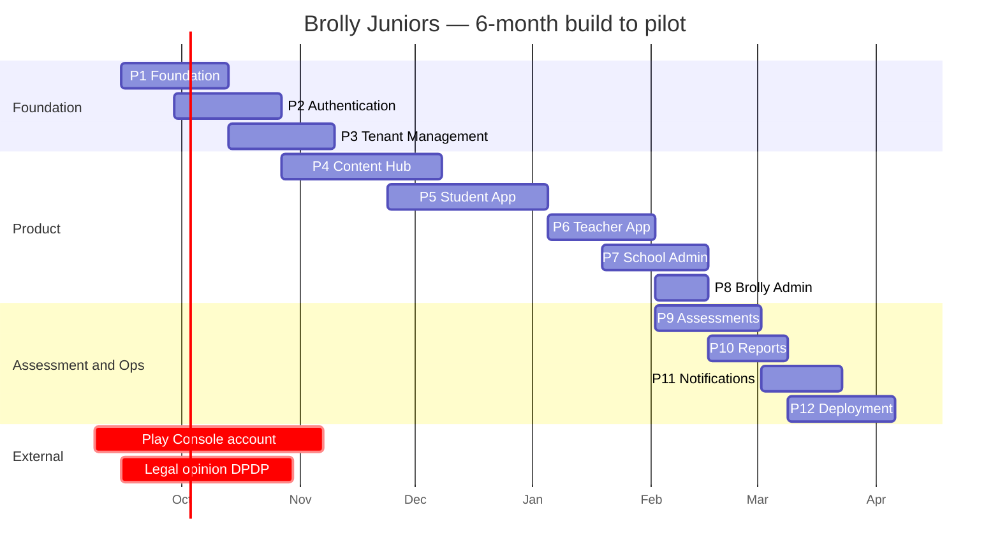
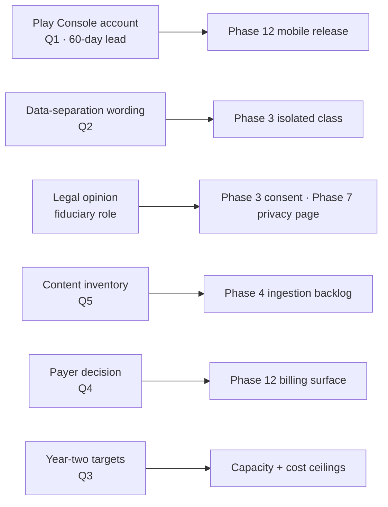

# Brolly Juniors — Implementation Plan

**Version:** 1.0
**Date:** 2 September 2026
**Owner:** Enterprise Product Manager
**Audience:** Engineering · Product · QA · DevOps · Leadership

---

## 1. Planning Basis and Honest Caveats

### 1.1 Confirmed inputs

| Input | Value |
|---|---|
| Team | 5 developers + 1 content designer |
| Pilot | 5 Hyderabad schools, compressed timeline |
| Stack | Next.js/React/TS · React Native/Expo/TS · FastAPI/Python · PostgreSQL · AWS · S3/CloudFront · Docker · GitHub Actions · CloudWatch |
| Content | Existing textbook series with a working HTML-to-PDF pipeline |
| Constraint | One school requires data separation |
| Constraint | Every learner is legally a child under DPDP; full compliance by 13 May 2027 |

### 1.2 Assumptions this plan rests on — all reversible, all flagged

| ID | Assumption | If wrong |
|---|---|---|
| PA-1 | Sprints are 2 weeks; 12 sprints ≈ 6 months | Rescale story points, not scope |
| PA-2 | A developer delivers ~16 story points per 2-week sprint after meetings, review and support | Velocity is re-baselined after Sprint 2 with actuals |
| PA-3 | The 5 developers split as 2 backend, 1 frontend web, 1 mobile, 1 full-stack/DevOps | Reallocate; the plan names the role, not the person |
| PA-4 | The academic term the pilot targets starts at roughly month 6 | Gate dates move; gate contents do not |
| PA-5 | No dedicated QA hire in the first 6 months; QA is a shared responsibility with one owner per release | If a QA hire lands, Phase 9–12 compress |

**Points are relative sizes, not days.** 1 = trivial, 2 = half a day, 3 = a day, 5 = two to three days, 8 = most of a sprint for one person, 13 = should be split.

### 1.3 What this plan does not do

It does not give a budget in rupees for anything other than infrastructure, because the salary and contractor rates were not supplied. §16 gives the infrastructure figure and the shape of the rest, and says which inputs are needed to complete it.

---

## 2. Phase Overview

| Phase | Name | Sprints | Points | Gate |
|---|---|---|---|---|
| 1 | Foundation | 1–2 | 96 | G1 |
| 2 | Authentication | 2–3 | 74 | G1 |
| 3 | Tenant Management | 3–4 | 82 | G1/G2 |
| 4 | Content Hub | 4–6 | 104 | G2 |
| 5 | Student App | 6–8 | 118 | G2/G3 |
| 6 | Teacher App | 8–9 | 86 | G3 |
| 7 | School Admin | 9–10 | 78 | G2/G4 |
| 8 | Brolly Admin | 10 | 56 | G2/G4 |
| 9 | Assessments | 10–11 | 92 | G3 |
| 10 | Reports | 11 | 64 | G4 |
| 11 | Notifications | 11–12 | 48 | G4 |
| 12 | Deployment & Hardening | 12–13 | 88 | G5 |
| | **Total** | | **986** | |

At an assumed 80 points per sprint across five developers (PA-2), 986 points is roughly 12.5 sprints of pure delivery. The plan allows 13 sprints and treats the remainder as the buffer that every honest plan needs and most omit.

**The two `crit` bars are not engineering work.** They are the items that can stop the pilot regardless of how the build goes, and they start before Sprint 1.

---

## 3. Phase 1 — Foundation

**Objectives.** Stand up the repository, the AWS environment, the database with tenancy enforced at the database layer, and the CI gates that make every later phase safe. Nothing user-facing ships.

**Deliverables.** Monorepo with CI · Terraform for VPC/RDS/ECS/S3/CloudFront · base FastAPI service with tenant middleware · Alembic migrations for the tenancy core · RLS generated and forced · `TenantTask` and its CI check · isolation test suite · Next.js shell · Docker Compose local environment.

**User stories**

| ID | Story | Points |
|---|---|---|
| F-1 | As an engineer, I want a monorepo with lint, typecheck and test running on every PR, so that quality is a gate rather than a habit | 5 |
| F-2 | As an engineer, I want the AWS environment defined in Terraform, so that it is reproducible and reviewable | 13 |
| F-3 | As the platform, I want `tenant_id NOT NULL` and forced RLS on every tenant-owned table, so that isolation is enforced by the database | 8 |
| F-4 | As the platform, I want the app to connect as a non-superuser role without `BYPASSRLS`, so that RLS cannot be bypassed | 3 |
| F-5 | As the platform, I want request-scoped tenant context using `SET LOCAL`, so that pooled connections cannot leak a tenant | 8 |
| F-6 | As the platform, I want `TenantTask` and a CI check that fails on any task outside it, so that background work cannot run unscoped | 8 |
| F-7 | As QA, I want an isolation suite that proves per model that tenant A cannot read tenant B, so that isolation is tested on every build | 8 |
| F-8 | As an engineer, I want composite `(id, tenant_id)` foreign keys, so that a cross-tenant reference is impossible at the storage layer | 5 |
| F-9 | As an engineer, I want a local Docker Compose environment seeded with three tenants, so that multi-tenancy is visible from day one | 5 |

**Tasks (abridged).** Repo scaffold and workspace config · GitHub Actions matrix · Terraform modules (VPC, RDS, ECS, ALB, S3, CloudFront, Secrets Manager) · FastAPI app factory, settings, health endpoints · SQLAlchemy async engine and session factory · tenant middleware · Alembic baseline · generated RLS migration · role creation and CI assertions · `TenantTask` and AST checker · isolation test harness with per-model parametrisation · seed script · Next.js app shell with token plumbing.

**Dependencies.** AWS account. **Blocks:** everything.

**Risks.** *Terraform scope creep* — mitigate by provisioning only what Phase 1–3 needs and adding later. *RLS misconfiguration silently failing open* — mitigate by writing the isolation suite before the first tenant-owned table.

**Timeline.** Sprints 1–2. **Team.** 2 backend, 1 DevOps/full-stack. **Points:** 96 (includes 33 points of infrastructure not listed above).

---

## 4. Phase 2 — Authentication

**Objectives.** Every persona can log in, hold the right role in the right tenant, and lose access the moment it is revoked.

**Deliverables.** JWT access/refresh with rotation · staff login · student roster+PIN login · tenant selector · RBAC resolution with `perm_v` caching · impersonation with reason, TTL, banner and audit · password reset · MFA for platform admins · rate limiting.

**User stories**

| ID | Story | Points |
|---|---|---|
| A-1 | As a staff user, I want to log in and receive short-lived access with a rotating refresh token | 8 |
| A-2 | As a multi-school teacher, I want to choose my school after login and switch later without logging out | 8 |
| A-3 | As a student, I want to log in with my roll number and PIN, without an email address | 8 |
| A-4 | As a student, I want to be forced to change the issued PIN on first use | 3 |
| A-5 | As the platform, I want RBAC evaluated per request with a cached permission set keyed by `perm_v` | 8 |
| A-6 | As a School Admin, I want a revoked teacher to lose access on their next request, not their next login | 5 |
| A-7 | As a Brolly Admin, I want impersonation that requires a reason, expires, shows a banner and writes paired audit rows | 13 |
| A-8 | As a Brolly Admin, I want MFA enforced on my account | 5 |
| A-9 | As the platform, I want rate limiting per identity and per tenant, not per IP | 5 |
| A-10 | As a user, I want a secure password reset that invalidates all sessions | 5 |

**Dependencies.** Phase 1. **Blocks.** Phases 5–8.

**Risks.** *IP-based lockout takes a class offline* — mitigated by A-9's per-identity design, and by a load test with 40 concurrent logins from one NAT address. *Impersonation shipped without the audit half* — mitigated by making the paired audit rows part of A-7's acceptance criteria, not a follow-up ticket.

**Timeline.** Sprints 2–3 (overlaps Phase 1). **Team.** 2 backend, 1 frontend. **Points:** 74.

---

## 5. Phase 3 — Tenant Management

**Objectives.** A tenant can be created, branded, populated and scheduled — including the isolated deployment class.

**Deliverables.** Tenant lifecycle · Tenant #1 provisioned by the same path · branding with runtime resolution and contrast validation · roster import with dry run · classes, sections, memberships · teacher assignment and delegation · entitlements · schedules · isolated deployment class stood up and migrated by the same pipeline.

**User stories**

| ID | Story | Points |
|---|---|---|
| T-1 | As a Brolly Admin, I want to provision a tenant with a deployment class and entitlements | 8 |
| T-2 | As the platform, I want Tenant #1 created by the same provisioning path as any school | 3 |
| T-3 | As a School Admin, I want to set branding and see it applied at runtime with no rebuild | 8 |
| T-4 | As the platform, I want tenant colours validated for contrast with an accessible derived text colour | 5 |
| T-5 | As a School Admin, I want a roster import with a dry run that applies nothing if any row fails | 13 |
| T-6 | As a School Admin, I want re-import to match existing students rather than duplicate them | 5 |
| T-7 | As a School Admin, I want to create classes and sections and assign teachers | 8 |
| T-8 | As a School Admin, I want to set a per-section chapter schedule over shared global content | 13 |
| T-9 | As the platform, I want two tenants to schedule the same chapter differently with no content duplication | 5 |
| T-10 | As Ops, I want the isolated database provisioned and migrated in the same pipeline stage as the shared one | 8 |
| T-11 | As a School Admin, I want to preview what a named section sees today | 5 |

**Dependencies.** Phases 1–2; **T-10 blocked by** the data-separation wording (PRD §20.4 Q2).

**Risks.** *Roster import is the sharpest usability drop in the product* — mitigate by building the dry run first and testing with a real school's file, not a synthetic one. *Isolated class built to a guess* — do not start T-10 until the contract wording is in hand.

**Timeline.** Sprints 3–4. **Team.** 2 backend, 1 frontend, 1 DevOps. **Points:** 82.

---

## 6. Phase 4 — Content Hub

**Objectives.** The existing textbooks become platform content, versioned, verified and delivered over CDN.

**Deliverables.** Content service and schema · HTML ingestion from the existing book pipeline · versioning with immutability · publish pipeline with execution verification and countable-claim checks · asset upload to S3 with versioned CDN paths · CBSE/BOOST mapping metadata · preview-as-role.

**User stories**

| ID | Story | Points |
|---|---|---|
| C-1 | As a content designer, I want existing chapter HTML ingested into structured blocks preserving code, output, images and answer boxes | 13 |
| C-2 | As the platform, I want published versions to be immutable, with corrections creating a new version | 5 |
| C-3 | As the platform, I want publication blocked unless every code fragment executes and matches its recorded output | 13 |
| C-4 | As the platform, I want countable claims, XP totals and arithmetic verified mechanically at publish | 8 |
| C-5 | As a content designer, I want CBSE mapping metadata per chapter with an official-versus-addition flag | 5 |
| C-6 | As a student, I want assets served from CDN under immutable versioned paths | 8 |
| C-7 | As a content designer, I want to preview a chapter as a student and as a teacher before publishing | 5 |
| C-8 | As a Brolly Admin, I want to see which tenants are on which version so a correction can be traced | 5 |
| C-9 | As the platform, I want private assets served through signed URLs with a short TTL | 5 |

**Dependencies.** Phase 1; **C-1 blocked by** the content inventory question (PRD §20.4 Q5).

**Risks.** *Ingestion turns out to need a rewrite of the books* — mitigate with a two-day spike on one chapter in Sprint 3, before Phase 4 is committed. *Verification is skipped under time pressure* — mitigate by making it a CI gate (AC-G-08) rather than a process step.

**Timeline.** Sprints 4–6. **Team.** 1 backend, 1 full-stack, content designer full-time. **Points:** 104.

---

## 7. Phase 5 — Student App

**Objectives.** A child can read a chapter and run Python, on a shared Android phone, without installing anything.

**Deliverables.** Chapter reader for all block types · CodeMirror 6 editor with touch toolbar · Pyodide runtime in a worker · traceback plus villain hints · progress, XP, badges, streaks · Expo app shell with flavour config · graded submission client with SSE and queueing.

**User stories**

| ID | Story | Points |
|---|---|---|
| S-1 | As a student, I want to see today's chapter and open it | 5 |
| S-2 | As a student, I want the chapter to render faithfully on a phone | 13 |
| S-3 | As a student, I want to write and run Python in the browser with no install | 13 |
| S-4 | As a student, I want the real traceback with a plain-language hint beside it | 8 |
| S-5 | As a student, I want to use the editor on a touch keyboard, including indentation | 8 |
| S-6 | As a student, I want my XP, badges and streak to match the printed book | 5 |
| S-7 | As a student, I want to submit graded work and see the verdict | 8 |
| S-8 | As a student, I want practice to keep working when the marking service is down | 5 |
| S-9 | As a student, I want the app to work on a 3 GB Android device within the performance budget | 13 |
| S-10 | As a student, I want reading to keep working when I lose connectivity | 8 |
| S-11 | As the platform, I want no analytics or attribution SDK in any student bundle, verified in CI | 5 |

**Dependencies.** Phases 2, 4. **Blocks.** Phases 6, 9.

**Risks.** *Pyodide first load is too slow on the reference device* — measure in Sprint 5 on a real device, not an emulator; fallback is a hosted practice tier for the first chapter only, at a known cost. *Editor unusable on a touch keyboard* — this is the highest-probability usability failure in the product; the touch toolbar is scoped in S-5 and tested with real students in Sprint 7.

**Timeline.** Sprints 6–8. **Team.** 1 frontend, 1 mobile, 1 backend part-time. **Points:** 118.

---

## 8. Phase 6 — Teacher App

**Objectives.** A non-programmer teacher can teach the lesson and mark the class inside a free period.

**Deliverables.** Today view · teaching notes with verified examples · live class progress board over SSE · stuck-student flags · marking queue with answer key side-by-side · override with reason · feedback · attendance · multi-school switching in the UI.

**User stories**

| ID | Story | Points |
|---|---|---|
| E-1 | As a teacher, I want everything for today's periods on one screen | 8 |
| E-2 | As a teacher, I want teaching notes with examples whose output is verified | 5 |
| E-3 | As a teacher, I want a live progress board for the class I am teaching | 13 |
| E-4 | As a teacher, I want students flagged after three failed attempts on one exercise | 5 |
| E-5 | As a teacher, I want a marking queue showing code, actual output, expected output and answer key together | 13 |
| E-6 | As a teacher, I want to override an auto-grade with a recorded reason | 5 |
| E-7 | As a teacher, I want to leave feedback visible only to that student | 3 |
| E-8 | As a teacher in three schools, I want the active school unmistakable on every screen | 8 |
| E-9 | As a teacher, I want to take attendance in under a minute | 5 |
| E-10 | As a teacher, I want to set an assignment in under two minutes | 8 |

**Dependencies.** Phases 4, 5, 9 (partial). **Risks.** *Marking takes longer than a free period* — timed usability test with a real teacher and 30 real submissions in Sprint 9; if it exceeds one minute per item, cut scope elsewhere and fix it.

**Timeline.** Sprints 8–9. **Team.** 1 frontend, 1 backend. **Points:** 86.

---

## 9. Phase 7 — School Admin

**Objectives.** The School Admin can run their tenant and answer the governing body without calling Brolly.

**Deliverables.** Dashboard · branding UI · roster import UI (stepper) · classes/sections/teachers UI · schedule planner · reports · data and privacy page · tenant audit view · data export and erasure requests.

**User stories**

| ID | Story | Points |
|---|---|---|
| D-1 | As a School Admin, I want a dashboard answering the principal's questions | 8 |
| D-2 | As a School Admin, I want the roster import as a guided stepper with a downloadable error file | 13 |
| D-3 | As a School Admin, I want a schedule planner with bulk apply and copy-to-section | 13 |
| D-4 | As a School Admin, I want reports I can export and print | 8 |
| D-5 | As a School Admin, I want a data and privacy page showing storage, sub-processors and retention | 8 |
| D-6 | As a School Admin, I want to see every impersonation event affecting my tenant | 5 |
| D-7 | As a School Admin, I want to request an export or an erasure | 8 |
| D-8 | As a School Admin, I want to preview as a student before the lesson | 5 |
| D-9 | As a School Admin, I want to be blocked from viewing answer keys | 2 |

**Dependencies.** Phases 3, 10 (D-1, D-4). **Risks.** *The data and privacy page makes a claim the contract does not support* — D-5 content is reviewed by the founder and, where it touches fiduciary status, waits on the legal opinion.

**Timeline.** Sprints 9–10. **Team.** 1 frontend, 1 backend. **Points:** 78.

---

## 10. Phase 8 — Brolly Admin

**Objectives.** Operate the platform without casual access to children's records.

**Deliverables.** Platform dashboard from rollups only · tenant directory and provisioning UI · entitlement grants · content publishing UI · impersonation console with friction · platform audit · support tickets.

**User stories**

| ID | Story | Points |
|---|---|---|
| P-1 | As a Brolly Admin, I want a cross-tenant dashboard reading only from nightly rollups, with the timestamp shown | 8 |
| P-2 | As a Brolly Admin, I want to provision a tenant and grant entitlements from the UI | 8 |
| P-3 | As a Brolly Admin, I want to publish content and repoint tenants | 8 |
| P-4 | As a Brolly Admin, I want an impersonation console that requires a reason and shows who I am about to access | 13 |
| P-5 | As a Brolly Admin, I want a platform-wide audit view including all impersonations | 8 |
| P-6 | As support, I want tickets routed by tenant and priority | 5 |
| P-7 | As the platform, I want the platform role to have SELECT on rollups and the tenant directory only | 3 |

**Dependencies.** Phases 3, 10. **Risks.** *Convenience pressure to add a live cross-tenant view* — prevented structurally by P-7: the role cannot read anything else, so the shortcut is not available to write.

**Timeline.** Sprint 10. **Team.** 1 full-stack. **Points:** 56.

---

## 11. Phase 9 — Assessments

**Objectives.** Work is set, submitted, executed safely and marked reliably.

**Deliverables.** Code Execution service with the full sandbox contract · queue and callbacks · deterministic grading · quiz engine · attempts and answers with autosave · exams with windows · scores with overrides · Class 9 practical-file tracker · Pyodide/server consistency suite.

**User stories**

| ID | Story | Points |
|---|---|---|
| X-1 | As the platform, I want graded code to run in a sandbox with no network, capped CPU, memory, time and output | 13 |
| X-2 | As the platform, I want grading to be deterministic for the same source and test set | 8 |
| X-3 | As the platform, I want per-tenant execution quotas that degrade to practice-only rather than erroring | 5 |
| X-4 | As a student, I want a quiz with autosave that survives a disconnection | 13 |
| X-5 | As a teacher, I want auto-grading of objective items and a queue for the rest | 8 |
| X-6 | As the platform, I want attempts to be append-only so a re-attempt never overwrites history | 5 |
| X-7 | As a Class 9 student, I want to track the official practical-file programmes | 8 |
| X-8 | As QA, I want a suite proving Pyodide and the server runtime agree on the curriculum corpus | 8 |
| X-9 | As the platform, I want exec results bound to a submission by a single-use callback token | 5 |
| X-10 | As a teacher, I want assignments with due dates and per-student status | 8 |
| X-11 | As the platform, I want timeouts reported as a named villain rather than a raw error | 3 |

**Dependencies.** Phases 4, 5. **Risks.** *Sandbox escape* — the highest-severity technical risk in the product; mitigated by no egress at the network layer rather than by trusting a Python restriction, plus an external review before pilot. *Practice and grading disagree* — X-8 exists precisely because a student who passes locally and fails on submission stops trusting the product immediately.

**Timeline.** Sprints 10–11. **Team.** 2 backend, 1 DevOps. **Points:** 92.

---

## 12. Phase 10 — Reports

**Objectives.** Everyone sees the right numbers, from the right source, with provenance.

**Deliverables.** Nightly rollup jobs as `TenantTask` · tenant and section rollup tables · School Admin dashboard queries from live tenant data · Brolly Admin dashboards from rollups · guardian progress view · CSV/PDF export · report artefact expiry · difficulty analytics feed.

**User stories**

| ID | Story | Points |
|---|---|---|
| R-1 | As the platform, I want nightly rollups computed per tenant, one context at a time | 8 |
| R-2 | As a School Admin, I want live tenant reporting with an "as of" stamp | 8 |
| R-3 | As a Brolly Admin, I want cross-tenant reporting from rollups only | 5 |
| R-4 | As a guardian, I want to see my own child's progress and no other child's | 5 |
| R-5 | As a School Admin, I want CSV and printable outputs | 8 |
| R-6 | As product, I want per-chapter pass-rate analytics to drive content fixes | 8 |
| R-7 | As the platform, I want generated report files to expire after 30 days | 3 |
| R-8 | As a teacher, I want a printable class progress sheet for parent meetings | 5 |
| R-9 | As the platform, I want schedule drift computed per section as a leading renewal indicator | 5 |
| R-10 | As Ops, I want an alarm if rollups have not run | 3 |

**Dependencies.** Phases 5, 6, 9. **Risks.** *Rollup job duration grows with tenants* — parallelised per tenant from the start, which costs nothing now and avoids a rewrite at 200 tenants.

**Timeline.** Sprint 11. **Team.** 1 backend, 1 frontend. **Points:** 64.

---

## 13. Phase 11 — Notifications

**Objectives.** People are told what they need to know, and children are not manipulated.

**Deliverables.** Notification service and templates · in-app inbox · Expo Push with device registry · transactional email with tenant branding · preference and consent gating · quiet hours · suppression logging.

**User stories**

| ID | Story | Points |
|---|---|---|
| N-1 | As a student, I want to know when an assignment is set and when work is marked | 5 |
| N-2 | As a School Admin, I want to be told when a roster import completes and when an impersonation touches my tenant | 5 |
| N-3 | As a guardian, I want transactional email in the tenant's branding | 5 |
| N-4 | As the platform, I want push tokens registered per device with invalid tokens deactivated | 8 |
| N-5 | As the platform, I want notification delivery gated by consent and preference, with suppressions logged | 8 |
| N-6 | As a parent, I want no notification to a child between 21:00 and 07:00 tenant-local | 3 |
| N-7 | As the platform, I want push payloads to carry a title and a deep link only, never marks | 3 |
| N-8 | As product, I want no notification tuned against a child's behaviour | 2 |
| N-9 | As a user, I want an in-app inbox with unread counts | 8 |
| N-10 | As Ops, I want failed deliveries retried and then alarmed | 3 |

**Dependencies.** Phases 5–8. **Risks.** *Push tokens are personal data on a child's device* — held in `devices` under RLS, with retention, and never used for behavioural segmentation.

**Timeline.** Sprints 11–12. **Team.** 1 backend, 1 mobile. **Points:** 48.

---

## 14. Phase 12 — Deployment and Hardening

**Objectives.** Ship to five schools, prove it recovers, and prove one more school can be added without engineering.

**Deliverables.** Blue/green deploy with automatic rollback · EAS flavour matrix producing five signed AABs · Play submissions (unlisted) · full CI gate set · load test · restore test · runbooks RB-01 to RB-07 · external isolation penetration test · onboarding runbook · accessibility audit · offline-tolerant reading · DPDP compliance checklist closure.

**User stories**

| ID | Story | Points |
|---|---|---|
| Y-1 | As Ops, I want blue/green deployment with automatic rollback on alarm | 8 |
| Y-2 | As Engineering, I want one commit to produce five signed AABs with per-school identity | 13 |
| Y-3 | As Engineering, I want a CI scan that fails the build if a purchase surface appears in any flavour | 5 |
| Y-4 | As Engineering, I want staggered Play submissions so one rejection does not block five | 3 |
| Y-5 | As Ops, I want a tested restore and a documented RTO/RPO | 8 |
| Y-6 | As Ops, I want runbooks RB-01 to RB-07, each executed once in staging | 13 |
| Y-7 | As Security, I want an external penetration test focused on tenant isolation | 8 |
| Y-8 | As Product, I want a sixth school onboarded by runbook with no engineering involvement | 8 |
| Y-9 | As QA, I want a load test simulating five schools starting first period simultaneously | 8 |
| Y-10 | As Compliance, I want the DPDP checklist closed and evidenced | 8 |
| Y-11 | As a student, I want reading and practice to work offline with queued submission | 8 |

**Dependencies.** All phases; **Y-2/Y-4 blocked by** the Play Console decision (PRD §20.4 Q1).

**Risks.** *Play rejection under Families or Repetitive Content policy* — mitigated by unlisted distribution, genuine per-tenant differentiation, staggered submission, and starting the account 60 days before it is needed. *Runbooks written but never executed* — Y-6's acceptance criterion is execution in staging, not authorship.

**Timeline.** Sprints 12–13. **Team.** All. **Points:** 88.

---

## 15. Sprint Breakdown

### 15.1 Six-month plan (Sprints 1–13)

| Sprint | Weeks | Focus | Points | Milestone |
|---|---|---|---|---|
| 1 | 1–2 | Repo, CI, Terraform, DB baseline | 48 | Environment up |
| 2 | 3–4 | RLS, tenant context, `TenantTask`, isolation suite; auth starts | 78 | **G1 criteria testable** |
| 3 | 5–6 | Auth complete; tenant provisioning; ingestion spike | 80 | **G1 passed** |
| 4 | 7–8 | Branding, roster import, classes/sections; Content Hub starts | 82 | Tenant configurable |
| 5 | 9–10 | Content ingestion, versioning, publish verification | 80 | Chapter renders |
| 6 | 11–12 | CDN assets, entitlement, schedule; Student app starts | 82 | **G2 criteria testable** |
| 7 | 13–14 | Chapter reader, editor, Pyodide, performance on device | 80 | **G2 passed** |
| 8 | 15–16 | Student progress/XP, Expo shell; Teacher today view | 80 | Student loop complete |
| 9 | 17–18 | Progress board, marking queue, overrides; School Admin starts | 82 | Teacher loop complete |
| 10 | 19–20 | Admin portals; Code Execution service | 80 | **G3 criteria testable** |
| 11 | 21–22 | Assessments, rollups, reports | 82 | **G3 passed** |
| 12 | 23–24 | Notifications, mobile flavours, Play submissions | 78 | **G4 passed** |
| 13 | 25–26 | Load test, pen test, runbooks, offline, hardening | 74 | **G5 passed · pilot ready** |

### 15.2 Twelve-month view

| Months | Focus | Outcome |
|---|---|---|
| 1–6 | Build to pilot (Sprints 1–13) | Five schools live |
| 7–8 | Pilot operation, weekly KPI reviews, defect burn-down, teacher training | Renewal signal |
| 9–10 | Convert pilot to paid; onboard schools 6–10 by runbook; iOS if a contract requires it; ERP import if a contract requires it | Repeatable onboarding |
| 11–12 | Class 10 content once CBSE publishes 2027–28; adaptive practice sequencing from existing attempt data; public Play listings once one has survived review; year-two capacity plan | Ready to scale |

**Reassess at ten schools:** whether five-plus flavours remains safer than a single multi-tenant Brolly app with school selection. That threshold is a decision point, not a foregone conclusion.

---

## 16. Resource Planning and Budget

### 16.1 Allocation by phase

| Role | P1 | P2 | P3 | P4 | P5 | P6 | P7 | P8 | P9 | P10 | P11 | P12 |
|---|---|---|---|---|---|---|---|---|---|---|---|---|
| Backend 1 | ●● | ●● | ●● | ● | ● | ● | ● | | ●● | ● | ● | ● |
| Backend 2 | ●● | ●● | ●● | ●● | | ● | ● | | ●● | ● | ● | ● |
| Frontend web | | ● | ● | ● | ●● | ●● | ●● | ● | | ● | | ● |
| Mobile | | | | | ●● | ● | | | | | ● | ●● |
| Full-stack / DevOps | ●● | ● | ● | ● | ● | | | ●● | ● | ● | | ●● |
| Content designer | | | | ●● | ● | ● | | | ● | | | ● |

`●●` primary · `●` partial

### 16.2 Infrastructure cost estimate (AWS `ap-south-1`, indicative)

| Item | Build phase | At pilot (~2,000 students) |
|---|---|---|
| ECS Fargate (api, hub, workers) | ₹9,000 | ₹22,000 |
| Code Execution tasks | ₹2,000 | ₹8,000 |
| RDS PostgreSQL Multi-AZ | ₹11,000 | ₹18,000 |
| RDS isolated instance | ₹6,000 | ₹9,000 |
| ElastiCache Redis | ₹3,500 | ₹5,000 |
| S3 + CloudFront | ₹1,500 | ₹6,000 |
| CloudWatch, Secrets, misc | ₹2,500 | ₹5,000 |
| Backups and vault | ₹1,500 | ₹3,000 |
| **Monthly total** | **≈ ₹37,000** | **≈ ₹76,000** |

Assumptions: sizes in TRD §10.2–10.3; scheduled scale-down outside school hours; log retention set explicitly. These are order-of-magnitude figures for planning, not a quote, and they should be re-run once the year-two student target exists (PRD §20.4 Q3).

**One-off costs:** Play Console developer registration; external penetration test; Indian data-protection legal opinion; domain and certificates; device lab (three low-end Android handsets — non-negotiable, since NFR-PRF-05 cannot be verified on an emulator).

**Not estimated here:** salaries, contractor rates, content production beyond the existing books, sales and onboarding effort. Provide headcount cost and the year-two targets and this table completes.

---

## 17. Risk Register

Scored L×I (1–5). Score ≥ 12 requires an owner and a date.

| ID | Risk | L | I | Score | Phase | Mitigation | Owner |
|---|---|---|---|---|---|---|---|
| IR-1 | Play Console lead time blocks all five apps | 4 | 5 | 20 | P12 | Start the account 60 days before Phase 12; plan so web delivery alone can carry G3 | Founder |
| IR-2 | Team capacity below the 986-point plan | 4 | 4 | 16 | all | Re-baseline velocity after Sprint 2 with actuals; gates name what they exclude | Product |
| IR-3 | Sandbox escape in Code Execution | 2 | 5 | 10 | P9 | No network egress at the VPC layer; caps; external review | Eng lead |
| IR-4 | Cross-tenant leak | 2 | 5 | 10 | P1 | Forced RLS, non-superuser role, isolation suite on every build, pen test | Eng lead |
| IR-5 | Textbook HTML resists ingestion | 3 | 4 | 12 | P4 | Two-day spike in Sprint 3 before committing Phase 4 | Content designer |
| IR-6 | Pyodide too slow on the reference device | 3 | 4 | 12 | P5 | Measure on a real handset in Sprint 5; hosted practice tier as a costed fallback | Eng lead |
| IR-7 | Marking exceeds a free period | 3 | 5 | 15 | P6 | Timed test with a real teacher in Sprint 9; cut elsewhere if it fails | Product |
| IR-8 | Data-separation wording exceeds the isolated class | 3 | 4 | 12 | P3 | Do not start T-10 until the wording is in hand | Founder |
| IR-9 | Legal opinion reverses the fiduciary assumption | 3 | 5 | 15 | P3 | `fiduciary_role` stored per consent so the answer can change without migration | Founder |
| IR-10 | Payer decision arrives late and forces purchase into apps | 4 | 3 | 12 | P12 | Default to school-pays; if reversed, run checkout on web only | Founder |
| IR-11 | Roster import fails on a real school file | 3 | 3 | 9 | P3 | Test with a real anonymised file in Sprint 4, not synthetic data | Backend 2 |
| IR-12 | Content inventory smaller than believed | 3 | 3 | 9 | P4 | Physical inventory before Sprint 4 | Content designer |
| IR-13 | Play Families/Repetitive Content rejection | 3 | 4 | 12 | P12 | Unlisted, differentiated metadata, staggered submissions | Mobile |
| IR-14 | Touch code editor unusable | 3 | 4 | 12 | P5 | Dedicated touch toolbar in scope; test with real students in Sprint 7 | Frontend |
| IR-15 | Schools do not use it | 3 | 5 | 15 | pilot | Zero-prep teacher console; schedule drift as a weekly KPI with escalation | Product |
| IR-16 | CBSE publishes 2027–28 syllabus mid-build | 4 | 3 | 12 | P4 | Content versioned and mapping structured, so a re-map is a content release | Content designer |
| IR-17 | DPDP readiness slips past 13 May 2027 | 2 | 5 | 10 | P12 | Checklist tracked as a KPI with a 90-day red line | Compliance |
| IR-18 | Migration drift between shared and isolated databases | 2 | 4 | 8 | P3 | Both migrated in the same pipeline stage; drift check in CI | DevOps |

### 17.1 Dependencies outside engineering control

Five of the six are business decisions, not engineering work. Every one of them can be closed this month, and four of them get more expensive the later they are closed.

---

## 18. Governance

| Ceremony | Cadence | Output |
|---|---|---|
| Sprint planning | Every 2 weeks | Committed backlog with points |
| Daily standup | Daily, 15 min | Blockers |
| Backlog refinement | Weekly | Next sprint's stories sized |
| Sprint review | Every 2 weeks | Working software demonstrated, not slides |
| Retrospective | Every 2 weeks | One change carried into the next sprint |
| Gate review | Per gate | Exit criteria signed or explicitly waived in writing |
| KPI review | Weekly during pilot | Actions per PRD §18.6 |
| Risk review | Monthly | Register updated; anything ≥12 has a dated action |

**Definition of Done** is the PRD §16.1 list, unchanged. **Gate exit criteria** are PRD §16.2 AC-G-01 to AC-G-12. A gate may be waived only in writing, by the founder, naming what is being accepted and when it will be closed — because an unrecorded waiver becomes an assumption, and an assumption becomes a defect.

---

## 19. Plan-Level Open Items

| # | Item | Needed by | Owner |
|---|---|---|---|
| 1 | Play Console account type and creation date | Immediately | Founder |
| 2 | Data-separation requirement in writing | Sprint 3 | Founder |
| 3 | Year-two school and student targets | Sprint 10 | Founder |
| 4 | B2B payer decision | Sprint 10 | Founder |
| 5 | Confirmed content inventory | Sprint 3 | Content designer |
| 6 | DPDP fiduciary legal opinion | Sprint 5 | Founder |
| 7 | Headcount cost inputs to complete §16 | Sprint 2 | Founder |
| 8 | Three low-end Android handsets for the device lab | Sprint 4 | Engineering |

Items 1 to 6 are the same open questions recorded in the PRD. Items 7 and 8 are new and are cheap to close.
