# Brolly Juniors — Technical Requirement Document

**Version:** 1.0
**Date:** 2 September 2026
**Owner:** Principal Solution Architect
**Audience:** Engineering · DevOps · Security · QA · Product
**Companion documents:** `Product_Requirement_Document.md` (what and why), `Backend_Schema_Document.md` (data), `Application_Flow_Document.md` (behaviour), `Implementation_Plan.md` (sequencing)

---

## 1. Scope and Confirmed Technology Baseline

This document specifies how Brolly Juniors is built. Requirement IDs referenced as `FR-*` and `NFR-*` are defined in the PRD; this document does not restate them, it satisfies them.

### 1.1 Confirmed stack

| Layer | Technology | Notes |
|---|---|---|
| Web application | Next.js (App Router) · React · TypeScript | Server components for content reading, client components for the editor |
| Marketing / SEO site | Next.js, separate deployment | Public pages, B2C acquisition, web checkout |
| Mobile | React Native · Expo · TypeScript | EAS Build profiles produce one signed artefact per school flavour |
| Backend | FastAPI · Python 3.12 | Async, Pydantic v2 models, SQLAlchemy 2.x async ORM |
| Database | PostgreSQL 16 (Amazon RDS) | Row-Level Security is the isolation control of record |
| Cache / queue broker | Redis (ElastiCache) | Session assist, rate limiting, Celery broker |
| Background work | Celery + Celery Beat | `TenantTask` base class carries tenant context |
| Auth | JWT access + refresh, RBAC | Tenant-scoped claims; no session state in the API |
| Cloud | AWS, `ap-south-1` (Mumbai) | Data residency requirement CN-3 |
| Object storage | Amazon S3 | Content assets, uploads, exports, backups |
| CDN | Amazon CloudFront | Signed URLs for private assets, public cache for immutable content |
| Containers | Docker, Amazon ECS on Fargate | Not EKS for the pilot (CN-16) |
| CI/CD | GitHub Actions | Build, test, isolation gate, deploy, EAS submit |
| Monitoring | Amazon CloudWatch | Logs, metrics, alarms, dashboards |
| Error tracking | Sentry with PII scrubbing | Guardian/staff surfaces only |

### 1.2 Non-negotiable architectural invariants

These are settled and are not revisited during implementation.

1. Shared PostgreSQL database, shared schema, `tenant_id NOT NULL` on every tenant-owned table.
2. RLS enabled **and forced**, with the application connecting as a non-superuser role that lacks `BYPASSRLS`.
3. Global `User`, per-tenant `Membership`. Identity is never tenant-scoped.
4. `Consent` is a first-class table with `fiduciary_role` stored at grant time.
5. Content carries no `tenant_id`. Tenancy attaches to entitlement and schedule.
6. Brolly Admin is a platform flag with audited impersonation, never a seeded tenant user.
7. Two runtimes: Pyodide in the client for practice, hosted Code Execution for graded submissions.
8. One codebase, one commit, N mobile flavours.
9. B2C is Tenant #1, created by the same path as any school tenant.

---

## 2. System Architecture

### 2.1 Context diagram

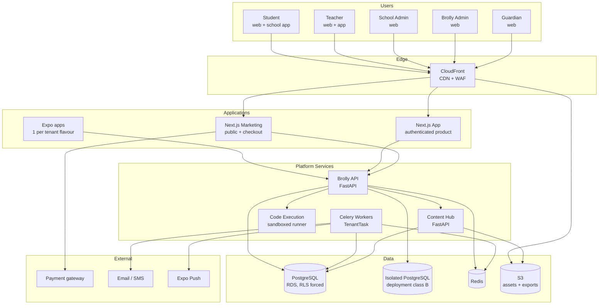

### 2.2 Architecture style and why

**Modular monolith per service, three services, not microservices.** Five developers cannot operate a microservice estate. The split is drawn where the *isolation model* changes, not where the domain nouns change:

| Service | Why it is separate |
|---|---|
| **Brolly API** | Everything tenant-scoped. Single RLS boundary, single transactional database. |
| **Content Hub** | The only service with no tenant dimension. Separating it makes "content has no `tenant_id`" a deployment fact rather than a coding convention that erodes. |
| **Code Execution** | Runs untrusted code. Its separation is a security boundary, not a domain boundary; it needs a different network posture, different IAM, and different failure semantics. |

Everything else — identity, membership, entitlement, scheduling, learning, assessment, reporting, admin — lives inside Brolly API as internal modules with enforced import boundaries.

### 2.3 Module map inside Brolly API

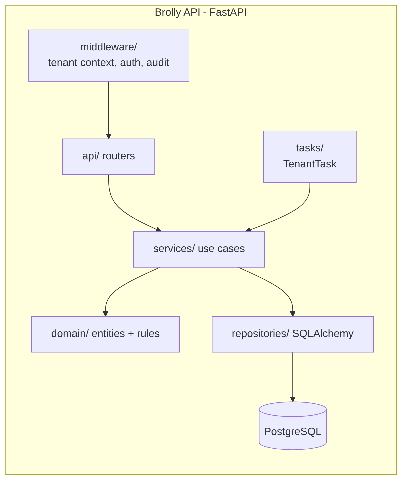

Import rules enforced by a CI lint step:

- `api/` may import `services/`, never `repositories/`.
- `services/` may import `domain/` and `repositories/`.
- `domain/` imports nothing from the other layers and contains no I/O.
- `tasks/` must derive from `TenantTask`; a module defining a Celery task outside that base fails the build.

---

## 3. High-Level Architecture

### 3.1 Runtime topology on AWS

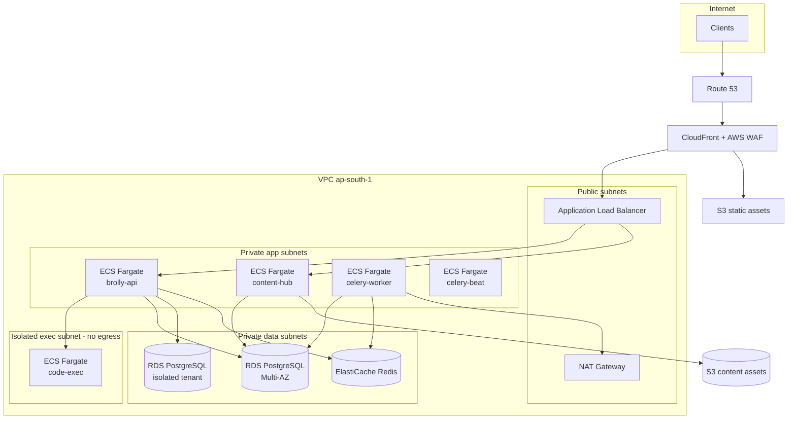

### 3.2 Deployment classes

Two classes, identical images, different data boundaries.

| | Class A — Shared | Class B — Conditionally isolated |
|---|---|---|
| Tenants | Tenant #1 (B2C) + standard schools | Schools with a contractual separation requirement |
| Database | Shared RDS instance, shared schema, RLS | Dedicated RDS instance, same schema, same RLS |
| Application | Shared ECS services | Same task definition, separate service and target group |
| Secrets | Shared parameter path | Per-tenant parameter path, separate KMS key |
| Backups | Shared automated backups | Separate backup plan and retention |
| Code | Identical commit | Identical commit |

Routing is resolved by the tenant resolver (§6.2): the tenant record carries `deployment_class` and a connection alias. A request for a Class B tenant is served by a Class B task, and Class A tasks hold no credentials for Class B databases.

**Why not five isolated stacks.** Five stacks means five migration runs, five alarm sets, five drift surfaces and five incident procedures against a team of five. Class B exists as a contractual escape hatch and is priced accordingly.

### 3.3 Environments

| Environment | Purpose | Data | Deploy trigger |
|---|---|---|---|
| `local` | Developer machine, Docker Compose | Seeded synthetic, ≥3 tenants | manual |
| `ci` | Ephemeral per pull request | Seeded synthetic | PR open |
| `staging` | Pre-production, production-shaped | Synthetic only, never production copies | merge to `main` |
| `production` | Live | Real | tagged release + manual approval |

Production data is never copied to a lower environment. Reproducing a bug uses a synthetic fixture built from the report, because the alternative is copying children's records onto a developer laptop.

---

## 4. Low-Level Architecture

### 4.1 Request lifecycle

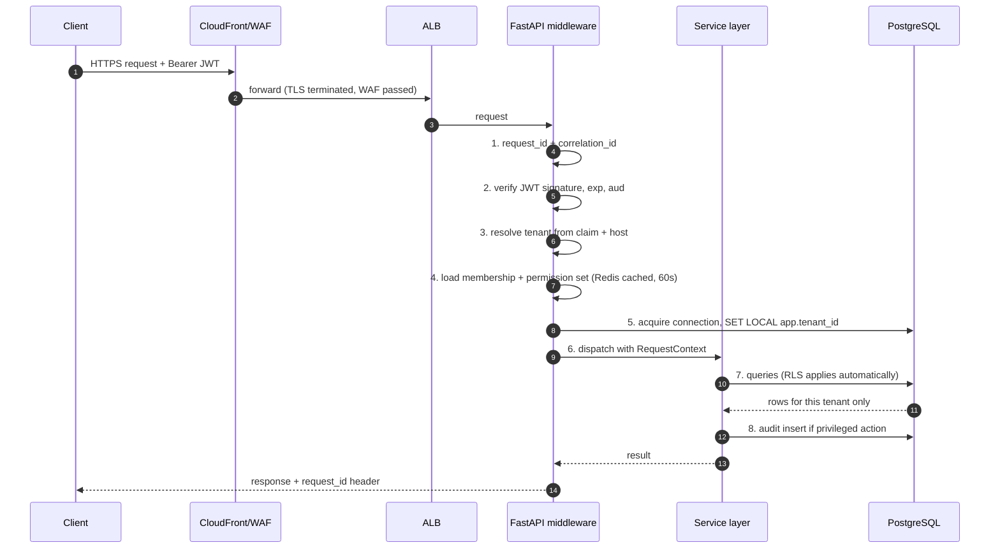

Step 5 is the load-bearing one. `SET LOCAL` binds the tenant to the transaction, so a connection returned to the pool cannot carry a stale tenant into the next request. Any code path that opens a connection without setting it will read zero rows rather than the wrong rows, because the RLS policy compares against a GUC that defaults to empty.

### 4.2 Tenant context implementation

```python
# middleware/tenant.py  (indicative)
TENANT_GUC = "app.tenant_id"

class RequestContext(BaseModel):
    request_id: str
    user_id: UUID | None
    tenant_id: UUID | None
    role: Role | None
    permissions: frozenset[str]
    impersonation_id: UUID | None = None
    is_platform_admin: bool = False

@asynccontextmanager
async def tenant_session(engine, tenant_id: UUID | None):
    async with engine.begin() as conn:
        # empty string when unset -> RLS matches nothing
        await conn.execute(
            text(f"SET LOCAL {TENANT_GUC} = :t"),
            {"t": str(tenant_id) if tenant_id else ""},
        )
        yield conn
```

Rules:

- The GUC is set with `SET LOCAL` inside the transaction, never `SET` on the session.
- No repository opens its own connection; all take the context-bound session.
- A platform query that legitimately spans tenants (tenant directory, rollups) uses a separate, explicitly named session factory and is limited to a whitelist of tables that carry no personal data.

### 4.3 `TenantTask` for background work

```python
class TenantTask(Task):
    abstract = True

    def __call__(self, *args, tenant_id: str, **kwargs):
        if not tenant_id:
            raise TenantContextMissing(self.name)
        with tenant_session_sync(tenant_id):
            return self.run(*args, **kwargs)

@celery.task(base=TenantTask, bind=True)
def recompute_progress(self, section_id: str, *, tenant_id: str): ...
```

Cross-tenant jobs iterate explicitly:

```python
@celery.task  # platform task, whitelisted, writes only to rollup tables
def nightly_rollups():
    for tenant_id in active_tenant_ids():
        rollup_for_tenant.delay(tenant_id=tenant_id)
```

A CI check (`scripts/check_tasks.py`) walks the AST of every module under `tasks/`, asserts each `@celery.task` either declares `base=TenantTask` or appears in an explicit platform-task allowlist committed to the repository, and fails the build otherwise.

### 4.4 Component responsibilities

| Component | Responsibility | Does not do |
|---|---|---|
| `brolly-api` | Auth, membership, entitlement, scheduling, learning state, assessment orchestration, admin, reporting reads | Store content bodies; execute untrusted code |
| `content-hub` | Content CRUD, versioning, publish pipeline, asset upload, CDN invalidation | Know about tenants or students |
| `code-exec` | Run one submission in a sandbox and return a structured result | Persist anything; talk to the database |
| `celery-worker` | Rollups, imports, notifications, retention, exports, publish verification | Serve HTTP |
| `celery-beat` | Schedule triggers | Do work |

### 4.5 Code Execution design

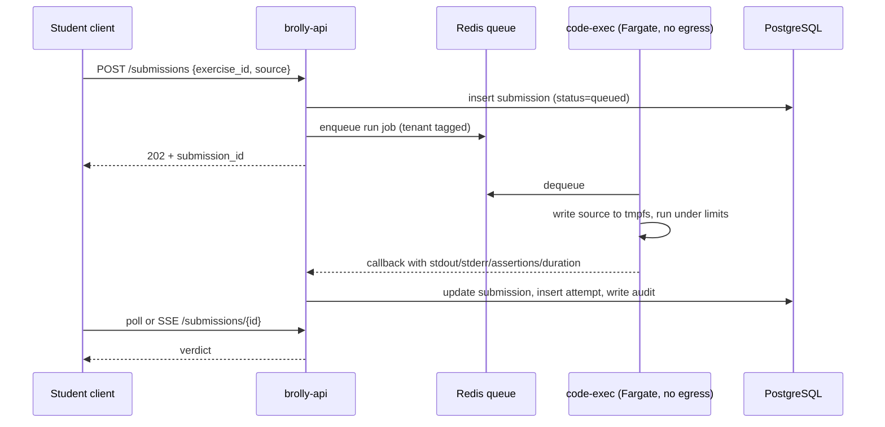

Sandbox contract:

| Control | Value |
|---|---|
| Network | None. Task runs in a subnet with no NAT route and a security group denying egress. |
| Filesystem | `tmpfs` only, size-capped, destroyed per run |
| CPU | 1 vCPU cap |
| Memory | 256 MB hard limit |
| Wall clock | 10 s hard kill |
| Output | 256 KB stdout/stderr cap, truncated with a marker |
| Process | No fork beyond a small cap; no `subprocess` module available |
| Persistence | None between runs |
| Identity | Task role with no AWS permissions beyond writing its own log stream |

**Practice versus grading.** Practice runs in Pyodide in the client: zero marginal cost, no queue, no latency budget spent on the network. Only graded submissions reach `code-exec`. A consistency test suite runs the same corpus of curriculum programmes through both runtimes on every release and fails on divergence, because a student who passes in practice and fails on submission loses trust in the product immediately.

---

## 5. Service Boundaries

### 5.1 Boundary contract table

| Consumer | Provider | Protocol | Auth | Sync/async | Failure behaviour |
|---|---|---|---|---|---|
| Web / mobile | brolly-api | HTTPS JSON | User JWT | sync | Retry with backoff on 5xx |
| Web / mobile | CloudFront → S3 | HTTPS | Signed URL for private assets | sync | Cached asset served if origin down |
| brolly-api | content-hub | HTTPS JSON, internal | Service JWT (mTLS optional later) | sync + cached | Serve last-known-good content projection from cache |
| brolly-api | code-exec | Redis queue + callback | Signed callback token | async | Queue; degrade to practice-only |
| celery-worker | brolly-api DB | SQLAlchemy | DB role | sync | Retry, dead-letter after N |
| brolly-api | payment gateway | HTTPS | API key in Secrets Manager | sync | Idempotent retry, webhook reconciliation |
| celery-worker | email/SMS/push | HTTPS | API key | async | Retry, then log and alarm |

### 5.2 What crosses a boundary

- **Content into Brolly API:** a *projection*, not the source. Brolly API stores `content_version_id`, chapter identifiers and cached metadata, and renders bodies fetched from Content Hub or CDN. It never stores an editable copy.
- **Tenant identity into Content Hub:** nothing. Content Hub receives no tenant identifier on read paths. Entitlement is evaluated in Brolly API before a content request is made.
- **Personal data into Code Execution:** nothing beyond an opaque submission identifier and the source the student wrote. No name, no roll number, no tenant name.

### 5.3 Anti-corruption rules

1. Content Hub's model may change without a Brolly API migration; the projection is versioned and validated by a Pydantic schema at the boundary.
2. Code Execution's result schema is versioned; an unknown version fails closed and the submission stays queued rather than being graded incorrectly.
3. No service reads another service's database. There is one writer per table.

---

## 6. Multi-Tenant Architecture

### 6.1 Isolation model

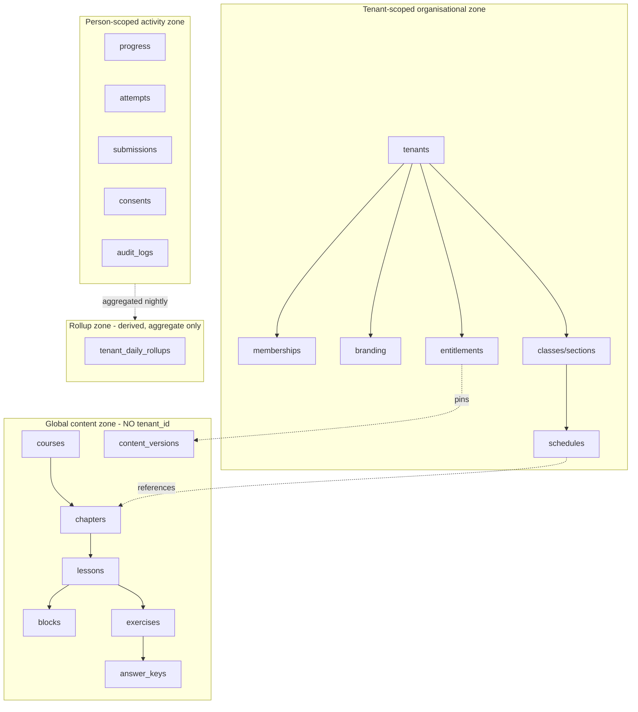

### 6.2 Tenant resolution order

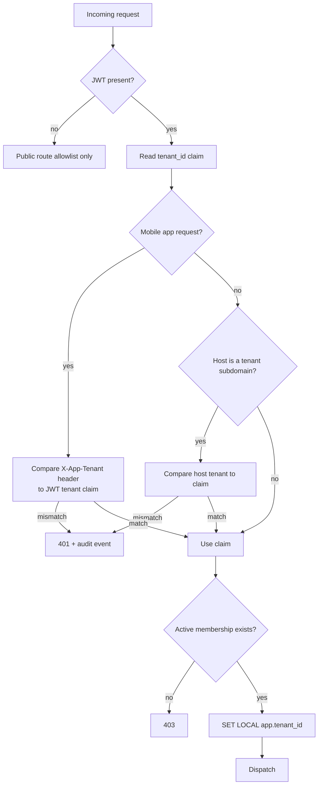

Three independent signals must agree before a tenant context is established: the JWT claim, the delivery surface (host or app identifier), and a live membership check. A disagreement is a security event, logged and alarmed, not a silent redirect.

### 6.3 RLS policy pattern

Applied identically to every tenant-owned table. `ddl` is generated from a single template so no table is policy-free by accident.

```sql
ALTER TABLE progress ENABLE ROW LEVEL SECURITY;
ALTER TABLE progress FORCE ROW LEVEL SECURITY;

CREATE POLICY tenant_isolation ON progress
  USING (tenant_id = NULLIF(current_setting('app.tenant_id', true), '')::uuid)
  WITH CHECK (tenant_id = NULLIF(current_setting('app.tenant_id', true), '')::uuid);
```

- `USING` governs reads, updates and deletes; `WITH CHECK` prevents inserting a row into another tenant.
- `NULLIF(..., '')` makes an unset GUC produce `NULL`, and `tenant_id = NULL` is never true, so an unscoped query returns nothing.
- `FORCE` means the table owner is also subject to the policy, closing the most common misconfiguration.

### 6.4 Database roles

| Role | Grants | Used by |
|---|---|---|
| `brolly_owner` | DDL owner, migrations only | Migration job, never the application |
| `brolly_app` | CRUD on application tables. **No** `SUPERUSER`, **no** `BYPASSRLS` | brolly-api, celery workers |
| `brolly_platform` | SELECT on tenant directory and rollup tables only | Cross-tenant dashboard queries |
| `brolly_readonly` | SELECT for analytics jobs, RLS applies | Reporting jobs |

Verified in CI: `SELECT rolsuper, rolbypassrls FROM pg_roles WHERE rolname='brolly_app'` must return `f, f`.

### 6.5 Per-tenant configuration

| Concern | Mechanism |
|---|---|
| Branding | `branding` row, resolved at runtime, cached 5 min, invalidated on write |
| Permissions | Role templates plus per-tenant permission overrides on `memberships` |
| Scheduling | `schedules` rows per section, tenant timezone applied |
| Reports | Every report query is tenant-scoped by RLS; no report accepts a tenant parameter from the client |
| Feature flags | `tenant_settings` JSONB with a validated schema; unknown keys rejected |

### 6.6 Noisy-neighbour controls

- Per-tenant API rate limits in Redis, keyed `rl:{tenant}:{route}`.
- Per-tenant code-execution quota; on exhaustion the tenant degrades to practice-only rather than erroring the lesson.
- Statement timeout of 5 s on `brolly_app`; 30 s for reporting role.
- Connection pool partitioned so one tenant's slow report cannot exhaust the pool used by lesson delivery.

---

## 7. Authentication Architecture

### 7.1 Token model

| Token | Lifetime | Storage | Contents |
|---|---|---|---|
| Access JWT | 15 min | Memory (web), SecureStore (mobile) | `sub`, `tid`, `role`, `perm_v`, `imp`, `jti`, `exp`, `aud`, `iss` |
| Refresh token | 30 days staff / 90 days student | HttpOnly Secure SameSite=Strict cookie (web), SecureStore (mobile) | Opaque, hashed at rest, one row per device |
| Service JWT | 5 min | In-memory | `sub=service`, `aud=content-hub` |
| Callback token | Single use, 15 min | In-memory | Binds a code-exec result to one submission |

`perm_v` is a permission-set version. Changing a membership increments the tenant's permission version, which invalidates cached permission sets and forces re-resolution on the next request — this is how FR-IAM-08 (revocation takes effect on the next request, not the next login) is delivered without shortening the access token to an unusable lifetime.

### 7.2 Login flows

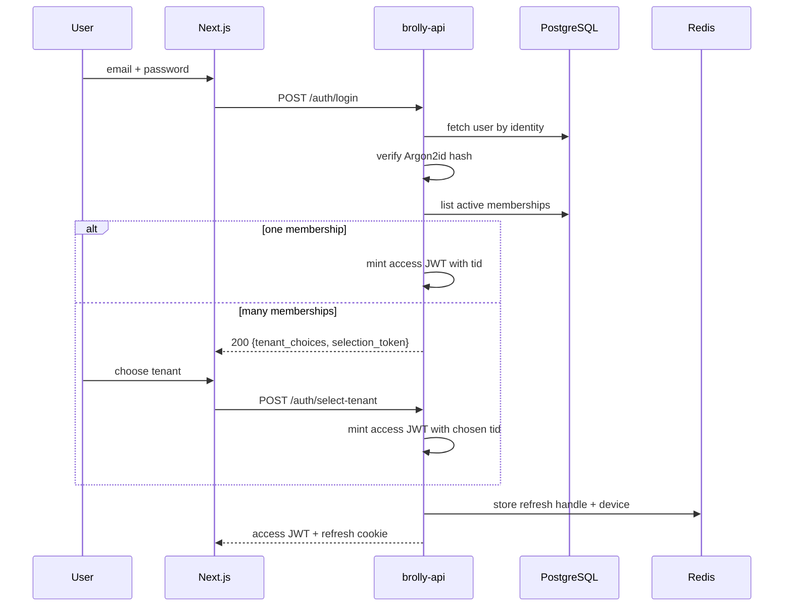

**Student login** does not use email. A student authenticates with `tenant short code + roster identifier + PIN`. The PIN is issued by the school, hashed with Argon2id, and must be changed on first use. Rate limiting is per identifier and per tenant, never per source IP alone, because forty students share one lab NAT address and IP-based lockout would lock out the class.

**Mobile login** additionally sends `X-App-Tenant` derived from the build flavour. A user with no membership in that tenant is rejected at the app, which is what makes a school app a school app rather than a re-skinned universal client.

### 7.3 Password and credential policy

| Control | Setting |
|---|---|
| Hash | Argon2id, memory 64 MB, time 3, parallelism 4 |
| Staff minimum | 12 characters, checked against a breached-password list |
| Student PIN | 6 digits, rotated on first use, lockout after 10 failures in 15 minutes with teacher-initiated unlock |
| Reset | Single-use token, 30 min, invalidates all refresh tokens |
| MFA | TOTP required for Brolly Admin, optional for School Admin, out of scope for students |

### 7.4 Impersonation

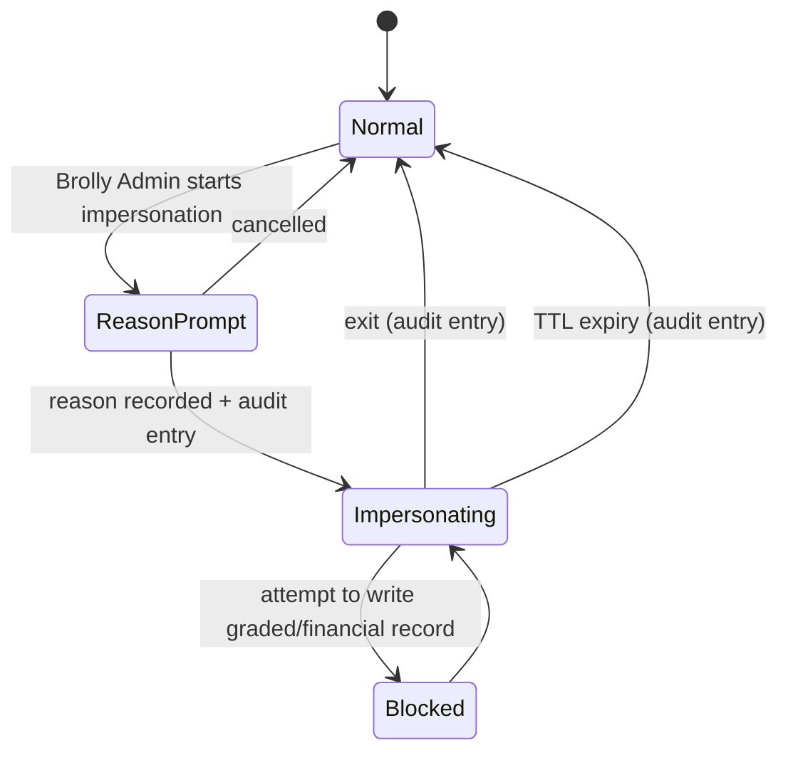

The impersonation JWT carries `imp: {actor_user_id, reason_id, expires_at}`. Every API response during an impersonated session includes a header the client uses to render the persistent banner, so a stale UI cannot hide an active impersonation.

### 7.5 Session revocation

- Refresh tokens are rows; revoking a device deletes the row.
- A `jti` denylist in Redis covers the ≤15-minute window in which an already-issued access token would otherwise remain valid after an emergency revocation.
- Membership revocation increments `perm_v`, so the next request re-resolves and fails authorisation even if the token is still cryptographically valid.

---

## 8. Authorization Architecture

### 8.1 Model

Authorisation is evaluated in three layers, each of which can only deny:

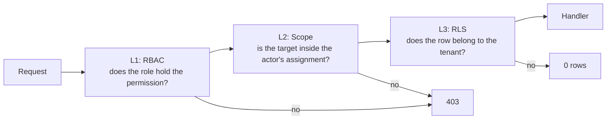

L1 is fast and cached. L2 is domain logic (a teacher's sections, a guardian's linked children). L3 is the database and is the control of record. Removing any one of the three must not produce a cross-tenant read — that property is what the isolation suite asserts.

### 8.2 Permission naming

`<resource>:<action>[:<qualifier>]` — for example `submission:grade:assigned`, `content:publish`, `tenant:impersonate`, `report:read:tenant`, `report:read:platform`.

### 8.3 Role → permission mapping (abridged; full matrix in the PRD §9.2)

| Permission | Brolly Admin | School Admin | Teacher | Student | Guardian |
|---|---|---|---|---|---|
| `tenant:create` | ✔ | | | | |
| `tenant:impersonate` | ✔ | | | | |
| `branding:write` | ✔ | ✔ | | | |
| `roster:import` | ✔ | ✔ | | | |
| `schedule:write` | ✔ | ✔ | delegated | | |
| `content:publish` | ✔ | | | | |
| `answer_key:read` | ✔ | | ✔ | | |
| `submission:grade:assigned` | via impersonation | | ✔ | | |
| `submission:read:own` | | | | ✔ | linked child |
| `report:read:tenant` | ✔ | ✔ | | | |
| `report:read:platform` | ✔ (rollups only) | | | | |
| `audit:read:tenant` | ✔ | ✔ | | | |

### 8.4 Enforcement in FastAPI

```python
@router.post("/submissions/{sid}/grade")
async def grade(
    sid: UUID,
    body: GradeIn,
    ctx: RequestContext = Depends(require_permission("submission:grade:assigned")),
    uow: UnitOfWork = Depends(get_uow),
):
    sub = await uow.submissions.get(sid)          # RLS already scoped this
    await assert_teaches_section(ctx, sub.section_id)   # L2 scope check
    ...
```

`require_permission` is the only way a route obtains a context; a route declared without it fails a CI check that inspects the router table.

### 8.5 Delegated permissions

School Admins may delegate `schedule:write` to teachers per section. Delegation is a row, not a role, so it is auditable and revocable without inventing a new role. New roles are expensive: each one multiplies the permission matrix that QA must test.

---

## 9. API Architecture

### 9.1 Conventions

| Concern | Decision |
|---|---|
| Style | REST over HTTPS, JSON, resource-oriented |
| Versioning | URI prefix `/v1`; breaking changes create `/v2` and both run during a deprecation window |
| Naming | Plural nouns, kebab-free, snake_case JSON fields |
| Pagination | Cursor-based: `?cursor=&limit=` returning `{items, next_cursor}` |
| Filtering | Explicit allowlisted query parameters; no arbitrary filter DSL |
| Errors | RFC 9457 problem+json with `type`, `title`, `status`, `detail`, `request_id` |
| Idempotency | `Idempotency-Key` header required on POST for payments and imports |
| Rate limits | `X-RateLimit-*` headers; 429 with `Retry-After` |
| Contract | OpenAPI 3.1 generated by FastAPI; TypeScript client generated in CI and committed |
| Time | All timestamps UTC ISO-8601; tenant timezone applied at render |

**No tenant identifier is ever accepted from the client on a tenant-scoped route.** The tenant comes from the token. A route that takes `tenant_id` as a parameter is a bug and is caught by a schema lint.

### 9.2 Surface map

| Group | Representative endpoints |
|---|---|
| Auth | `POST /v1/auth/login` · `/auth/student-login` · `/auth/select-tenant` · `/auth/refresh` · `/auth/logout` · `/auth/password-reset` |
| Me | `GET /v1/me` · `GET /v1/me/memberships` · `GET /v1/me/progress` |
| Tenants (platform) | `POST /v1/admin/tenants` · `PATCH /v1/admin/tenants/{id}` · `POST /v1/admin/tenants/{id}/entitlements` · `POST /v1/admin/impersonations` |
| Branding | `GET /v1/branding` · `PUT /v1/branding` |
| Roster | `POST /v1/roster/imports` (dry-run) · `POST /v1/roster/imports/{id}/commit` · `GET /v1/roster/imports/{id}` |
| Org | `GET/POST /v1/classes` · `/sections` · `/sections/{id}/members` · `/sections/{id}/teachers` |
| Schedule | `GET/PUT /v1/sections/{id}/schedule` |
| Learning | `GET /v1/courses` · `/courses/{id}/chapters` · `/chapters/{id}` · `POST /v1/progress/events` |
| Practice | `GET /v1/exercises/{id}` (starter + tests, no answer key) |
| Submissions | `POST /v1/submissions` · `GET /v1/submissions/{id}` · `GET /v1/submissions?section_id=` |
| Grading | `POST /v1/submissions/{id}/grade` · `POST /v1/submissions/{id}/feedback` |
| Assessment | `GET /v1/assessments/{id}` · `POST /v1/assessments/{id}/attempts` · `POST /v1/attempts/{id}/submit` |
| Consent | `POST /v1/consents` · `POST /v1/consents/{id}/withdraw` · `GET /v1/consents` |
| Reports | `GET /v1/reports/class/{id}` · `/reports/student/{id}` · `/admin/reports/platform` |
| Notifications | `GET /v1/notifications` · `POST /v1/devices` |
| Billing | `GET /v1/subscriptions` · `POST /v1/checkout-sessions` · `POST /v1/webhooks/payments` |
| Content Hub (internal) | `GET /int/v1/versions/{id}/chapters/{cid}` · `POST /int/v1/versions/{id}/publish` |
| Health | `GET /healthz` (liveness) · `GET /readyz` (dependencies) |

### 9.3 Error taxonomy

| HTTP | `type` | When |
|---|---|---|
| 400 | `validation-error` | Payload fails schema |
| 401 | `unauthenticated` | Missing/invalid/expired token |
| 401 | `tenant-mismatch` | Token tenant disagrees with delivery surface — always audited |
| 403 | `permission-denied` | RBAC or scope denial |
| 403 | `consent-required` | No valid consent for the purpose |
| 404 | `not-found` | Includes anything the tenant cannot see — never 403, to avoid confirming existence across tenants |
| 409 | `conflict` | Idempotency or version conflict |
| 422 | `unprocessable` | Semantically invalid (e.g. schedule for an unentitled course) |
| 429 | `rate-limited` | Quota exceeded |
| 503 | `dependency-unavailable` | Code execution or gateway down; body states the degraded mode |

**404, not 403, for cross-tenant targets.** A 403 tells an attacker the resource exists in another tenant. A 404 tells them nothing.

### 9.4 Realtime

Server-Sent Events on `/v1/submissions/{id}/events` for grading results and `/v1/sections/{id}/events` for the teacher's live progress board. SSE rather than WebSockets: the traffic is one-directional, it survives ALB idle timeouts with a heartbeat, and it needs no new infrastructure.

---

## 10. Infrastructure Architecture

### 10.1 AWS account and network

| Item | Decision |
|---|---|
| Accounts | Separate AWS accounts for `production` and `non-production`, under one Organization |
| Region | `ap-south-1` (Mumbai). No data leaves the region. |
| AZs | Three |
| VPC | `10.20.0.0/16` production |
| Subnets | Public ×3 (ALB, NAT) · App private ×3 · Exec private ×3 (no NAT route) · Data private ×3 |
| Egress | NAT Gateway for app tier only; exec tier has none |
| Endpoints | VPC endpoints for S3, ECR, Secrets Manager, CloudWatch Logs |

### 10.2 Compute sizing (pilot)

| Service | Task size | Count | Autoscale on |
|---|---|---|---|
| `brolly-api` | 1 vCPU / 2 GB | 2–6 | CPU 60% and ALB request count |
| `content-hub` | 0.5 vCPU / 1 GB | 2 | CPU 60% |
| `celery-worker` | 1 vCPU / 2 GB | 2–8 | Queue depth |
| `celery-beat` | 0.25 vCPU / 0.5 GB | 1 | none (singleton) |
| `code-exec` | 1 vCPU / 2 GB | 2–20 | Queue depth, scale-to-min off-hours |

Autoscaling is scheduled as well as reactive: Indian school hours are predictable, so capacity is raised at 07:00 IST and lowered at 18:00 IST rather than waiting for latency to degrade during first period.

### 10.3 Data tier

| Item | Decision |
|---|---|
| Engine | PostgreSQL 16 on RDS, Multi-AZ |
| Instance (pilot) | `db.t4g.medium` primary, one read replica for reporting |
| Storage | gp3, autoscaling enabled, encrypted with a customer-managed KMS key |
| Connections | PgBouncer sidecar in transaction pooling mode; app pool sized to avoid RDS connection exhaustion |
| Redis | ElastiCache, `cache.t4g.small`, Multi-AZ, encryption in transit and at rest |
| Isolated class | Separate RDS instance, separate KMS key, separate parameter group |

**PgBouncer caveat, stated because it is the classic way an RLS system leaks:** transaction pooling is safe only because the tenant GUC is set with `SET LOCAL` inside the transaction. Session-level `SET` with transaction pooling would leak a tenant across requests. This is asserted by an integration test that runs concurrent requests for two tenants through the pooler and checks for cross-contamination.

### 10.4 Secrets and configuration

- Secrets Manager for database credentials, gateway keys, signing keys; rotation enabled on database credentials.
- Parameter Store for non-secret configuration, namespaced `/brolly/{env}/{service}/...`.
- No secret is ever a container environment variable baked into an image; secrets are injected by ECS at task start from Secrets Manager ARNs.
- A CI job (`gitleaks`) fails the build on any credential-shaped string in the diff.

### 10.5 Cost controls

Budgets with alarms at 70/90/100 percent; scheduled scale-down outside school hours; S3 lifecycle to Infrequent Access at 90 days and Glacier at 365 for exports and backups; CloudWatch log retention set explicitly per log group (30 days application, 400 days audit) because the default of "never expire" is the single largest silent cost in a CloudWatch-based stack.

---

## 11. CDN Architecture

### 11.1 Distribution layout

| Path pattern | Origin | Cache | Auth |
|---|---|---|---|
| `/_next/static/*` | S3 (web build) | 1 year immutable | public |
| `/assets/content/{version}/*` | S3 content bucket | 1 year immutable, version in path | public (non-sensitive illustrations) |
| `/assets/private/*` | S3 content bucket | no-store at edge | CloudFront signed URL, 10 min TTL |
| `/api/*` | ALB | no-store | Bearer JWT |
| `/branding/{tenant}/*` | S3 | 5 min | public (logos are public by nature) |

### 11.2 Why versioned immutable paths

Content is versioned and immutable (BR-CNT-02), so asset URLs contain the content version. A correction publishes a new version with new URLs, and no cache invalidation is required. Invalidation is reserved for mistakes; it is slow, rate-limited and easy to get wrong, and a design that depends on it will eventually serve a stale chapter to one school and the corrected one to another.

### 11.3 Private asset flow

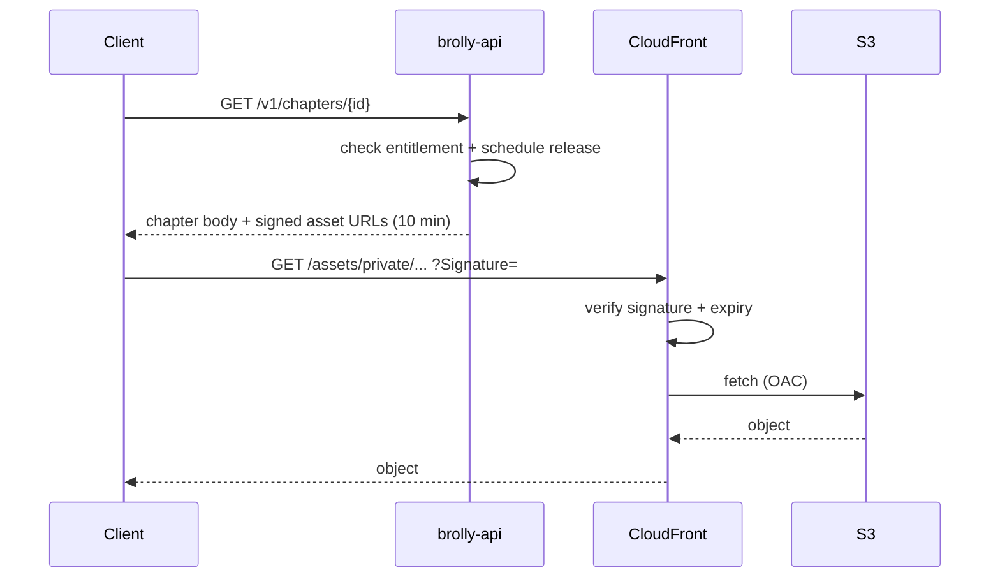

S3 buckets are private with Origin Access Control; there is no public bucket policy anywhere in the estate.

### 11.4 Edge security

AWS WAF on the distribution with: AWS managed common rule set, known-bad-inputs set, rate-based rule at 2,000 requests per 5 minutes per IP for `/api/*`, and a geo posture that logs rather than blocks (a pilot school's traffic can egress through unexpected addresses and blocking on geography would take a classroom offline mid-period).

---

## 12. Security Architecture

### 12.1 Layered controls

| Layer | Controls |
|---|---|
| Edge | TLS 1.2+, WAF, rate limiting, signed URLs |
| Network | Private subnets, security groups least-privilege, no inbound to app tier except ALB, no egress from exec tier |
| Identity | JWT with short access lifetime, refresh rotation, MFA for admins, Argon2id |
| Authorisation | Three-layer model (§8.1), 404-not-403 for cross-tenant |
| Data | RLS forced, non-superuser app role, KMS at rest, TLS in transit, column-level encryption for the few sensitive fields |
| Code execution | Full sandbox contract (§4.5) |
| Supply chain | Pinned dependencies, `pip-audit` and `npm audit` gates, image scanning in ECR, SBOM per release |
| Secrets | Secrets Manager, rotation, no secrets in images or logs |
| Application | Pydantic validation on every input, parameterised queries only, output encoding, CSP, strict CORS allowlist |
| Operations | Least-privilege IAM, no long-lived human access keys, break-glass role with alarm on assumption |

### 12.2 Threat model — the five that matter here

| Threat | Vector | Control | Detection |
|---|---|---|---|
| Cross-tenant data access | Forged/replayed token, missing tenant context, pooler leak | Three-signal resolution, RLS forced, `SET LOCAL`, isolation suite in CI | Alarm on `tenant-mismatch` 401s |
| Untrusted code escape | Student submission | No egress, tmpfs, resource caps, no subprocess, disposable task | Anomalous exec duration/exit codes |
| Credential stuffing on student accounts | Shared PINs, lab NAT | Per-identifier rate limits, forced first-use change, teacher unlock | Failed-login rate per tenant |
| Insider over-access | Support engineer curiosity | Impersonation-only access with reason and TTL; no direct production DB console for engineers | Every impersonation audited and visible to the school |
| Content tampering | Compromised publish path | Immutable versions, publish requires `content:publish`, execution gate | Publish audit trail with diff |

### 12.3 Data classification

| Class | Examples | Handling |
|---|---|---|
| Public | Marketing pages, logos, illustrations | CDN cacheable |
| Internal | Curriculum bodies, answer keys | Signed URLs, role-gated |
| Personal (child) | Name, roster ID, submissions, progress | RLS, minimised, never in logs, erasable |
| Sensitive | Credentials, consent evidence, payment references | Encrypted, restricted columns, never exported in bulk |

### 12.4 Compliance-driven controls

| Requirement | Control |
|---|---|
| DPDP: verifiable parental consent | `consents` table with evidence reference; consent gate at the service layer |
| DPDP: no tracking of children | CI scan rejecting analytics/attribution/session-replay SDKs in student bundles |
| DPDP: erasure | Retention scheduler plus an erasure workflow that is tested, not theoretical |
| DPDP: breach notification within 72 h | Detection alarms, an owned runbook, and a rehearsed notification template |
| Data residency | Single region, VPC endpoints, no cross-region replication |
| Play Families policy | No ad SDKs, target-age declaration, per-tenant privacy policy URL |

### 12.5 Testing

Isolation suite on every build; dependency and image scanning on every build; DAST against staging weekly; external penetration test focused on tenant isolation before the sixth school; annual review thereafter.

---

## 13. Logging Strategy

### 13.1 Log classes

| Class | Destination | Retention | Contains personal data |
|---|---|---|---|
| Application | CloudWatch Logs `/brolly/{env}/{service}` | 30 days | No |
| Access | ALB + CloudFront logs to S3 | 90 days | IP only |
| Audit | `audit_logs` table, mirrored to S3 Object Lock | 400 days minimum | Identifiers, not content |
| Security | CloudTrail, GuardDuty | 400 days | No |
| Exec | Per-run log stream | 7 days | Submitted source only |

### 13.2 Structured format

```json
{
  "ts": "2026-09-02T04:11:02.481Z",
  "level": "INFO",
  "service": "brolly-api",
  "env": "production",
  "request_id": "01J...",
  "correlation_id": "01J...",
  "tenant_id": "8f3...",
  "user_id": "b21...",
  "route": "POST /v1/submissions",
  "status": 202,
  "duration_ms": 41,
  "event": "submission.queued"
}
```

Identifiers, never content. No name, email, roster number, submitted source or free text from a child appears in an application log. A logging middleware runs a redaction pass and a unit test asserts that a payload containing known personal-data field names is redacted before emission.

### 13.3 Correlation

`request_id` is generated at the edge and propagated through the API, Celery task headers and the code-exec callback, so one identifier reconstructs a submission from the student's tap to the teacher's marking queue.

### 13.4 Audit logging

Audit is a database table with triggers, not a log stream, because it must be queryable by a School Admin and must survive log expiry. Events: authentication, membership change, impersonation start/end, roster import, schedule change, content publish, entitlement change, grade override, consent grant/withdraw, export, erasure. `UPDATE` and `DELETE` are revoked from the application role on this table.

---

## 14. Monitoring Strategy

### 14.1 The four signals per service

| Service | Latency | Traffic | Errors | Saturation |
|---|---|---|---|---|
| brolly-api | p50/p95/p99 per route group | RPS by tenant | 5xx rate, 401 `tenant-mismatch` count | CPU, pool utilisation |
| content-hub | p95 fetch | RPS | 5xx | CPU |
| code-exec | queue wait + run duration | submissions/min | timeouts, OOM kills | queue depth, task count |
| workers | task duration | tasks/min | failures, retries, DLQ depth | queue depth |
| database | query p95 | connections | deadlocks, errors | CPU, IOPS, replication lag, storage |

### 14.2 Business and product monitors

Weekly active students, chapter completions, submissions graded, activation funnel per tenant, schedule drift per class, exercise pass-rate band breaches. These are computed from rollups and published to a CloudWatch dashboard alongside the technical signals, because a product that is up but unused fails in exactly the same way as a product that is down, and only one of those two is visible on a standard dashboard.

### 14.3 Alarms

| Alarm | Condition | Severity | Response |
|---|---|---|---|
| Cross-tenant signal | Any `tenant-mismatch` 401, or isolation test failure in production smoke | **P1** | Halt releases, investigate immediately, begin breach assessment |
| API availability | 5xx > 2% for 5 min during school hours | P1 | Page |
| API latency | p95 > 1 s for 10 min | P2 | Investigate |
| Exec queue | Depth > 500 or wait > 60 s | P2 | Scale, then investigate |
| DB CPU | > 80% for 15 min | P2 | Investigate slow queries |
| Replica lag | > 30 s | P2 | Reporting degraded |
| Failed tasks | DLQ depth > 0 | P2 | Triage |
| Backup | Any missed snapshot or failed restore test | P1 | Ops owner |
| Consent gate | Any processing attempt refused for missing consent above baseline | P2 | Compliance review |
| Budget | 90% of monthly budget | P3 | Finance review |

### 14.4 Health endpoints

`/healthz` returns 200 if the process is alive. `/readyz` checks database, Redis and Content Hub reachability and returns a per-dependency status. ECS uses `/healthz` for task health and the ALB uses `/readyz` for target registration, so a dependency outage drains traffic without killing tasks into a restart loop.

### 14.5 On-call

Business-hours-first rotation aligned to Indian school hours (07:00–18:00 IST, Monday to Saturday), with a P1-only out-of-hours page. Every P1 produces a written post-incident review with a cause and, more importantly, the check that would have caught it — per NFR-MNT-05, a rule that exists only in prose degrades.

---

## 15. Scalability Strategy

### 15.1 Growth axes and their limits

| Axis | Pilot | First constraint met | Response |
|---|---|---|---|
| Tenants | 6 | ~200 tenants: rollup job duration | Parallelise per-tenant rollups; partition rollup table |
| Students | ~2,000 | ~50,000: `attempts`/`submissions` table size | Range partition by month; archive to S3 |
| Concurrent lessons | ~200 | API task count | Horizontal scale, scheduled pre-warm |
| Graded submissions | low | Exec queue depth at exam season | Scale exec tasks; queue with visible position |
| Content volume | 10 books | S3/CDN unbounded | None |
| Mobile flavours | 5 | ~15 flavours: build time and store review load | Reassess flavour-versus-single-app at 10 schools |

### 15.2 Scaling levers, in order of preference

1. **Do less work.** Pyodide for practice removes the largest source of per-student server load entirely.
2. **Cache.** Content projections, branding, permission sets, entitlement checks — all read-mostly with clear invalidation.
3. **Scale out stateless tiers.** API, workers and exec are stateless; add tasks.
4. **Read replicas** for reporting, which is the only heavy read workload.
5. **Partition** the two tables that grow without bound (`attempts`, `audit_logs`).
6. **Shard by tenant** — last resort, and the shared-schema model already makes it a routing change rather than a rewrite, because tenants are physically separable at any time by moving rows.

### 15.3 Indexing principle

Every tenant-scoped index leads with `tenant_id`. A query planner that cannot use `tenant_id` first will scan another tenant's rows and discard them under RLS, which is correct but wasteful and becomes the dominant cost at scale. The schema document specifies these indexes per table.

### 15.4 Load testing

Before Gate 3, a k6 scenario simulating five schools starting first period simultaneously: 200 concurrent logins in 60 seconds, 200 chapter loads, 400 practice runs (client-side, measured on device), 100 graded submissions. Acceptance is the PRD §14.1 budgets, measured on the reference device, not on a developer laptop.

---

## 16. Backup Strategy

| Asset | Method | Frequency | Retention | Restore test |
|---|---|---|---|---|
| PostgreSQL (shared) | RDS automated backups + PITR | Continuous, 5 min granularity | 35 days | Monthly |
| PostgreSQL (isolated) | Separate automated backups + PITR | Continuous | 35 days | Monthly |
| Long-term DB | AWS Backup monthly snapshot to a vault | Monthly | 12 months | Quarterly |
| S3 content | Versioning + cross-account replication within region | Continuous | Indefinite | Quarterly |
| S3 exports/audit mirror | Object Lock (governance mode) | Continuous | 400 days | Quarterly |
| Secrets | Secrets Manager versioning | Continuous | 90 days | On rotation |
| Infrastructure | Terraform state in S3 with DynamoDB locking, versioned | Per apply | Indefinite | On every apply |

Rules: backups are encrypted with a separate KMS key from the primary; the backup vault is in a different AWS account so a compromised production account cannot delete backups; a restore that has not been tested is not a backup, so the monthly restore test writes a result into the release record and a missed test is a P1 alarm.

---

## 17. Disaster Recovery Strategy

### 17.1 Objectives

| Scenario | RPO | RTO |
|---|---|---|
| Single task/AZ failure | 0 | Automatic, < 2 min |
| Database primary failure | 0 (Multi-AZ) | < 5 min automatic failover |
| Accidental data destruction | ≤ 5 min | ≤ 4 h via PITR |
| Region failure | ≤ 24 h | ≤ 24 h (documented, not automated) |
| Ransomware / account compromise | ≤ 24 h | ≤ 48 h from cross-account vault |

### 17.2 Region failure position, stated honestly

There is no warm standby in a second region. Data residency (CN-3) and pilot economics both argue against it, and a second-region standby that is never exercised is a cost with no reliability benefit. The documented position is: infrastructure is reproducible from Terraform in under two hours, and data is restorable from the cross-account vault. This is a **≤24 hour** recovery, and it is acceptable for a school platform where a lost day means a rescheduled period, not a financial loss. This position should be revisited when a school contract specifies an RTO.

### 17.3 Runbooks required before Gate 3

`RB-01` database restore to a point in time · `RB-02` full environment rebuild from Terraform · `RB-03` isolated-tenant restore without touching shared data · `RB-04` credential rotation under compromise · `RB-05` breach assessment and 72-hour notification · `RB-06` rollback of a bad release · `RB-07` content version rollback.

Each runbook names an owner, has been executed at least once in staging, and records the date it was last exercised.

### 17.4 DR drill schedule

Quarterly game day: one drill from `RB-01`, `RB-02` or `RB-03`, timed, with the result recorded against the RTO target above.

---

## 18. Deployment Architecture

### 18.1 Pipeline

```mermaid
flowchart LR
    A[PR opened] --> B[Lint + typecheck]
    B --> C[Unit tests]
    C --> D[Isolation suite<br/>AC-G-01..03]
    D --> E[Contract + integration tests]
    E --> F[Security scans<br/>deps, image, secrets]
    F --> G[Child-surface SDK scan<br/>AC-G-06]
    G --> H[Build images + push ECR]
    H --> I{main?}
    I -- yes --> J[Deploy staging]
    J --> K[Smoke + E2E]
    K --> L{Tagged release?}
    L -- yes --> M[Manual approval]
    M --> N[Migrate]
    N --> O[Blue/green deploy production]
    O --> P[Post-deploy smoke]
    P --> Q{Healthy?}
    Q -- no --> R[Automatic rollback]
```

### 18.2 Release gates in CI

Each maps to a PRD acceptance criterion and fails the build, not a report:

| Gate | Check |
|---|---|
| AC-G-01 | Every tenant-scoped model returns zero foreign rows under a second tenant's context |
| AC-G-02 | No Celery task outside `TenantTask` or the platform allowlist |
| AC-G-03 | `brolly_app` is not superuser and lacks `BYPASSRLS`; every tenant-owned table has RLS forced with a policy |
| AC-G-04 | Impersonation cannot start without a reason; paired audit rows asserted |
| AC-G-05 | Consent gate refuses processing without a valid grant |
| AC-G-06 | No analytics/attribution/session-replay SDK in any student bundle |
| AC-G-07 | No purchase surface, price string or billing SDK in any mobile flavour |
| AC-G-08 | Every code fragment in the content under publish executed and matched |

### 18.3 Database migrations

Alembic, expand-and-contract only:

1. Release *n* adds the new column/table, nullable or defaulted, and writes to both shapes.
2. Release *n* backfills in a `TenantTask` batch job.
3. Release *n+1* reads the new shape.
4. Release *n+2* drops the old shape.

Migrations run as `brolly_owner` in a one-off ECS task before the service deploy, are forward-only in production, and are applied to Class B databases in the same pipeline stage so the two classes never drift. Any migration adding a tenant-owned table must also add the RLS policy in the same revision; a CI check compares the table list against the policy list and fails on a gap.

### 18.4 Deployment strategy

ECS blue/green via CodeDeploy with a 10% canary for 10 minutes, automatic rollback on 5xx or latency alarm. Deployments are scheduled outside 07:00–17:00 IST on weekdays unless the change is a fix for a live incident.

### 18.5 Mobile release pipeline

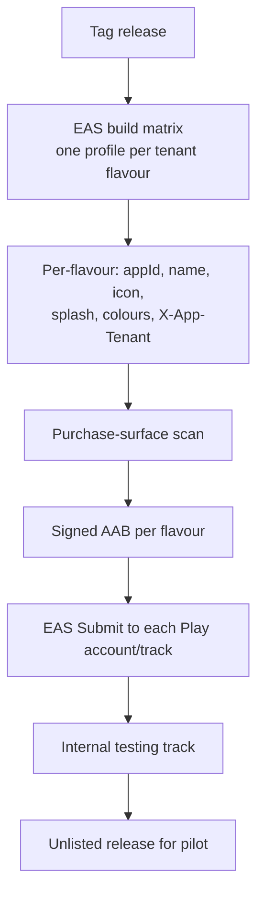

Signing keys are held per flavour in EAS with documented recovery; a lost upload key is not recoverable by the team without Google's intervention, so key custody is a named responsibility, not an implicit one. Flavours are staggered across days at first submission so one policy rejection does not block five listings simultaneously.

### 18.6 Configuration and feature flags

Environment configuration is in Parameter Store per environment and service. Feature flags are database rows on `tenant_settings` with a validated schema, evaluated server-side, defaulting to off. Flags are removed within two releases of full rollout; a flag that outlives its rollout becomes an untested code path.

### 18.7 Rollback

| Change type | Rollback |
|---|---|
| Application | Blue/green shift back; automatic on alarm |
| Migration | Never rolled back; expand-and-contract means release *n−1* still works against the new schema |
| Content | Repoint the tenant's entitlement to the previous immutable version |
| Mobile | Halt staged rollout; ship a fixed build (no true rollback exists on Play) |

---

## 19. Traceability to PRD Requirements

| PRD requirement group | Satisfied by |
|---|---|
| FR-TEN-01…10 | §6, §4.2, §4.3, §18.2 |
| FR-IAM-01…11 | §7, §8 |
| FR-CON-01…11 | §12.4, §13.4, Schema doc |
| FR-CH-01…10 | §5, §11, §18.3 |
| FR-ENT / FR-LRN | §9.2, §4.5, §11.3 |
| FR-CODE-01…07 | §4.5, §12.2 |
| FR-MOB-01…08 | §18.5 |
| FR-AUD-01…05 | §13.4, §16 |
| NFR-PRF | §10.2, §15.4 |
| NFR-SEC / NFR-PRV | §12 |
| NFR-AVL | §17 |
| NFR-MNT | §13, §14, §18 |

---

## 20. Open Technical Questions

| # | Question | Blocks | Owner |
|---|---|---|---|
| T1 | Does the isolated tenant's contract require a separate AWS account rather than a separate RDS instance? | Class B design, cost | Founder + Architect |
| T2 | Play Console account type and whether one account can host five school-named listings, or each school needs its own developer account. | §18.5 entirely; longest lead time | Founder |
| T3 | Payment gateway selection and whether B2B invoicing is in-product or offline. | §9.2 billing surface | Founder |
| T4 | Is a read replica needed at pilot scale, or does it wait for measured reporting load? | §10.3 cost | Architect |
| T5 | Retention periods per data class, once legal opinion on fiduciary role is received. | §13.1, retention jobs | Compliance |

These are technical restatements of PRD §20.4 and do not add new unknowns beyond T1 and T4.
