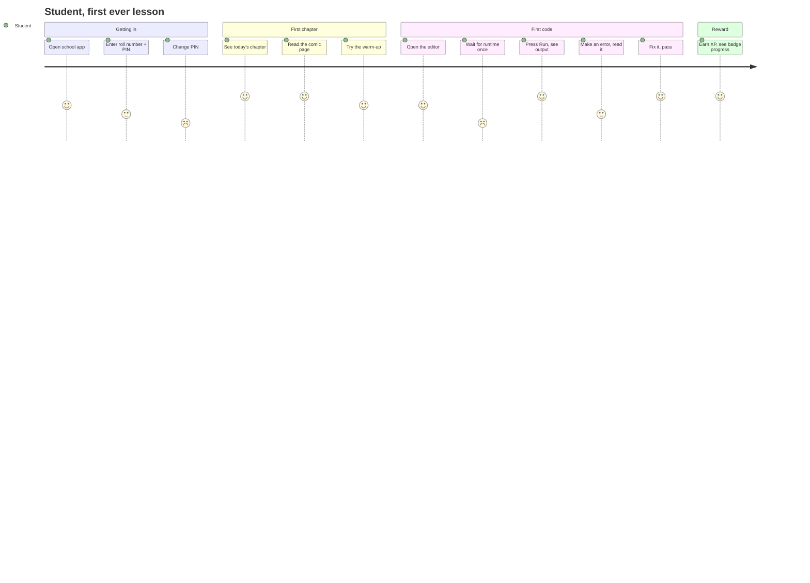
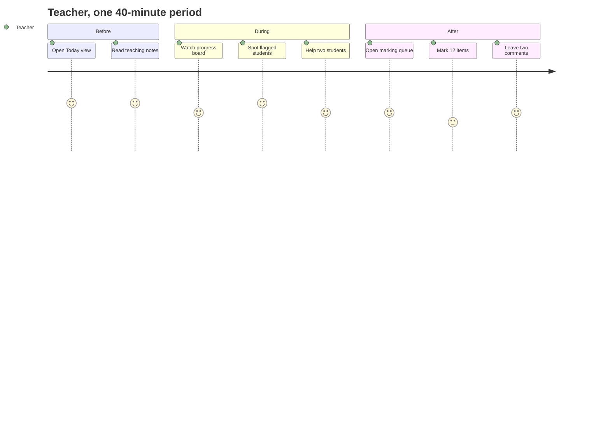
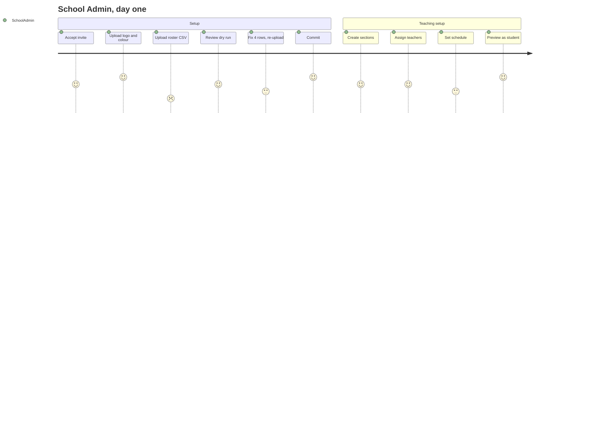

# Brolly Juniors — UI/UX Design Brief

**Version:** 1.0
**Date:** 2 September 2026
**Owner:** Lead UX Architect
**Audience:** Design · Frontend · Product · QA
**Surfaces covered:** Student App (web + Expo) · Teacher App (web + Expo) · School Admin Portal (web) · Brolly Admin Portal (web)

---

## 1. Product Design Strategy

### 1.1 The design problem, stated plainly

Four audiences with almost nothing in common share one codebase: a ten-year-old on a shared phone, a non-programmer teacher with thirty-nine other children in the room, a vice-principal who is not technical and is accountable to a governing body, and a platform operator who must not casually see a child's work. A single "clean modern SaaS" treatment fails at least three of them.

The strategy is **one design system, four postures**:

| Surface | Posture | What that means concretely |
|---|---|---|
| Student | Playful, generous, forgiving | Large targets, one primary action per screen, XP and badges carried over from the textbooks, error states that teach |
| Teacher | Dense, fast, keyboard-friendly | Everything for one period on one screen; marking in under a minute per item |
| School Admin | Reassuring, evidence-forward | Every destructive action has a dry run; every question the principal asks is answerable from one page |
| Brolly Admin | Sober, high-friction where it matters | Impersonation is deliberately slower than it could be; rollup timestamps always visible |

### 1.2 Brand constraint that shapes everything

In B2B, this is **the school's product**. The design system must survive having its palette and logo replaced at runtime without looking broken and without any Brolly mark appearing on a school screen. That rules out gradients keyed to a fixed brand colour, illustration styles that only work on one background, and any layout that depends on a logo's aspect ratio.

Practically: two tenant-controlled colours (primary, secondary), a logo in a fixed-height slot, everything else from the neutral scale.

### 1.3 Continuity with the printed books

The textbooks are the product students already know: Pixel the robot guide, Prof. Loop, the Bug Brigade villains, XP per chapter, badges, streaks, the named teaching boxes (LEARN IT, ITS TRAPS, TRY IT, THE BIG IDEA). The platform reuses these rather than inventing a second visual language, because a child who has seen THE INFINITE in Chapter 5 should meet the same character when their loop hangs on screen.

**Constraint:** these belong to the Brolly content, not to the tenant, so they render identically inside a school-branded app. Character art is neutral against both light backgrounds and any tenant palette.

---

## 2. UX Principles

| # | Principle | Test |
|---|---|---|
| 1 | **One primary action per screen.** | A student can name what to do next without reading twice |
| 2 | **Never hide the traceback.** | Errors show the real Python message with a hint beside it, never instead of it |
| 3 | **Destructive actions get a dry run.** | Roster import previews before it commits; nothing partial is ever applied |
| 4 | **The active tenant is always visible.** | A teacher in three schools can never mark the wrong school's class |
| 5 | **Show provenance on any number.** | Rollup timestamps, "as of", and the source of every figure a person will repeat to somebody else |
| 6 | **No child is compared to a named child.** | No leaderboards, no rankings, no "you are behind Priya" |
| 7 | **Fail informatively.** | Every error says what happened, why, and what to do next |
| 8 | **Design for the shared phone.** | 3 GB RAM Android, 4G, on-screen keyboard, interrupted sessions |
| 9 | **Reading age governs student copy.** | Class 5 surfaces written for a Class 5 reader, not a Class 9 one |
| 10 | **No engagement dark patterns.** | No streak-loss anxiety mechanics, no notification timed to pull a child back |

Principle 10 is not only ethics. Behavioural tracking of children is prohibited under DPDP, so the instrumentation that would tune such patterns does not and will not exist.

---

## 3. Design System

### 3.1 Tokens

```
--color-primary        tenant-controlled   (default #123A4B)
--color-secondary      tenant-controlled   (default #129C8B)
--color-surface        #FFFFFF
--color-surface-alt    #FEFCF5      cream, student reading surfaces
--color-border         #DCE6EE
--color-text           #16242E
--color-text-muted     #5B6B76
--color-success        #35B36A
--color-warning        #F0912F
--color-danger         #E8617E
--color-info           #3E9BD8
--color-focus          #3E9BD8      3px outline, never removed

--radius-sm 6px  --radius-md 11px  --radius-lg 16px  --radius-pill 999px
--space  4 / 8 / 12 / 16 / 24 / 32 / 48 / 64
--shadow-card  0 1px 3px rgba(22,36,46,.08), 0 4px 12px rgba(22,36,46,.05)
--dur-fast 120ms  --dur-base 200ms  --ease  cubic-bezier(.2,.7,.3,1)
```

**Tenant colours are validated on upload.** If a school's primary colour fails 4.5:1 against white, the system derives an accessible on-surface variant for text and keeps the raw colour for fills only. A school cannot make its own app illegible.

### 3.2 Typography

| Role | Family | Size / line | Use |
|---|---|---|---|
| Display | Outfit 700 | 32/40 | Screen titles |
| Heading | Outfit 600 | 24/32, 20/28 | Section headings |
| Body | Work Sans 400 | 16/26 (student), 15/24 (staff) | Prose |
| Body small | Work Sans 400 | 13/20 | Metadata, captions |
| Label | Work Sans 600 | 13/16, +0.02em | Form labels, chips |
| Code | IBM Plex Mono 400 | 14/22 | Editor, code blocks, output |
| Sticky note | Nothing You Could Do | 16/22 | Pixel's asides, student surfaces only |

Minimum body size on student surfaces is 16px and never scales below it. Font loading uses `font-display: swap` with a metric-matched fallback so a slow 4G connection shows readable text immediately rather than blank space.

### 3.3 Voice

| Surface | Voice | Example |
|---|---|---|
| Student | Direct, warm, second person, short sentences | "Your loop never stops. Look at line 4 — what makes it end?" |
| Teacher | Concise, professional, no filler | "12 items need review. 3 students flagged." |
| School Admin | Plain, evidence-led | "No rows were applied. 4 rows have errors — download the report." |
| Brolly Admin | Neutral, precise | "Figures as of 02:00 IST today." |

Never: exclamation stacking, "Oops!", anthropomorphising the platform as a friend, or telling a child they are behind.

---

## 4. Colour System

| Token | Value | Meaning | Contrast rule |
|---|---|---|---|
| Primary | tenant | Primary actions, active nav | Text on it must pass 4.5:1; derived if needed |
| Secondary | tenant | Accents, progress fills | Decorative only; never the sole carrier of meaning |
| Success | `#35B36A` | Passed, complete | Always paired with a ✓ and a label |
| Warning | `#F0912F` | Needs attention, late | Paired with an icon |
| Danger | `#E8617E` | Failed, destructive | Paired with an icon and a word |
| Info | `#3E9BD8` | Neutral notice | |
| Neutral 0–900 | greyscale | Structure | Body text ≥ 4.5:1, large text ≥ 3:1 |

**Semantic colours are fixed and are not tenant-controlled.** A school cannot make "failed" green. Status must mean the same thing across all tenants, because Brolly support reads screenshots from five schools.

Colour is never the only signal: every status has an icon and a text label. This covers colour-vision deficiency and also the printed page, since teachers print progress boards.

---

## 5. Component Library

| Component | Variants | Key states | Notes |
|---|---|---|---|
| Button | primary, secondary, ghost, danger | default, hover, focus, active, loading, disabled | Min target 44×44; loading state keeps width to avoid layout shift |
| Input / Select / Textarea | — | default, focus, error, disabled, readonly | Label always visible; error text below, never a tooltip |
| Card | default, interactive, stat | — | radius-md, shadow-card |
| Chip | neutral, status, XP, CBSE/BOOST | — | CBSE/BOOST chip is mandatory wherever alignment is claimed |
| Table | dense, comfortable | empty, loading, error | Sticky header; row actions in a fixed right column |
| Modal / Sheet | sm, md, lg | — | Sheet on mobile, modal on desktop; focus trapped; Esc closes |
| Toast | info, success, warning, danger | — | Never for errors that need action; those are inline |
| Tabs / Stepper | — | — | Stepper for roster import and onboarding |
| Progress ring / bar | — | — | Always paired with "N of M" text |
| Badge | 60 chapter badges | earned, locked | Locked shows silhouette, never a nag |
| **CodeEditor** | practice, graded, readonly | idle, running, error | CodeMirror 6; see §5.1 |
| **OutputPanel** | stdout, traceback, assertions | — | Monospace, preserves whitespace, horizontally scrollable |
| **VillainCard** | 60 sprites | — | Named error character with the rule it teaches |
| Empty state | — | — | Always says why it is empty and what to do |
| **TenantBanner** | school, impersonation | — | Persistent; impersonation variant is danger-coloured with a countdown |
| DataGrid (admin) | — | loading, empty, error | Cursor pagination; no infinite scroll on staff screens |
| ConfirmDialog | standard, typed-confirmation | — | Typed confirmation for tenant suspension and erasure |

### 5.1 CodeEditor specification

| Aspect | Decision |
|---|---|
| Engine | CodeMirror 6, Python language pack |
| Height | Min 240px, grows to content, max 60vh |
| Touch | Dedicated Tab / Backspace / `:` / `(` / `"` toolbar above the on-screen keyboard |
| Indentation | 4 spaces; Enter after `:` auto-indents; Shift+Tab dedents |
| Run | Primary button plus Ctrl/Cmd+Enter; disabled while running, with a Stop after 3s |
| Runtime | Pyodide in a Web Worker; first load shows a one-time progress indicator with an explanation |
| Errors | Full traceback in OutputPanel, plus a hint card naming the matching Bug Brigade villain when the error matches a known pattern |
| Reset | "Back to starter code" with confirmation |
| Autosave | Draft saved locally every 5 s; restored on return |
| Not included | No autocomplete, no linting squiggles. Both remove the error-reading practice the curriculum is built to teach. |

---

## 6. Responsive Design

| Breakpoint | Width | Primary surface |
|---|---|---|
| `xs` | < 480 | Student phone, teacher phone |
| `sm` | 480–767 | Large phone, small tablet |
| `md` | 768–1023 | Tablet, school lab screens |
| `lg` | 1024–1439 | Teacher/admin desktop |
| `xl` | ≥ 1440 | Admin desktop |

Rules: student surfaces are designed at `xs` first; teacher and admin at `lg` first with a usable `xs` fallback for the phone; the CodeEditor stacks editor-above-output below `md` and side-by-side at `md` and up; data tables become stacked cards below `md`, never horizontally scrolling tables; no surface requires a mouse.

**School lab reality:** many lab machines run at 1366×768 with browser chrome. `lg` layouts are verified at 1366×640 usable height, and the teacher's marking screen fits one item without scrolling at that size.

---

## 7. Accessibility Guidelines

Target: **WCAG 2.1 AA** on every surface. Non-negotiable, and part of the release gate.

| Area | Requirement |
|---|---|
| Contrast | 4.5:1 body, 3:1 large text and UI boundaries; tenant colours validated and derived if failing |
| Keyboard | Every action reachable; visible focus never removed; logical order; skip-to-content |
| Screen reader | Landmarks, one `h1` per screen, labelled controls, `aria-live` polite for run results and assertive for errors |
| Targets | 44×44 minimum on touch, 8px minimum spacing |
| Motion | All animation respects `prefers-reduced-motion`; nothing conveys meaning through motion alone |
| Forms | Label + error + hint associated programmatically; errors summarised at the top and linked |
| Code editor | Screen-reader-accessible textarea fallback; output announced on completion |
| Language | `lang` attribute set; reading age enforced by editorial review |
| Timeouts | Assessment timers warn at 5 minutes and can be extended by a teacher |
| Colour independence | Every status carries an icon and a word |

**Testing:** automated axe checks in CI on every changed screen, plus a manual keyboard-only pass and a screen-reader pass on the student learning flow before each gate. Automated tools catch roughly half of real issues; the manual pass is the one that finds the code editor being unusable.

---

## 8. User Journey Maps

### 8.1 Student — first lesson



Lowest points: the PIN change and the one-time runtime download. Both are addressed in design — the PIN change explains why in one sentence, and the runtime download shows what it is doing and states it happens only once.

### 8.2 Teacher — a single period



The marking step is the one that decides renewal. If it takes longer than a free period, the school stops setting work.

### 8.3 School Admin — onboarding day



The roster upload is the sharpest drop in the whole product. Design response: a downloadable template, a dry run that names the exact cell in error, and a downloadable error file that can be opened next to the original.

---

## 9. Wireframe Specifications

Layout skeletons, expressed as regions rather than pixels.

### 9.1 Student — chapter reader (mobile-first)

```
┌──────────────────────────────┐
│ [school logo]   Chapter 4/12 │  header 56px, tenant branded
├──────────────────────────────┤
│ ▓▓▓▓▓▓▓░░░  70 / 100 XP      │  progress strip 40px
├──────────────────────────────┤
│                              │
│  Content blocks              │  scroll region, cream surface
│  · prose                     │  max-width 68ch
│  · LEARN IT card             │
│  · code block + output       │
│  · TRY IT (editor)           │
│                              │
├──────────────────────────────┤
│ ◀ Previous     Next ▶        │  sticky footer 64px
└──────────────────────────────┘
```

### 9.2 Student — exercise with editor

```
┌──────────────────────────────┐
│ ← Exercise 3 · Graded  +20 XP│
├──────────────────────────────┤
│ Prompt (2–3 lines)           │
├──────────────────────────────┤
│  1 │ name = input("Name: ")  │  CodeEditor, min 240px
│  2 │ print("Hi", name)       │
├──────────────────────────────┤
│ [Tab][⌫][ : ][ ( ][ " ]      │  touch toolbar
├──────────────────────────────┤
│ OUTPUT                       │  OutputPanel, monospace
│ Traceback (most recent...)   │
│ ─────────────────────────    │
│ 🐛 THE GAP — a bracket is    │  VillainCard hint
│    missing on line 2         │
├──────────────────────────────┤
│ [ Run ]        [ Submit ]    │
└──────────────────────────────┘
```

### 9.3 Teacher — today view (desktop)

```
┌────────────┬──────────────────────────────────────────────┐
│ School A ▾ │  Wednesday 2 September                       │
│            ├──────────────────────────────────────────────┤
│ Today      │ ┌── 7A · Period 3 ─────────────────────────┐ │
│ Classes    │ │ Ch 5 Round and Round   [Open] [Notes]    │ │
│ Marking 12 │ │ 28 students · 3 flagged                  │ │
│ Students   │ └──────────────────────────────────────────┘ │
│ Reports    │ ┌── 8B · Period 5 ─────────────────────────┐ │
│            │ │ Ch 2 Decisions, In Detail  [Open][Notes] │ │
└────────────┴──────────────────────────────────────────────┘
```

### 9.4 School Admin — roster import stepper

```
 ① Upload  ──  ② Review  ──  ③ Confirm  ──  ④ Done
┌──────────────────────────────────────────────────┐
│ Review                                           │
│  Create 312   Update 44   Skip 6   Errors 4      │
│ ⚠ 4 rows have errors. Nothing will be applied    │
│   until they are fixed.                          │
│ ┌──────────────────────────────────────────────┐ │
│ │ Row │ Roll   │ Name      │ Problem           │ │
│ │ 18  │ 7A-018 │ (blank)   │ Name is required  │ │
│ │ 91  │ 7A-018 │ R. Menon  │ Duplicate roll    │ │
│ └──────────────────────────────────────────────┘ │
│ [Download error file]  [Upload corrected file]   │
└──────────────────────────────────────────────────┘
```

---

## 10. Screen-by-Screen Requirements

Every screen specifies Objective, User Actions, Data Displayed, Validation Rules and API Dependencies.

### 10.1 Student App

#### S-01 Student Login
- **Objective:** get a child into the app in under 30 seconds on a shared device.
- **User actions:** enter school code (web only; fixed by flavour in the app) · enter roll number · enter PIN · submit · "I forgot my PIN" → instruction to ask the teacher.
- **Data displayed:** tenant logo and name; three fields; a single error line.
- **Validation:** roll number required, trimmed, case-insensitive · PIN exactly 6 digits · generic failure message that does not distinguish unknown roll from wrong PIN · lockout after 10 failures in 15 minutes, per identity, with teacher unlock · in-app, `X-App-Tenant` must match the JWT tenant or the attempt is refused and audited.
- **API:** `POST /v1/auth/student-login`.

#### S-02 First-use PIN change
- **Objective:** replace the issued PIN without the child abandoning.
- **User actions:** enter new PIN twice · submit.
- **Data displayed:** one sentence explaining why.
- **Validation:** 6 digits · not the issued PIN · not a repeated or sequential run (`111111`, `123456`) · both entries match.
- **API:** `POST /v1/auth/change-credential`.

#### S-03 Student Home
- **Objective:** show exactly one next thing to do.
- **User actions:** open today's chapter · resume last chapter · view badges · view assignments.
- **Data displayed:** greeting with first name only · today's chapter card · XP total and current rank · streak · badge wall (earned/locked) · open assignments count · practical-file counter (Class 9 only).
- **Validation:** locked chapters are shown as locked with the release date, never hidden without explanation · no other child appears anywhere on this screen.
- **API:** `GET /v1/me/progress`, `GET /v1/courses`, `GET /v1/assignments?status=open`.

#### S-04 Chapter Reader
- **Objective:** deliver the chapter faithfully on a small screen.
- **User actions:** scroll · open an exercise · mark a section read · navigate previous/next · retry a warm-up.
- **Data displayed:** all block types (prose, LEARN IT, ITS TRAPS, code, output, image, TRY IT) · chapter progress · XP earned so far · CBSE/BOOST chip where a syllabus claim is made.
- **Validation:** access requires entitlement **and** schedule release, else 404 · answer keys never present in the payload · signed asset URLs expire in 10 minutes and refresh silently.
- **API:** `GET /v1/chapters/{id}`, `POST /v1/progress/events`.

#### S-05 Exercise / Code Editor
- **Objective:** let a child run code and understand the result.
- **User actions:** edit · Run (local) · Submit (graded) · reset to starter · view hint · view attempt history.
- **Data displayed:** prompt · editor · output panel with real traceback · villain hint card when the error pattern matches · XP value · attempts used.
- **Validation:** source ≤ 64 KB · Run disabled while running with a Stop after 3 s · Submit disabled without at least one successful local run for graded items · offline permits Run, queues Submit with a plain message.
- **API:** `GET /v1/exercises/{id}`, `POST /v1/submissions`, `GET /v1/submissions/{id}` (SSE).

#### S-06 Assessment / Quiz
- **Objective:** run a timed assessment without losing work.
- **User actions:** start · answer · flag for review · navigate questions · submit · auto-submit on time.
- **Data displayed:** question, options, position, time remaining, flagged count.
- **Validation:** attempt limit enforced server-side · correct answers absent from the payload before submission · autosave every answer change · disconnection resumes the same attempt · server clock governs the timer, with a 5-minute warning.
- **API:** `POST /v1/assessments/{id}/attempts`, `PATCH /v1/attempts/{id}/answers`, `POST /v1/attempts/{id}/submit`.

#### S-07 My Progress
- **Objective:** show a child their own trajectory without comparison.
- **User actions:** filter by course · open a chapter · view badge detail.
- **Data displayed:** chapters complete / total · XP · badges · streak · practical-file completion (Class 9).
- **Validation:** no ranking, no cohort average, no named peer.
- **API:** `GET /v1/me/progress`.

#### S-08 Assignments
- **Objective:** show what is due without inducing anxiety.
- **User actions:** open assignment · open a linked exercise · see submitted state.
- **Data displayed:** title, due date, item count, per-item status.
- **Validation:** late items are marked late and remain openable · assignments referencing unreleased chapters are not shown.
- **API:** `GET /v1/assignments`, `GET /v1/assignments/{id}`.

### 10.2 Teacher App

#### T-01 Teacher Login + Tenant Selector
- **Objective:** get a multi-school teacher into the right school.
- **User actions:** email + password · select school if more than one · switch school later from the header.
- **Data displayed:** school cards with logo, name and role.
- **Validation:** only active memberships listed · selection mints a new token · the header names the active school on every subsequent screen.
- **API:** `POST /v1/auth/login`, `POST /v1/auth/select-tenant`, `GET /v1/me/memberships`.

#### T-02 Today
- **Objective:** everything for today's periods on one screen.
- **User actions:** open a chapter · open teaching notes · open the section's progress board · jump to marking.
- **Data displayed:** per assigned section: scheduled chapter, student count, flagged count, outstanding marking.
- **Validation:** only sections assigned to this teacher, in the active tenant · a section with no scheduled chapter shows an explicit "nothing scheduled" with a link to request a change.
- **API:** `GET /v1/teacher/today`.

#### T-03 Teaching Notes
- **Objective:** let a non-programmer teach the chapter cold.
- **User actions:** read · run a code example inline · project the example full-screen · open the answer key.
- **Data displayed:** chapter notes, misconceptions, worked examples with verified output, answer keys, common errors.
- **Validation:** requires `answer_key:read`; School Admin cannot reach this screen · every example's output has been verified at publish time.
- **API:** `GET /v1/chapters/{id}?include=notes,answer_keys`.

#### T-04 Class Progress Board
- **Objective:** show who is where, at a glance, mid-lesson.
- **User actions:** sort · filter to flagged · open a student · open an attempt history.
- **Data displayed:** per student: current chapter, items passed/total, last active, flag reason.
- **Validation:** live tenant data, not rollups · flag = 3+ failed attempts on the same exercise · no student is ranked against another; sort defaults to roll number, not score.
- **API:** `GET /v1/sections/{id}/progress`, SSE `GET /v1/sections/{id}/events`.

#### T-05 Marking Queue
- **Objective:** mark a class in under a free period.
- **User actions:** open next item · pass/fail · override with reason · leave feedback · skip · bulk-pass identical-verdict items.
- **Data displayed:** student's code, actual output, expected output, answer key, auto-verdict, attempt number.
- **Validation:** override requires a reason ≥ 10 characters · original auto-verdict retained and shown after override · only sections assigned to this teacher · auto-passed items are excluded from the queue by default.
- **API:** `GET /v1/submissions?section_id=&status=needs_review`, `POST /v1/submissions/{id}/grade`, `POST /v1/submissions/{id}/feedback`.

#### T-06 Create Assignment
- **Objective:** set work in under two minutes.
- **User actions:** pick chapter · pick exercises · set due date · target whole section or selected students · publish.
- **Data displayed:** chapter list limited to released chapters, exercise list with XP.
- **Validation:** at least one exercise · due date in the future · chapter must be released for this section · publishing triggers notifications.
- **API:** `POST /v1/assignments`.

#### T-07 Student Detail
- **Objective:** answer "how is this child doing" in one screen.
- **User actions:** view progress, attempt history, scores · leave feedback.
- **Data displayed:** chapters, XP, submissions with verdicts, attendance, flags.
- **Validation:** only students in the teacher's own sections · no data from another tenant even if the same child existed there.
- **API:** `GET /v1/students/{id}`.

#### T-08 Attendance
- **Objective:** record a period's attendance in under 60 seconds.
- **User actions:** mark all present, then toggle exceptions · save · add a note.
- **Data displayed:** roster with today's status.
- **Validation:** one record per student per section per date · editable for 7 days, audited thereafter.
- **API:** `POST /v1/sections/{id}/attendance`.

### 10.3 School Admin Portal

#### A-01 Dashboard
- **Objective:** answer the principal's questions without a support call.
- **User actions:** drill into a class · export · open the data and privacy page.
- **Data displayed:** active students (7d), chapters completed, submissions graded, per-class adoption, schedule drift, licence seats used vs entitled.
- **Validation:** live tenant data with an "as of" stamp · nothing from another tenant, ever.
- **API:** `GET /v1/reports/tenant/summary`.

#### A-02 Branding
- **Objective:** make the platform look like the school's.
- **User actions:** upload logo, icon, splash · set two colours · set support contact and privacy URL · preview as student and teacher.
- **Data displayed:** live preview on a phone frame and a desktop frame.
- **Validation:** logo PNG/SVG ≤ 1 MB, min 512px · colours are 6-digit hex · contrast checked, with a derived accessible text colour when the school's colour fails · privacy URL must be https and reachable · changes take effect at next request with no rebuild.
- **API:** `GET/PUT /v1/branding`.

#### A-03 Roster Import
- **Objective:** create hundreds of students without hand entry and without half-applying a bad file.
- **User actions:** download template · upload CSV · review dry run · download error file · commit · download credential sheet.
- **Data displayed:** counts to create/update/skip, per-row errors with row number and cell, existing-student matches.
- **Validation:** required columns present · roll number unique within tenant · class level 5–9 · section exists or is created explicitly · **any error blocks the whole commit** · re-import matches on roll number and updates rather than duplicating · credential sheet is downloadable once and is not retrievable later.
- **API:** `POST /v1/roster/imports`, `POST /v1/roster/imports/{id}/commit`.

#### A-04 Classes & Sections
- **Objective:** model the school's actual teaching groups.
- **User actions:** create class · create section · move students · archive.
- **Data displayed:** class → section tree with counts.
- **Validation:** unique section name within a class · archiving a section with active students requires reassignment first · removing a student preserves their history.
- **API:** `GET/POST /v1/classes`, `/v1/sections`, `PATCH /v1/sections/{id}/members`.

#### A-05 Teacher Management
- **Objective:** get the right teacher in front of the right section.
- **User actions:** invite teacher · assign to sections · delegate schedule control · revoke.
- **Data displayed:** teachers with assignments, employment type, last active.
- **Validation:** assignment requires an existing active membership · revocation takes effect on the next request and is audited · a Brolly-supplied teacher's other schools are never visible here.
- **API:** `POST /v1/memberships/invites`, `POST /v1/sections/{id}/teachers`.

#### A-06 Schedule Planner
- **Objective:** align the platform to the school's timetable.
- **User actions:** pick a section · drag chapters onto weeks · bulk-apply a pattern · copy a schedule to another section · lock.
- **Data displayed:** chapter list with estimated hours, term calendar, current drift.
- **Validation:** only chapters of entitled courses · release date within the academic year · due after release · copying to a section on a different course is refused with a reason.
- **API:** `GET/PUT /v1/sections/{id}/schedule`.

#### A-07 Reports
- **Objective:** produce something that can be shown to a governing body.
- **User actions:** choose report and scope · generate · download CSV/PDF.
- **Data displayed:** class progress, student progress, attendance, assessment outcomes.
- **Validation:** tenant-scoped by RLS; scope parameters cannot widen it · generated files expire after 30 days and the screen says so.
- **API:** `POST /v1/reports`, `GET /v1/reports/{id}`.

#### A-08 Data & Privacy
- **Objective:** let the admin answer the data-separation question without calling Brolly.
- **User actions:** read · request export · raise an erasure request · view audit log.
- **Data displayed:** storage region, deployment class, sub-processor list, retention periods by data type, consent coverage, every impersonation event affecting this tenant with actor, reason and duration.
- **Validation:** exports and erasure requests require re-authentication · audit is read-only and scoped to this tenant.
- **API:** `GET /v1/tenant/privacy`, `GET /v1/audit`, `POST /v1/data-requests`.

### 10.4 Brolly Admin Portal

#### B-01 Platform Dashboard
- **Objective:** run the business without reading children's work.
- **User actions:** filter by tenant, channel, date · drill into a tenant summary.
- **Data displayed:** tenants live, active students by tenant, chapters completed, submissions, exec seconds, **and the rollup computation timestamp, prominently**.
- **Validation:** reads `tenant_daily_rollups` only; the underlying role has SELECT on nothing else · a missing rollup shows yesterday's labelled figures, not an error and not live data.
- **API:** `GET /v1/admin/reports/platform`.

#### B-02 Tenant Directory & Provisioning
- **Objective:** onboard a school in one sitting.
- **User actions:** create tenant · set deployment class · grant entitlements · invite School Admin · suspend/archive.
- **Data displayed:** tenant list with status, class, channel, seats, contract dates.
- **Validation:** unique short code · isolated class requires a database alias before activation · suspension requires typed confirmation and a reason · archive is reversible for 30 days.
- **API:** `POST /v1/admin/tenants`, `PATCH /v1/admin/tenants/{id}`, `POST /v1/admin/tenants/{id}/entitlements`.

#### B-03 Content Hub
- **Objective:** publish and correct content safely.
- **User actions:** create version · ingest chapter HTML · run verification · publish · repoint tenants · preview as student/teacher.
- **Data displayed:** version tree, verification report (executed fragments, mismatches, countable-claim checks), tenants on each version.
- **Validation:** publish blocked on any verification failure with the failing item named · published versions are immutable · repointing a tenant is audited.
- **API:** `POST /int/v1/versions`, `POST /int/v1/versions/{id}/publish`.

#### B-04 Impersonation Console
- **Objective:** make support possible while making casual access impossible.
- **User actions:** search tenant → user · enter reason · start · exit.
- **Data displayed:** who is about to be accessed, in which tenant, TTL, and a notice that the School Admin will see this event.
- **Validation:** reason ≥ 20 characters, free text, no preset list · TTL enforced server-side · graded and financial writes blocked while impersonating · persistent danger-coloured banner with countdown on every screen · paired audit entries.
- **API:** `POST /v1/admin/impersonations`, `DELETE /v1/admin/impersonations/{id}`.

#### B-05 Platform Audit
- **Objective:** answer "who did what" across the platform.
- **User actions:** filter by tenant, actor, action, date range · export.
- **Data displayed:** immutable audit stream, impersonation sessions highlighted.
- **Validation:** read-only · export is itself audited.
- **API:** `GET /v1/admin/audit`.

#### B-06 Support Tickets
- **Objective:** route and resolve.
- **User actions:** triage, assign, respond, resolve.
- **Data displayed:** ticket list by tenant, priority, age, first-response time.
- **Validation:** viewing a ticket does not grant access to the tenant's data; that still requires impersonation.
- **API:** `GET /v1/admin/tickets`.

---

## 11. Error, Empty and Loading States

| State | Rule |
|---|---|
| Loading | Skeletons matching final layout, never a centred spinner on a full page; anything over 3 s explains what it is doing |
| Empty | Says why it is empty and what to do: "No chapter is scheduled for 7A today. Ask your school admin to set the schedule." |
| Error (recoverable) | Inline, near the cause, with a retry |
| Error (system) | What happened, whether work was lost, what to do, and the request ID for support |
| Offline (student) | Banner: reading works, running works, submitting is queued |
| Degraded (exec down) | Explicit: "Marking is delayed. Your work is saved and will be marked automatically." |
| Permission denied | Plain sentence naming who can grant it; never a raw 403 |

---

## 12. Design Deliverables and Definition of Done

| Deliverable | Gate |
|---|---|
| Token set and themeable component library in Storybook | G1 |
| Student chapter reader and editor, high fidelity, xs + md | G2 |
| Teacher today, progress board, marking queue, lg + xs | G3 |
| School Admin onboarding flow including roster stepper | G2 |
| Brolly Admin console including impersonation friction | G2 |
| Accessibility audit report per surface | each gate |
| Branding validation rules implemented and tested with a deliberately illegible palette | G2 |
| Copy review against reading age for all student strings | G3 |

A screen is done when: it is keyboard-navigable, passes axe with no serious violations, renders correctly under two different tenant palettes including a low-contrast one, has designed empty/loading/error states, works at 1366×640 for staff surfaces and 360×640 for student surfaces, and its copy has been read aloud by someone other than its author.

---

## 13. Open Design Questions

| # | Question | Blocks |
|---|---|---|
| D1 | Do guardians get a mobile surface, or web only? | Scope of the guardian journey |
| D2 | Does the school app need a teacher mode, or are teachers web-only in B2B? | T-01 to T-08 mobile layouts |
| D3 | Do we ship a printable progress sheet for parent meetings? Schools have asked for paper in every pilot conversation so far. | A-07 |
| D4 | Does the Class 9 practical-file tracker need a printable index page matching the physical file? | S-07 |
| D5 | Reading-age target for Class 5 versus Class 9 student surfaces — one voice or two? | All student copy |
