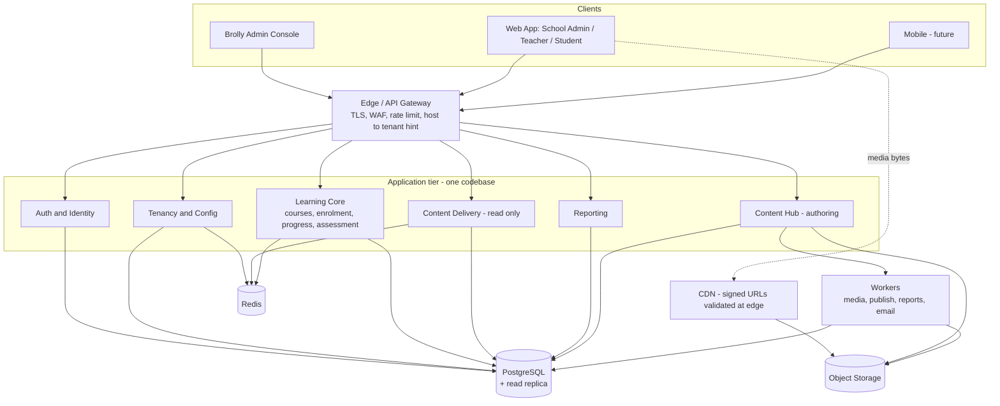

# 01 — Overview & Technology Stack

## 1.1 What we are building

A single multi-tenant SaaS learning platform. Brolly Juniors owns the platform and the master
curriculum (Python, AI). Organisations (schools/businesses) and direct consumers use it through
tenant-scoped, white-labelled experiences driven entirely by configuration.

Two things must be true when we are done, and everything below serves them:

- **Adding a school is a data operation.** Insert a tenant row + branding + entitlements. No deploy.
- **Updating a textbook is a publish operation.** Create a version, publish it. No deploy.

## 1.2 Stated assumptions

These are assumptions made where the brief was silent. Correct any that are wrong — several
change the schema.

| # | Assumption |
|---|---|
| A1 | Target scale year 1: tens of tenants, low tens of thousands of students. Design must reach 1,000+ tenants without redesign, but we do not build for that on day 1. |
| A2 | Primary market is India; data residency in `ap-south-1` (Mumbai) or equivalent. Students are **minors**, so child-data rules (DPDP Act 2023 §9, and GDPR-K / COPPA if we go international) apply. |
| A3 | One shared web application on `app.brollyjuniors.com` for v1; subdomains (`abc.brollyjuniors.com`) are designed for but not necessarily switched on in v1. |
| A4 | Tenants **consume** the master curriculum; they do not author their own chapters. They do author tenant-local artefacts (classes, assignments, announcements). |
| A5 | Course content is authored as **structured blocks (JSON)**, not free HTML — safer, portable to mobile, and renderable without a deploy. |
| A6 | Students will run Python in the browser (Pyodide/WASM) in v1; a server-side sandbox is a later addition. See D7. |
| A7 | Payments are not in v1, but the entitlement model must not need rework when they arrive. |
| A8 | The team is comfortable with TypeScript across the stack. If the team is Python-first, see D1. |
| A9 | Single production region initially, multi-AZ, with the CDN providing global reach for content. |

## 1.3 Recommended technology stack

| Layer | Recommendation | Why this one |
|---|---|---|
| Language | **TypeScript** end to end | One language, one type system, and request/response contracts shared between API and web via a single package. Halves the surface area for a small team. |
| Repo | **pnpm workspaces + Turborepo** | Enforces the "one core application" rule structurally — shared packages are imported, not copy-pasted. Cached CI. |
| Backend | **NestJS 11** | Its guard/interceptor/DI model is the single best fit for this problem: tenant resolution, RBAC, entitlement checks and audit logging are cross-cutting concerns that must be *impossible to forget*. Nest applies them globally, with explicit opt-out, rather than opt-in per route. |
| ORM | **Prisma 6** | Strong typed schema and first-class migrations. We wrap it in a client extension that injects `tenant_id` automatically (see 02). Caveat about RLS + connection pooling documented in 09 / R4. |
| Database | **PostgreSQL 16** | Row-Level Security is the reason. It gives a defence layer *below* application code, which is what makes shared-schema multi-tenancy defensible. Also JSONB for content blocks and settings, and declarative partitioning for audit and progress later. |
| Cache / queue | **Redis 7 + BullMQ** | Tenant config, permission sets, entitlement sets and content manifests are read constantly and change rarely — ideal cache targets. BullMQ runs media transcode, publish fan-out, report generation. |
| Object storage | **S3-compatible** (AWS S3, or Cloudflare R2) | Media never goes in Postgres. Content-addressed keys make objects immutable and cacheable forever. R2 is worth costing — zero egress fees matter for video. |
| CDN | **CloudFront** (or Cloudflare) | Chosen for **signed URLs validated at the edge**, which is how protected curriculum stays protected without duplicating files per tenant. |
| Frontend | **Next.js 15 (App Router) + React 19** | Server components resolve tenant and branding on the server before first paint: no logo/colour flash, and no tenant registry in the client bundle. |
| Styling | **Tailwind + CSS custom properties + shadcn/ui** | Branding is applied by writing `--brand-primary` and friends into a style tag from tenant config. Zero per-tenant CSS builds. |
| Client data | **TanStack Query** | Stale-while-revalidate matches the content-manifest model exactly. |
| Auth | **In-house**: Argon2id + RS256 JWT access (10 min) + rotating refresh cookie | Multi-tenant identity with per-tenant roles is awkward to bolt onto most managed providers, and the `tenant_id` binding must be ours. Alternative in D1b. |
| Content editing | **TipTap / ProseMirror** producing block JSON | Yields a validated document tree, not HTML soup. Sanitisation happens once, at authoring time. |
| Observability | **OpenTelemetry + pino + Sentry** | Every log line and span carries `tenant_id`, `user_id`, `request_id`. Non-negotiable when debugging a shared-tenant system. |
| Testing | **Vitest + Supertest + Playwright** | Plus a dedicated cross-tenant abuse suite (see 07). |
| Infra | **Docker + Terraform**, containers on ECS / Fly / Render | Boring and portable. |

### Why not Python/Django

Django + DRF is a perfectly good choice here and has mature multi-tenancy libraries. Choose it if
the engineering team is Python-first — a team that ships fast in Python will beat a team learning
NestJS. The substance of these documents is framework-agnostic; only the code idioms change. This
is decision **D1**.

## 1.4 High-level architecture

Two things to notice:

- **Content Delivery is separate from Content Hub.** Authoring can be down, deploying, or on fire;
  students keep learning, because delivery reads published rows from a replica, Redis, and the CDN.
- **Media bytes never traverse the application tier.** The API returns signed URLs; the browser
  fetches from the CDN.

## 1.5 The principles, and where each is enforced

| Principle (brief §43) | Enforced by |
|---|---|
| One core application | Monorepo with shared `packages/*`; no `if (isB2B)` branching — feature flags in 06 |
| Multi-tenant by design | `tenant_id` from the first migration; RLS from the first migration |
| Reusable learning platform | Learning Core has no knowledge of tenant type |
| Configuration over hard-coding | `tenant_branding`, `tenant_feature`, feature registry in `packages/config` |
| Centralised authorization | Global Nest guards; deny by default |
| Secure tenant isolation | Tenant from host/JWT only, never from request body — see 02 |
| Global curriculum + tenant assignment | Platform tables carry no `tenant_id`; `tenant_entitlement` joins them |
| Central Content Hub | A single writer path to `content_version` |
| Content separate from code | Block JSON and manifests fetched at runtime |
| Versioned content | Immutable `content_version`; monotonic `release_no` per textbook/course |
| Centralised media | S3 + CDN, content-addressed |
| Automatic propagation | Publish flips one pointer; clients revalidate the pointer by ETag |
| No duplicated master content | One object per asset, shared by all tenants; entitlement is a join, not a copy |
| Extensible | New tenant = rows; new subject = rows; new role = rows |
