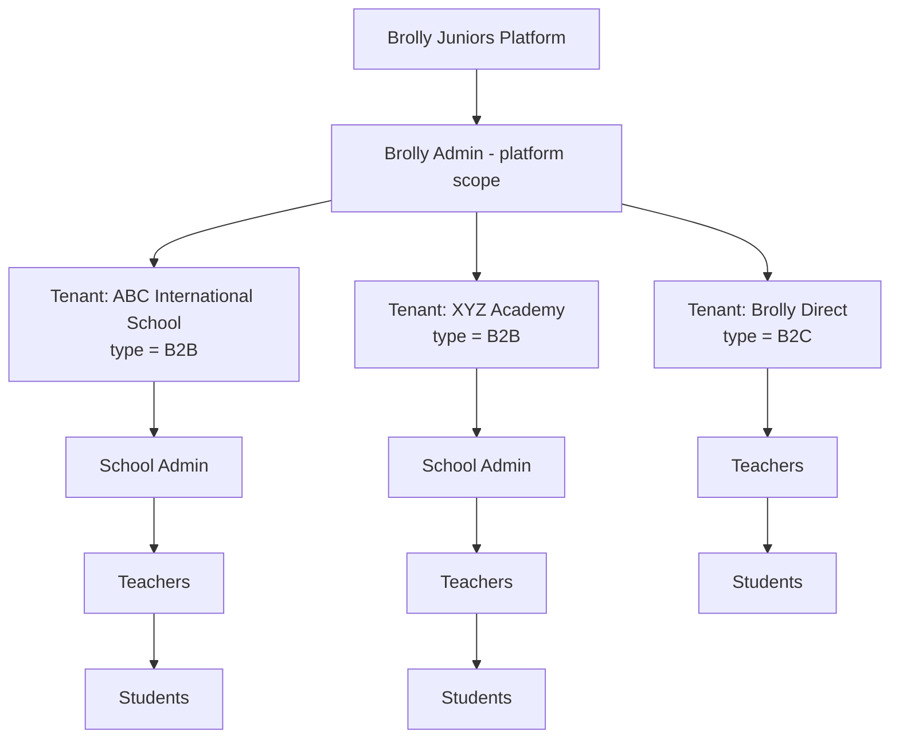
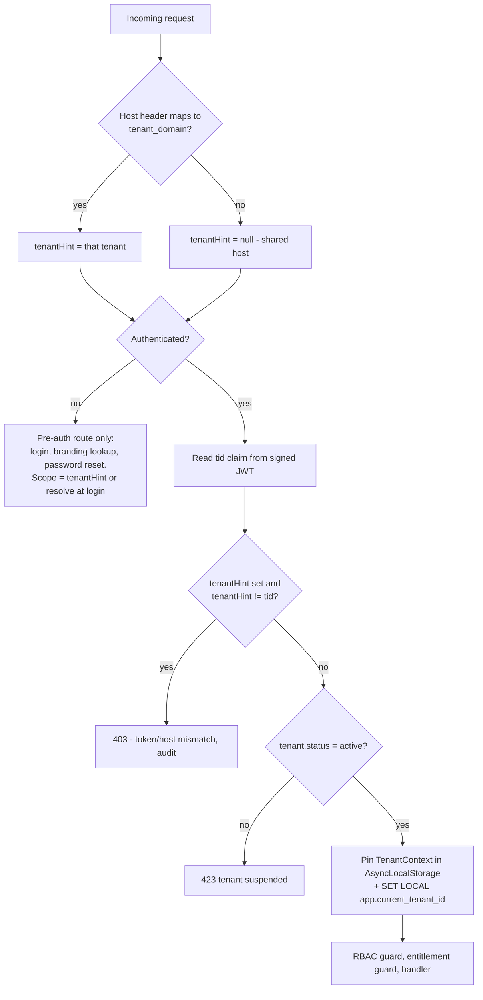

# 02 — Multi-Tenancy, Tenant Resolution & Isolation

## 2.1 Tenancy model: shared database, shared schema, `tenant_id` everywhere

| Option | Isolation | Cost at 1,000 tenants | Migration pain | Verdict |
|---|---|---|---|---|
| Database per tenant | Strongest | 1,000 databases, 1,000 connection pools | 1,000 migrations per release | Rejected for v1 |
| Schema per tenant | Strong | Postgres degrades badly past a few thousand schemas; catalog bloat | 1,000 schema migrations | Rejected |
| **Shared schema + `tenant_id` + RLS** | Strong *if enforced in depth* | One database, one pool, one migration | One migration per release | **Chosen** |

Shared schema is chosen because it is the only option where onboarding a school is genuinely a
data operation, and because Postgres RLS closes the usual objection ("one bad query leaks
everything") at the database layer rather than relying on developer discipline.

**Escape hatch, designed in now:** `tenant_id` is the natural shard key. A tenant that outgrows
the shared cluster — or one with a contractual data-residency requirement — can be moved to a
dedicated database with no schema change, because every tenant-owned row already carries
`tenant_id` and no query joins across tenants. A `tenant.shard_key` column and a connection
resolver keyed on it are cheap to add later; we deliberately do not build the router in v1.

## 2.2 Platform data vs tenant data

This split is the second most important decision in the system, after `tenant_id` itself.

```
PLATFORM-OWNED (no tenant_id)          TENANT-OWNED (tenant_id NOT NULL)
────────────────────────────           ─────────────────────────────────
permission                             tenant, tenant_domain
role (system templates)                tenant_setting, tenant_branding, tenant_feature
subject, course, module                tenant_entitlement
lesson, topic                          user, user_role
textbook, chapter, section             student_profile, teacher_profile
content_item, content_version          academic_year, class
content_release                        class_teacher, class_student
media_asset                            enrollment
exercise, quiz, quiz_question          assignment, assignment_target, submission
plan, plan_entitlement                 quiz_attempt, quiz_answer
feature (registry)                     progress, achievement, certificate
                                       audit_log, session, notification
```

Rule of thumb: **if two tenants would ever want the same row, it is platform data.** A Python
chapter is the same chapter for every school. A class is not.

Consequence: the master Python course exists exactly once. School A, School B and B2C reach it
through `tenant_entitlement`, never through a copy.

## 2.3 B2B and B2C on one codebase

`tenant_type` is an attribute, not a branch in the code.



**B2C is modelled as a single system tenant** (`Brolly Direct`, `tenant_type = B2C`). Every direct
consumer is a user inside it.

- *Why not one tenant per consumer?* It would put millions of rows in the tenant table, make
  platform analytics a cross-tenant aggregation, and give every B2C signup its own settings and
  branding rows for no benefit.
- *Then what isolates one B2C student from another?* Not tenancy — **resource ownership**. A
  student can only read `progress`, `submission` and `enrollment` rows where `user_id = self`.
  This rule already has to exist for B2B (a School A student must not read another School A
  student's marks), so B2C needs no new mechanism. That is the point.
- *Trade-off to accept:* B2C rows share the same partitions and indexes as everything else. If B2C
  grows past a few million users, it can be split out using the shard escape hatch above.

The differences between B2B and B2C are expressed **only** as:

1. `tenant_type` (used for reporting and defaults, not for logic branching)
2. The set of roles present (`SCHOOL_ADMIN` simply has no assignments in the B2C tenant)
3. `tenant_feature` flags (`school_management = false`, `course_purchase = true`)

There is no `if (tenant.type === 'B2B')` anywhere in feature code. See 06 §6.7.

## 2.4 Tenant resolution — how the backend decides which tenant you are

**Rule: the tenant is never taken from a request body, query string, or a client-set header.**



Precedence and roles of each source:

| Source | Used for | Authoritative? |
|---|---|---|
| `Host` header → `tenant_domain` table | Branding on the login page; binding a session to a host | Only as a *constraint* — it must match the token |
| `tid` claim in the signed access token | Every authenticated request | **Yes.** This is the tenant. |
| Login-time tenant selection | Deciding which tenant the new token is for | Yes, at that one moment |
| Anything from the client | Nothing | Never |

### The one genuinely hard case: login on a shared host

On `abc.brollyjuniors.com` the tenant is known before login. On the shared
`app.brollyjuniors.com` it is not, and the user has only typed an email and password. Three
workable answers:

| Option | UX | Notes |
|---|---|---|
| **(a) Email is globally unique across the platform** | Best — just email + password | One human = one account. Cannot be a teacher at two schools with one email. Simplest, and correct for ~99% of real cases. |
| (b) Email unique per tenant + user types an organisation code | Extra field | Supports the same email in multiple tenants |
| (c) Email unique per tenant + after password check, show a tenant chooser | Good UX, more complex | Leaks "this email exists in N orgs"; must be rate-limited and constant-time |

**Recommended: (a) globally unique email**, with the schema built as `UNIQUE (tenant_id, email)`
*plus* a global `UNIQUE (lower(email))` constraint that can be dropped later if we ever need
multi-tenant humans. That keeps option (b)/(c) open without a migration. This is decision **D3**.

### Brolly Admin and cross-tenant access

Brolly Admin users live in a reserved **platform tenant** with `is_platform = true`. Their token
carries `scope = "platform"` rather than a normal `tid`. Platform scope:

- is only accepted on `/api/v1/platform/*` routes;
- requires the session to have passed re-authentication (step-up) within the last 30 minutes for
  destructive operations;
- when acting inside a tenant (impersonation / support), issues a **separate, short-lived,
  explicitly-marked token** with that `tid` and `act_as` set, and every request under it is
  audited as impersonation. Impersonation never silently inherits platform scope.

## 2.5 Isolation in depth — four independent layers

A single missed `WHERE tenant_id = ?` must not be able to leak data. So it is enforced four times,
by four different mechanisms, each of which alone would be sufficient.

### Layer 1 — Request context

Tenant is resolved once (2.4) and stored in `AsyncLocalStorage`. Nothing downstream accepts a
tenant argument from the caller; it reads the context. A global guard rejects any request that
reaches a tenant-scoped handler with no context set.

### Layer 2 — Data access layer

A Prisma client extension intercepts every query against a tenant-owned model and injects
`where: { tenantId }` on reads and `data: { tenantId }` on writes. Attempting to pass a different
`tenantId` explicitly throws. Raw SQL is banned outside a reviewed `packages/db/raw` directory,
enforced by an ESLint rule.

### Layer 3 — Postgres Row-Level Security

The application connects as a **non-superuser role without `BYPASSRLS`**. Every tenant-owned table
gets:

```sql
ALTER TABLE class ENABLE ROW LEVEL SECURITY;
ALTER TABLE class FORCE ROW LEVEL SECURITY;

CREATE POLICY class_tenant_isolation ON class
  USING      (tenant_id = current_setting('app.current_tenant_id', true)::uuid)
  WITH CHECK (tenant_id = current_setting('app.current_tenant_id', true)::uuid);
```

`SET LOCAL app.current_tenant_id = '…'` is issued at the start of each request's transaction.
`FORCE` matters: without it, the table owner bypasses its own policies. `USING` blocks reads;
`WITH CHECK` blocks writing a row into another tenant.

> **Pooling caveat (see R4).** `SET LOCAL` is transaction-scoped, so every tenant-scoped request
> must run inside a transaction, and PgBouncer must be in *transaction* pooling mode (not
> statement). This is a real operational constraint, not a footnote — it is why the data layer
> wraps each request in a transaction by default.

### Layer 4 — Composite foreign keys

RLS stops you reading another tenant's rows. Composite FKs stop you *linking* to them, which is
the subtler bug. Every tenant-owned table gets `UNIQUE (tenant_id, id)`, and child tables
reference the pair:

```sql
CREATE TABLE class_student (
  tenant_id  uuid NOT NULL,
  class_id   uuid NOT NULL,
  student_id uuid NOT NULL,
  PRIMARY KEY (tenant_id, class_id, student_id),
  FOREIGN KEY (tenant_id, class_id)   REFERENCES class(tenant_id, id),
  FOREIGN KEY (tenant_id, student_id) REFERENCES "user"(tenant_id, id)
);
```

It is now structurally impossible to enrol Tenant B's student into Tenant A's class, even with a
compromised application tier.

### Layer 5 (process, not code) — Adversarial tests

A permanent test suite whose only job is to attempt cross-tenant access. See 07 §7.6. CI fails if
any of it passes.

## 2.6 Authorization beyond tenancy: the four-question check

Tenant isolation is necessary but not sufficient. Every tenant-scoped endpoint answers four
questions in order, and short-circuits on the first failure:

```
1. Authentication   Is the token valid, unrevoked, unexpired?
2. Tenant           Does tid match host, and is the tenant active?
3. Permission       Does this user's role set grant the required permission,
                    AND is the governing feature enabled for this tenant?
4. Resource scope   Does this specific row belong to a scope the user can reach?
                       Student  -> own rows only
                       Teacher  -> rows for classes they are assigned to
                       SchoolAdmin -> any row in the tenant
                    Plus, for content: does an entitlement exist? (see 05)
```

Question 4 is the one most systems get wrong. A teacher having `view_progress` does not mean they
may view *every* student's progress in the school. Scope is resolved by a per-resource policy
function (`packages/auth/policies`), not by the guard alone — see 03 §3.6.

## 2.7 Tenant lifecycle

```
provisioning -> active -> suspended -> active
                      \-> archived (read-only, retained) -> purged
```

- **provisioning**: rows created, admin invite pending, no logins accepted.
- **active**: normal.
- **suspended**: all logins for that tenant refused with `423`; data untouched. Used for
  non-payment or investigation. Brolly Admin retains access.
- **archived**: read-only export window; scheduled for deletion.
- **purged**: hard delete of tenant-owned rows, media retained only where platform-owned.
  Because platform curriculum was never copied per tenant, purging a tenant never risks deleting
  shared content — a direct benefit of the split in 2.2.

Status is checked on every request (from Redis-cached tenant config), not just at login, so
suspension takes effect within the cache TTL (60 s) rather than at token expiry.
