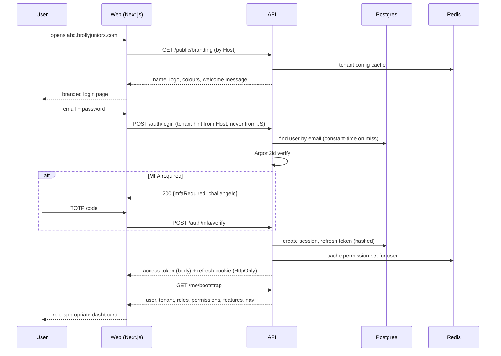

# 03 — Authentication & Authorization (RBAC)

## 3.1 Identity model

Every principal is a `user` row carrying `(tenant_id, user_id)`. Roles are **not** a column on the
user — they are assignments, so a person can be both a Teacher and a School Admin, and so new
roles never require a schema change.

```
user ──< user_role >── role ──< role_permission >── permission
                        │
                        └── tenant_id NULL  = system role template (Brolly-defined)
                            tenant_id set   = tenant-custom role
```

`student_profile` and `teacher_profile` hold role-specific attributes (grade, guardian contact,
subjects taught) rather than bloating `user`.

## 3.2 Credentials

| Concern | Decision |
|---|---|
| Password hashing | **Argon2id**, m=19 MiB, t=2, p=1, per-password salt. Never MD5/SHA/bcrypt-with-low-cost. |
| Password policy | Min 10 chars for adults; **min 8 with no composition rules for students**, plus a breached-password check (k-anonymity range query against HIBP). Complexity rules make children reuse passwords. |
| Student onboarding | School Admin bulk-creates students with a one-time code or a school-issued temporary password forced to change at first login. Students under the consent age get **no email requirement** — username within tenant is enough (see D5). |
| Storage | `password_hash` only. Never a reversible form, never in logs, never in audit rows. |
| Lockout | Exponential backoff per `(email, ip)` and a hard lock after 10 failures in 15 min, released by time or admin. Backoff is applied to unknown emails too, in constant time, so the endpoint is not a user-enumeration oracle. |
| MFA | TOTP, **required for Brolly Admin and School Admin**, optional for Teacher, off for Student. Recovery codes stored hashed. |

## 3.3 Token strategy

| Token | Form | Lifetime | Stored |
|---|---|---|---|
| Access | JWT, **RS256** (asymmetric, so verifiers never hold a signing key), `kid` for rotation | **10 min** | Memory only in the SPA; sent as `Authorization: Bearer` |
| Refresh | Opaque 256-bit random, hashed in DB | 30 days (sliding), 12 h for admin sessions | `HttpOnly; Secure; SameSite=Lax; Path=/api/v1/auth` cookie |

Access token claims:

```json
{
  "sub":   "user uuid",
  "tid":   "tenant uuid",
  "scope": "tenant",           // or "platform"
  "roles": ["TEACHER"],
  "perm":  "b64 bitmap or hash",  // see 3.5
  "sid":   "session uuid",
  "amr":   ["pwd","otp"],
  "iat": 0, "exp": 0, "iss": "brolly", "aud": "brolly-api"
}
```

- **Refresh rotation with reuse detection.** Each refresh returns a new refresh token and
  invalidates the old one. Presenting an already-used refresh token means it was stolen: the whole
  `session` family is revoked immediately and an audit event is raised.
- **Revocation.** Access tokens are short enough to not need a blocklist, with one exception — a
  `session` marked revoked, a suspended tenant, or a role change bumps `user.perm_version`, and the
  API rejects tokens whose `perm_version` is stale (checked against a Redis lookup, ~0.2 ms). This
  gives us near-immediate revocation without a per-request DB hit.
- **Why not tokens in `localStorage`:** XSS-readable. Why not the access token in a cookie: CSRF.
  Access-in-memory + refresh-in-HttpOnly-cookie is the combination that resists both, and the
  refresh endpoint is additionally CSRF-protected by double-submit + `SameSite`.

## 3.4 Authentication flow



`/me/bootstrap` is a deliberate single round-trip: it returns identity, tenant branding, the
effective permission set, and enabled features together, so the client renders the right shell
without a waterfall of calls.

## 3.5 RBAC model

Permissions are the atoms; roles are bundles. Code checks **permissions, never role names** —
`@RequirePermission('student:create')`, not `if (role === 'SCHOOL_ADMIN')`. This is what makes the
system extensible to tenant-custom roles without touching feature code.

Permission naming: `domain:action[:scope]`.

```
tenant:read          tenant:create        tenant:update       tenant:suspend
user:read            user:create          user:update         user:deactivate
role:assign          role:manage
class:read           class:create         class:update        class:delete
class:assign_teacher class:assign_student
course:read          course:assign
enrollment:read      enrollment:create
assignment:read      assignment:create    assignment:grade
submission:read      submission:create
progress:read:self   progress:read:class  progress:read:tenant  progress:read:platform
content:read         content:create       content:update      content:publish
content:version:read media:upload         media:delete
report:read:class    report:read:tenant   report:read:platform
audit:read           settings:manage      branding:manage     feature:manage
billing:manage       entitlement:manage
```

Note the `:self` / `:class` / `:tenant` / `:platform` suffixes on read permissions. Scope is part
of the permission, so "a teacher may read progress" and "a school admin may read progress" are
different permissions, not the same permission with different behaviour.

### Default role templates (seeded, editable per tenant)

| | Brolly Admin | School Admin | Teacher | Student |
|---|:--:|:--:|:--:|:--:|
| `tenant:*` | ✓ | — | — | — |
| `content:create/update/publish` | ✓ | — | — | — |
| `media:upload` | ✓ | — | — | — |
| `entitlement:manage` | ✓ | — | — | — |
| `user:create/update` | ✓ | ✓ (own tenant) | — | — |
| `role:assign` | ✓ | ✓ (below own level) | — | — |
| `class:*` | ✓ | ✓ | read + own classes | read own |
| `assignment:create` | ✓ | — | ✓ | — |
| `assignment:grade` | ✓ | — | ✓ | — |
| `submission:create` | — | — | — | ✓ |
| `progress:read` | `:platform` | `:tenant` | `:class` | `:self` |
| `report:read` | `:platform` | `:tenant` | `:class` | — |
| `content:read` | ✓ all | entitled only | entitled only | entitled + assigned |
| `settings/branding:manage` | ✓ all tenants | own tenant | — | — |
| `audit:read` | ✓ platform | ✓ own tenant | — | — |

Two guardrails worth stating explicitly:

- **No privilege escalation.** `role:assign` can only grant a role whose permission set is a subset
  of the granter's own. A School Admin can never mint a platform-scoped role.
- **Roles are per-tenant assignments.** `user_role` carries `tenant_id`; a role granted in Tenant A
  is meaningless in Tenant B.

## 3.6 Effective authority = permission ∧ feature ∧ entitlement ∧ scope

A single function computes what a user may actually do:

```
can(user, permission, resource?) =
      hasPermission(user.roleSet, permission)
  AND featureEnabled(tenant, featureGoverning(permission))
  AND (resource is null OR policyFor(resource.type)(user, resource) == allow)
  AND (resource is content OR content is null OR entitled(tenant, content))
```

- **Permission** comes from roles (cached in Redis, invalidated by `perm_version`).
- **Feature** comes from `tenant_feature`. Turning off `class_management` for a B2C tenant makes
  every class permission inert without removing it from any role. This is why there are no
  B2B/B2C conditionals in feature code.
- **Policy** is the per-resource scope check: `teacherOwnsClass`, `studentOwnsSubmission`,
  `withinSameTenant`. These are ordinary functions, unit-tested in isolation, and the only place
  ownership logic lives.
- **Entitlement** applies to curriculum content and is covered in 05 §5.8.

### Enforcement in the request pipeline

```
Request
  → TenantResolutionGuard      (02 §2.4)
  → AuthGuard                  (verify JWT, perm_version, session)
  → PermissionGuard            (@RequirePermission metadata)
  → FeatureGuard               (@RequireFeature metadata)
  → Handler
      → policyFor(resource)    explicit, in the service, on the loaded row
  → AuditInterceptor           (writes the audit row on success/failure)
```

The first four are **global**. A route with no `@RequirePermission` is rejected unless explicitly
marked `@Public()`. Deny by default is the only setting that survives a growing team.

The resource-scope check is deliberately *not* a guard: it needs the loaded row, and pretending
otherwise leads to guards that re-fetch rows and to IDOR bugs when someone forgets. It lives in the
service, immediately after the fetch, and there is a lint rule requiring every `findUnique` in a
controller-facing service to be followed by a policy call or an explicit
`// eslint-disable … reason:` comment.

## 3.7 Session and account management

- Users can list and revoke their own sessions (`device, ip, last_seen`).
- Password change revokes all sessions except the current one.
- Password reset is a single-use, 30-minute, hashed token; the response is identical whether or not
  the email exists.
- School Admin can force-reset a student password in their tenant; the action is audited and the
  student's sessions are revoked.
- Deactivating a user revokes sessions immediately via `perm_version`.

## 3.8 Cross-tenant test obligations for this layer

Implemented in Phase 3, run forever:

| Test | Expectation |
|---|---|
| Tenant A token used against Tenant B host | 403, audited |
| Tenant A token, request for Tenant B resource id | 404 (not 403 — do not confirm existence) |
| Student token requesting another student's `progress` in the same tenant | 403 |
| Teacher requesting progress for a class they are not assigned to | 403 |
| School Admin attempting `content:publish` | 403 |
| School Admin attempting to grant a platform role | 403 |
| Expired / revoked / stale-`perm_version` token | 401 |
| Refresh token replay | Whole session family revoked, 401, audited |
| Direct DB query without `app.current_tenant_id` set | Returns zero rows (RLS proof) |
| Any route reachable with no `@RequirePermission` and no `@Public()` | Build fails |
