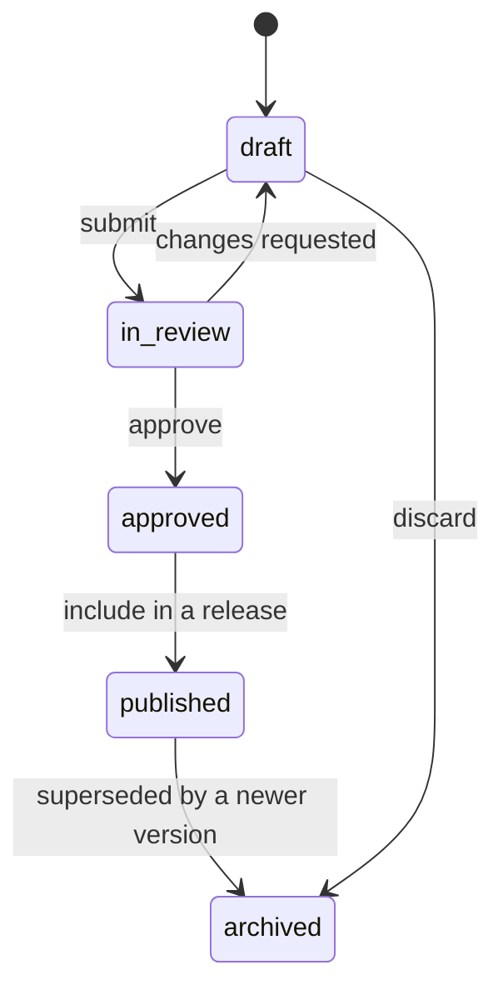
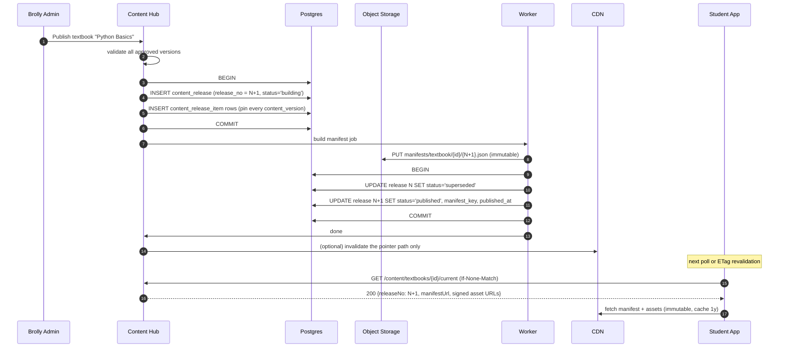
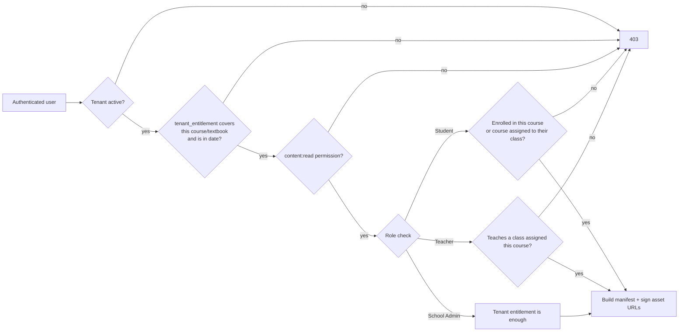

# 05 — Content Hub, Versioning, Media, CDN & Entitlement

This is the part of the system that makes "update a textbook without deploying the app" true. The
whole design reduces to one idea:

> **Everything is immutable and content-addressed, except one small pointer per textbook.**
> Publishing = writing new immutable things, then flipping the pointer in a single transaction.

Immutability is what removes the two hard problems — cache invalidation and partial reads. There is
nothing to invalidate, because nothing ever changes at a given URL; and a reader is never halfway
between versions, because they resolve the pointer once and then read a frozen set.

## 5.1 The two halves: Hub and Delivery

| | **Content Hub** (write) | **Content Delivery** (read) |
|---|---|---|
| Users | Brolly Admin, content authors | Every student, teacher, admin |
| Traffic | Tens of requests/minute | The entire platform's read load |
| Database | Primary | Read replica + Redis |
| Availability need | Business hours | 99.9%+ |
| Deployable | Separate service (or separate module with its own scaling group) | Separate |

They are separated because their failure modes must not be shared. If the Hub is down, no one can
author — but every student keeps reading, because delivery depends only on already-published rows,
Redis, and the CDN. This directly answers brief §40.

## 5.2 Content representation: block documents, not HTML

`content_version.body` is a JSONB block document validated against a Zod schema:

```json
{
  "schemaVersion": 1,
  "blocks": [
    { "type": "heading",  "level": 2, "text": "Variables in Python" },
    { "type": "paragraph","spans": [{ "text": "A variable is a name that refers to a value." }] },
    { "type": "code",     "language": "python", "source": "x = 5\nprint(x)", "runnable": true },
    { "type": "image",    "mediaId": "0f3a…", "alt": "Memory diagram", "caption": "…" },
    { "type": "video",    "mediaId": "9c21…", "captionsMediaId": "b7…" },
    { "type": "callout",  "variant": "tip", "blocks": [ … ] },
    { "type": "exercise", "exerciseId": "…" },
    { "type": "quiz",     "quizId": "…" }
  ]
}
```

Why blocks rather than HTML or Markdown:

- **Safe by construction.** There is no place to put a `<script>`; the renderer only knows a fixed
  set of block types. XSS in textbook content is designed out, not filtered out.
- **Media is referenced by id, never by URL.** URLs are resolved at delivery time with a signature.
  A content version can therefore be published once and served differently to entitled and
  unentitled callers, and asset storage can move without rewriting content.
- **Portable.** The same document renders in web today and in a React Native reader later, with no
  HTML sanitiser in the mobile app.
- **Diffable.** Version-to-version changelogs are computed structurally.

An unknown block type renders as a graceful placeholder rather than breaking the page — so a new
block type can be authored before every client supports it.

## 5.3 Authoring lifecycle



- A `content_item` has at most one `draft_version` and exactly one
  `current_published_version` per locale.
- Editing published content **never mutates it**. It creates version *n+1* in `draft`.
- **Validation gate** before `approved`: schema validity, every referenced `media_id` exists and is
  finalised, no broken internal links, alt text present on every image, captions present on every
  video, code blocks parse. Accessibility checks are gates, not warnings — this is content for
  children and often for schools with accessibility obligations.
- Authors preview drafts at `/preview/{contentVersionId}` behind `content:read` + a signed preview
  token, served `Cache-Control: no-store`. Preview never touches the published path.

## 5.4 Releases: making a publish atomic

A textbook edit usually touches several sections at once. Publishing them one at a time would let a
student see Chapter 1 v2 next to Chapter 2 v1. So the unit of publication is a **release**, not a
version.



Key properties:

- The manifest object is written **before** the pointer flips, so the pointer never references
  something that does not exist.
- The pointer flip is a single-row `UPDATE` inside one transaction, guarded by the partial unique
  index "one published release per scope" (04 §4.5). It is atomic by construction, not by
  convention.
- **Rollback is the same operation in reverse**: mark N+1 `rolled_back`, mark N `published`. It is
  a sub-second database write, not a redeploy. This is the single most valuable operational
  property of the design.

### The manifest

```json
{
  "scope": "textbook",
  "scopeId": "…",
  "releaseNo": 42,
  "publishedAt": "2026-09-05T10:00:00Z",
  "title": "Python Basics",
  "structure": [
    { "type": "chapter", "id": "…", "title": "Getting Started", "children": [
      { "type": "section", "id": "…", "title": "What is Python?",
        "contentVersionId": "…", "bodyUrl": "https://cdn…/content/{hash}.json" }
    ]}
  ],
  "assets": { "0f3a…": { "url": "https://cdn…/media/ab/abcd…/diagram.png", "kind": "image" } }
}
```

The manifest is the table of contents plus a resolved asset map. A reader fetches the manifest
once, then fetches section bodies lazily — so a 400-page textbook does not become a 40 MB download.

## 5.5 Media storage

**Content-addressed keys.** The storage key is derived from the bytes:

```
media/{sha256[0:2]}/{sha256}/{slugified-filename}.{ext}
media/ab/abcd1234…/memory-diagram.png
```

Consequences, all of them good:

- The same object is never stored twice, no matter how many times it is uploaded.
- **A URL can never go stale**, so `Cache-Control: public, max-age=31536000, immutable` is
  correct — no CDN invalidation is ever needed for media.
- Replacing an image in a chapter produces a *different* URL, so there is no window in which some
  users see the old image and some the new. Cache-busting is inherent, not bolted on.
- The 256-bit hash is unguessable, which matters for the delivery model in 5.7.

Logical organisation lives in metadata (`media_asset.tags`, and the content that references it),
not in the key path. Human-friendly paths and immutability are incompatible; immutability wins.

**Upload flow:** client requests a pre-signed `PUT` from the API → uploads directly to storage
(bytes never touch the app tier) → calls `POST /media/finalise` → the API verifies size, sniffs the
real MIME type from magic bytes (never trusting the client's `Content-Type` or extension), computes
the hash, and creates the `media_asset` row. Unfinalised objects are swept after 24 h.

**Derivatives** are produced by a worker and recorded in `media_asset.derivatives`: responsive
image sizes + AVIF/WebP, HLS renditions for video, a poster frame, a PDF page count. Derivative
keys are also content-addressed.

**Two visibility classes:**

| | `public` | `protected` |
|---|---|---|
| Examples | Tenant logos, favicons, marketing images | Textbook pages, chapter videos, exercise assets |
| Bucket/prefix | Public read via CDN | Private bucket, CDN origin access only |
| URL | Plain, cached 1 year | **Signed**, cached 1 year at the edge |

## 5.6 CDN architecture

```
Browser ──► cdn.brollyjuniors.com (CloudFront)
               │  cache HIT  ──────────────► served from edge
               │  cache MISS
               ▼
           Origin Access Control ──► private S3 bucket (no public access at all)
```

- The bucket has **no public policy**; the CDN is the only reader, via Origin Access Control.
  Bypassing the CDN by guessing the S3 URL returns 403.
- Cache key excludes signature query parameters, so **one cached edge object serves every entitled
  user** while each user still needs their own valid signature. This is what lets us protect
  content without duplicating a single byte per tenant.
- Response headers: `Cache-Control: public, max-age=31536000, immutable` for media, content bodies
  and versioned manifests; `no-store` for preview.
- Range requests enabled for video/PDF; Brotli for JSON.
- `stale-if-error=86400` on the manifest-pointer response, so a delivery-API outage does not black
  out reading for students who have loaded a book that day.

## 5.7 Protecting curriculum without duplicating it

The requirement (§37) is that a user cannot simply guess a media URL. The design:

1. **Asset URLs are unguessable** (256-bit hash) and are only ever revealed inside a manifest
   response, which is itself entitlement-checked.
2. **Signed URLs, validated at the edge.** When the delivery API builds a manifest response for a
   caller, it signs each asset URL with a **15-minute** expiry using the CDN key pair. The edge
   validates the signature; an expired or forged one gets 403 without ever reaching origin.
3. Signatures are minted **per response, after** the entitlement check — so an unentitled tenant
   receives no usable URLs at all, not merely a hidden UI.
4. Client refreshes the manifest transparently when signatures near expiry (TanStack Query).

**Chosen: per-asset signed URLs, not signed cookies.** Signed cookies would grant a path prefix,
and because paths are content-addressed (not tenant-partitioned) a prefix cookie would effectively
grant the whole media namespace. Per-asset signatures keep the grant as narrow as the entitlement.

**The residual risk, stated plainly:** a signed URL is a bearer capability. Within its 15-minute
window an entitled student can share it. This is true of every CDN-delivered protected content
system, and the mitigations are proportionate rather than absolute: short expiry, audit of manifest
requests, per-user rate limiting on manifest issuance, and — for high-value video only — HLS with
short-lived segment tokens. **We are explicitly not building DRM.** If the business requires
hard anti-piracy guarantees for video, that is decision **D8** and it changes the video pipeline.

## 5.8 The entitlement / access model

Content access is a conjunction, evaluated on the server, on every content request:



- **`tenant_entitlement`** is the tenant-level grant: which courses/textbooks this school has
  bought or been given, with validity dates and an optional seat limit. Sourced from a `plan`, or
  granted manually by Brolly Admin, or created by a B2C purchase later.
- **`enrollment`** is the user-level grant. Students need both; a school having Python does not
  mean every student is doing Python.
- The check happens in the **delivery API**, before any URL is signed. Frontend hiding is a UX
  nicety with no security role.
- Entitlement sets are cached in Redis per tenant, keyed by a version stamp that Brolly Admin
  bumps on change — so a revoked entitlement takes effect within seconds without a per-request
  join.

**Revocation is honest about its limits:** revoking an entitlement stops new manifests immediately,
but already-signed URLs remain valid until they expire (≤15 min). For an immediate hard cut, the
signing key can be rotated, invalidating every outstanding signature platform-wide. That is a
break-glass operation, and it is documented as such.

## 5.9 Caching strategy, layer by layer

| Layer | What | TTL | Invalidated by |
|---|---|---|---|
| Browser memory (TanStack Query) | Manifest, section bodies | 5 min stale, background revalidate | Navigation / focus |
| Browser HTTP cache | Media, section bodies, versioned manifests | 1 year, `immutable` | Never — URLs change instead |
| CDN edge | Same | 1 year | Never for media; pointer path only, on publish |
| **Pointer response** (`/content/{scope}/{id}/current`) | `{releaseNo, manifestUrl}` | `max-age=60, stale-while-revalidate=300, stale-if-error=86400` + ETag | Publish bumps ETag |
| Redis | Tenant config, branding, permission sets, entitlement sets, manifest bodies | 5–15 min | Version-stamp bump on write |
| App in-process LRU | Hot tenant config | 30 s | TTL only |
| Postgres | Source of truth | — | — |

The only thing in the system with a short TTL is a few hundred bytes of pointer JSON. Everything
expensive is cached forever. That is the payoff of immutability.

**Propagation latency after a publish:** ≤60 s for a client already on the page (pointer TTL), and
immediate for any new page load. If a business case demands instant propagation, an SSE/WebSocket
"release published" nudge on the delivery channel is a small addition — designed for, not built.

## 5.10 Failure handling

| Failure | Behaviour |
|---|---|
| Content Hub down | Authoring unavailable. Reading unaffected. |
| Delivery API down | CDN keeps serving already-signed assets and cached bodies (`stale-if-error`). New manifests fail; the reader shows a cached table of contents where available. |
| Postgres primary down | Delivery continues from the read replica and Redis. Writes (progress, submissions) queue client-side and retry with idempotency keys. |
| Redis down | Fall through to Postgres, degraded latency, circuit-broken. Never fail closed on cache absence. |
| Object storage down | Edge cache serves hits; misses fail per-asset. Text still renders — another reason media is referenced, not embedded. |
| Publish job fails mid-flight | Release stays `building`; the pointer never moved. Retry is safe because manifest keys are deterministic. |

## 5.11 Worked example — the §44 end-to-end scenario

| Day | Action | System effect |
|---|---|---|
| 1 | Author writes Python Ch.1 §1 | `content_version` v1 `draft` |
| 1 | Submit → approve → publish textbook | Release **1** created and pinned; manifest `…/1.json` written; pointer → 1 |
| 1 | School A, School B and B2C students open the book | All three fetch pointer → 1, then the same manifest and the same CDN objects. One copy, three tenants. |
| 2 | Author edits Ch.1 §1 | `content_version` **v2** `draft`. Published v1 untouched; students still read v1. |
| 2 | Publish | Release **2** pins v2 for §1 and v1 for everything else; manifest `…/2.json`; pointer → 2 in one transaction |
| 2 | Students revalidate (≤60 s) | Pointer returns release 2; new manifest; only the changed section's body URL differs, so only it is refetched |
| 2 | A typo is spotted in v2 | Pointer → release 1. Sub-second. No deploy, no cache purge. |

No frontend deploy, no backend deploy, no mobile release at any step.
